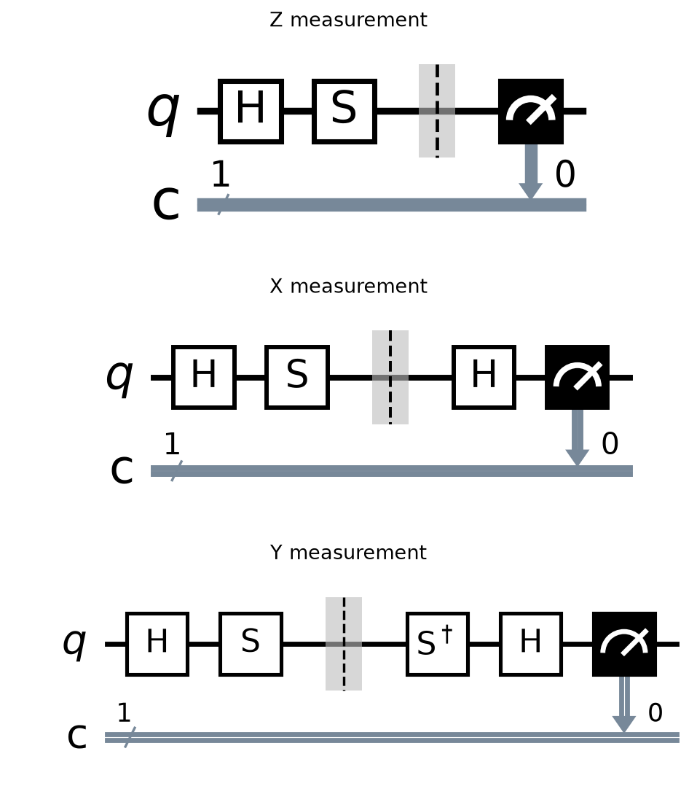
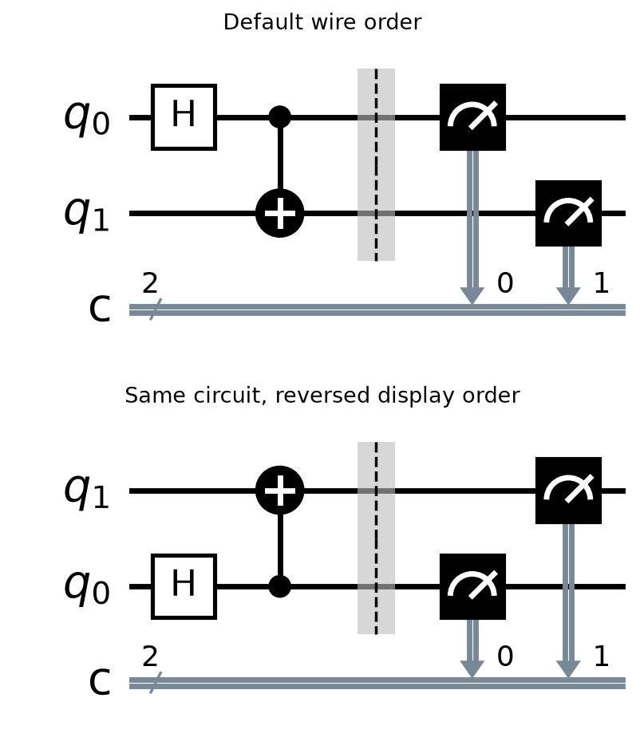
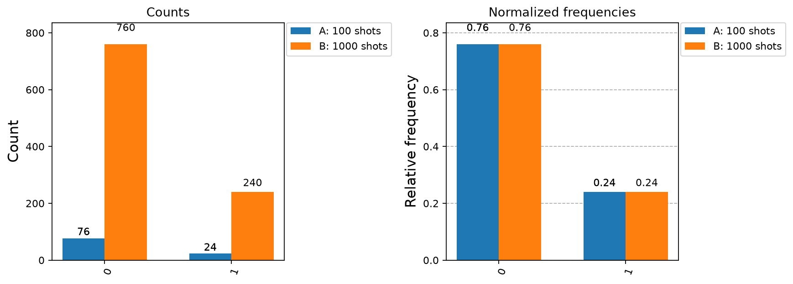
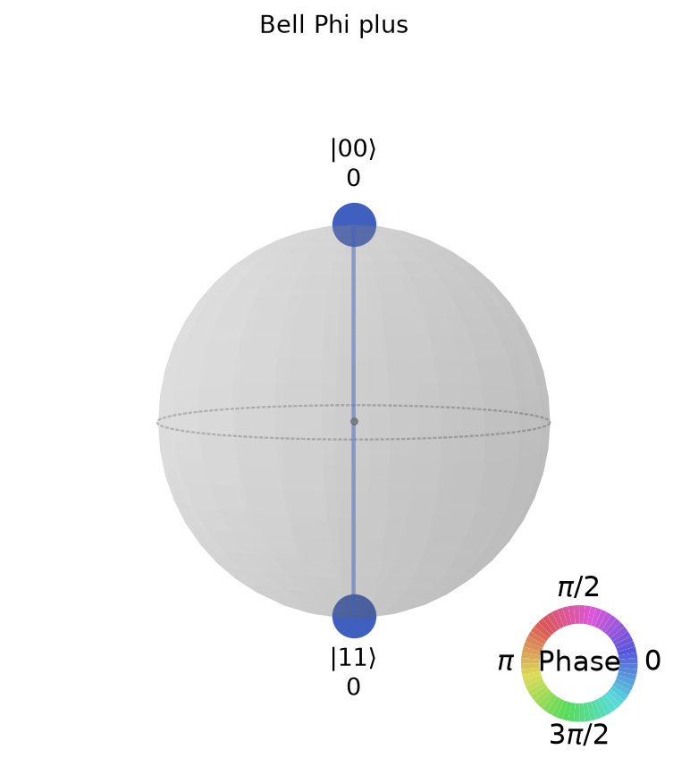
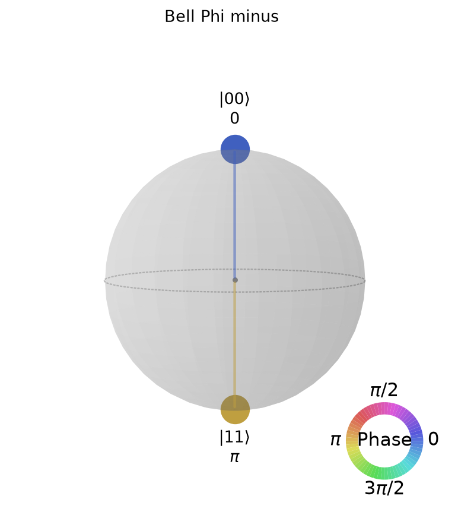
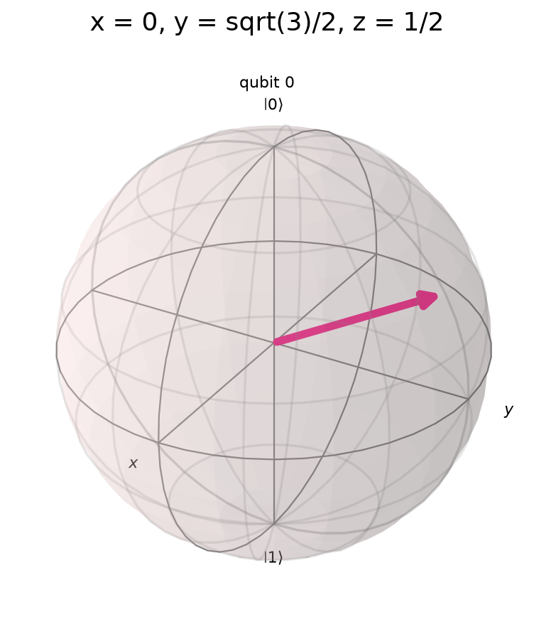
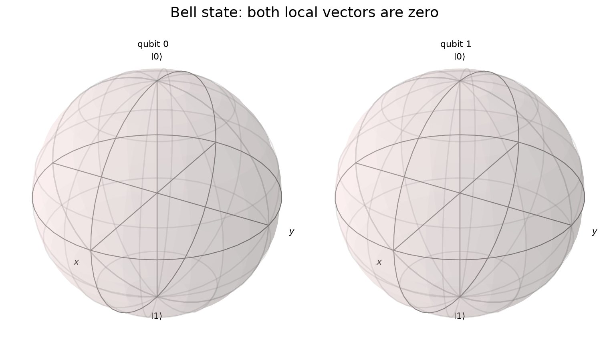
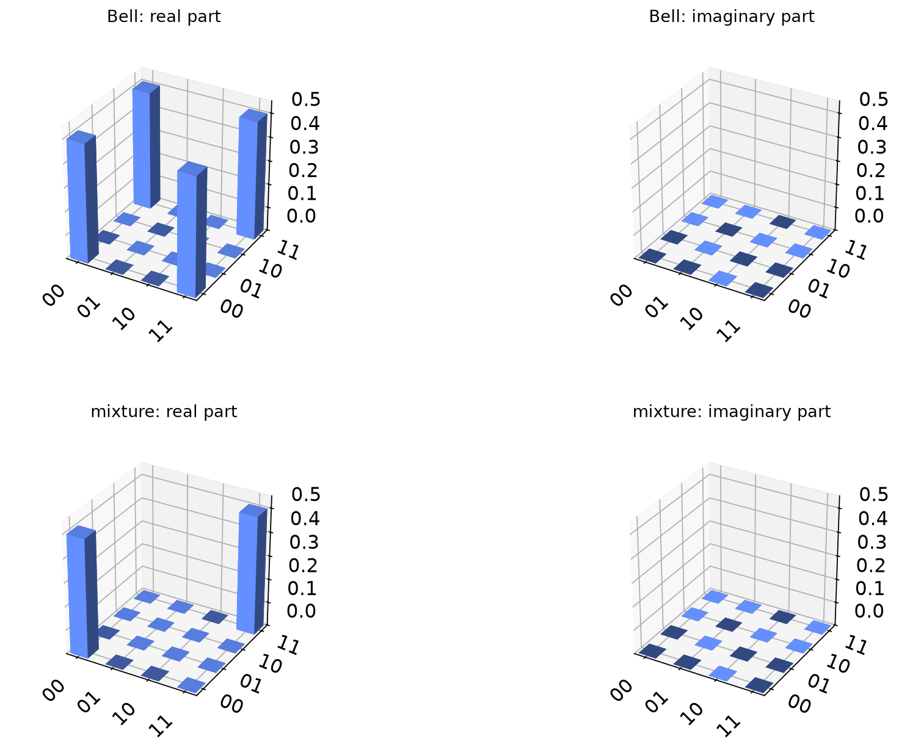

# 2. 測定、基底、可視化

[← 量子状態と演算](01-quantum-operations.md) | [次: 回路の構築 →](03-circuit-construction.md)

第1章では、状態とゲートから確率や期待値を計算しました。この章では、調べたい量に合わせて測定回路を作り、得られた結果を図と結び付けて解釈します。「何を測るか」「どのデータを得たか」「図から何が分かるか」を順に確認します。

コードはQiskit 2.5.2を基準とし、実機を使わずに実行します。描画にはMatplotlib、回路図にはpylatexenc、qsphereにはseabornも必要です。例えば、次の指定でQiskitの可視化用依存関係を追加できます。

```text
python -m pip install "qiskit[visualization]==2.5.2"
```

各Python例は独立して実行できます。図を作る例は、実行したディレクトリへPNGを保存します。図中の短い英語ラベルは、直後の日本語の説明と対応させています。乱数のseedは掲載例の再現用で、実機の測定結果を固定する指定ではありません。

<a id="measurement-basis"></a>
## 測定と基底

測定すると何が得られ、量子状態はどう変わるのでしょうか。この節では、**結果の確率**と**結果に応じた測定後の状態**を分けて考えます。対象は理想的な射影測定です。実機の読み出し誤差や、測定中のノイズは含めません。

### 0と1の確率を求めた後に、何が起こるか

計算基底、つまりZ基底で1量子ビットを測るとき、

$$
|\psi\rangle=\alpha|0\rangle+\beta|1\rangle
$$

から0を確率$|\alpha|^2$、1を確率$|\beta|^2$で得ます。結果が0だった試行では、測定後の状態は$|0\rangle$です。結果が1だった試行では$|1\rangle$です。ここでは、[global phase](01-quantum-operations.md#phase)だけが異なる状態を同一視しています。

この変化を**射影**（**projection**）と呼びます。元の状態から、得られた結果に対応する成分を取り出し、長さが1になるように正規化する操作です。射影を表す行列は

$$
P_0=|0\rangle\langle0|=\begin{pmatrix}1&0\\0&0\end{pmatrix},
\qquad
P_1=|1\rangle\langle1|=\begin{pmatrix}0&0\\0&1\end{pmatrix}
$$

です。ketとbraをこの順に掛けると行列になります。例えば$P_0|\psi\rangle=\alpha|0\rangle$なので、$|1\rangle$側の成分が取り除かれます。

結果を$b\in\{0,1\}$と書けば、確率と測定後の状態は

$$
p_b=\langle\psi|P_b|\psi\rangle,
\qquad
|\psi_b\rangle=\frac{P_b|\psi\rangle}{\sqrt{p_b}}
\quad(p_b>0)
$$

です。分母は、取り出した成分を正規化するために必要です。$p_b=0$の結果は起こらないので、その分岐の測定後状態をこの式で計算しません。

例えば

$$
|\psi\rangle=\frac{\sqrt3}{2}|0\rangle+\frac{i}{2}|1\rangle
$$

ならば、0の確率は$3/4$、1の確率は$1/4$です。1を得た分岐では、

$$
P_1|\psi\rangle=\frac{i}{2}|1\rangle,
\qquad
\frac{P_1|\psi\rangle}{\sqrt{1/4}}=i|1\rangle.
$$

全体の$i$を除けば$|1\rangle$です。測定前の$3/4$と$1/4$という確率を、測定後の状態へそのまま持ち越すわけではありません。

### 同じ系を続けて測る場合と、準備し直す場合

いま1を得た量子ビットへ何もせず、もう一度Z基底で測ると、1を確率1で得ます。最初の測定で$|1\rangle$へ移ったためです。一方、毎回最初の$|\psi\rangle$を準備し直して測る実験では、各試行の確率は再び$(3/4,1/4)$です。

コードで両者の違いを確かめます。`Statevector.measure()`は、サンプリングした結果と、その結果に対応する新しい状態を返します。元の`Statevector`を測定後の状態へ書き換えるメソッドではないため、戻り値を受け取って使います。

```python
import numpy as np
from qiskit import QuantumCircuit
from qiskit.quantum_info import Statevector

psi = Statevector([np.sqrt(3) / 2, 1j / 2])
psi.seed(4)
outcome, post = psi.measure()
again, _ = post.measure()
x_readout = QuantumCircuit(1)
x_readout.h(0)

print("first Z outcome:", outcome)
print("post probabilities:", np.round(post.probabilities(), 6))
print("second Z outcome:", again)
print("next X probabilities:", np.round(post.evolve(x_readout).probabilities(), 6))
print("original probabilities:", np.round(psi.probabilities(), 6))
```

出力:

```text
first Z outcome: 1
post probabilities: [0. 1.]
second Z outcome: 1
next X probabilities: [0.5 0.5]
original probabilities: [0.75 0.25]
```

最初の1は、seedを固定した今回の一例です。同じZ測定の繰返しは確定しますが、途中で測定基底をXへ変えると半々になります。$|1\rangle=(|+\rangle-|-\rangle)/\sqrt2$なので、X基底の2成分の絶対値二乗がともに$1/2$だからです。

### 調べたい量から測定基底を選ぶ

一般の正規直交基底$|u_0\rangle,|u_1\rangle$で測るとは、どちらの基底状態に対応する結果を得るかを調べることです。「正規直交」は、各状態の長さが1で、異なる状態の内積が0であることを意味します。

$$
P_b=|u_b\rangle\langle u_b|,
\qquad p_b=|\langle u_b|\psi\rangle|^2.
$$

結果$b$を得た状態は、global phaseを除いて$|u_b\rangle$です。Z・X・Y測定では、それぞれの演算子の固有状態をこの基底に選びます。0を$+1$、1を$-1$と読み替えて平均すると、対応する演算子の[期待値](01-quantum-operations.md#expectation)になります。

Qiskitの通常の`measure`で行う計算基底の測定を使うには、測りたい基底を計算基底へ戻してから測ります。$U|b\rangle=|u_b\rangle$なら、測定前に$M=U^\dagger$を適用します。すると

$$
\langle b|M|\psi\rangle=\langle u_b|\psi\rangle
$$

となり、求めたい測定確率を得られます。基底変換の詳しい導出は[第1章](01-quantum-operations.md#matrix-order)にあります。

| 調べたい量 | 結果0が表す状態 | 結果1が表す状態 | `measure`の前の操作（時間順） |
|---|---|---|---|
| Z | $\lvert0\rangle$ | $\lvert1\rangle$ | なし |
| X | $\lvert+\rangle$ | $\lvert-\rangle$ | H |
| Y | $\lvert+i\rangle$ | $\lvert-i\rangle$ | S† → H |

例えば$|+i\rangle=(|0\rangle+i|1\rangle)/\sqrt2$を準備して、XとYのどちらの向きに確定しているかを調べましょう。Z基底では半々です。X基底でも、振幅$(1+i)/2$と$(1-i)/2$の絶対値二乗は半々です。Y基底では$|+i\rangle$そのものが結果0の基底状態なので、0が確率1です。

```python
import matplotlib.pyplot as plt
from qiskit import QuantumCircuit
from qiskit.primitives import StatevectorSampler

circuits = []
for basis in ["Z", "X", "Y"]:
    qc = QuantumCircuit(1, 1)
    qc.h(0)
    qc.s(0)  # |+i>を準備する。
    qc.barrier()
    if basis == "X":
        qc.h(0)
    elif basis == "Y":
        qc.sdg(0)
        qc.h(0)
    qc.measure(0, 0)
    circuits.append(qc)

results = StatevectorSampler(seed=7).run(circuits, shots=1000).result()
for basis, result in zip(["Z", "X", "Y"], results):
    counts = result.data.c.get_counts()
    print(basis, dict(sorted(counts.items())))

fig, axes = plt.subplots(3, 1, figsize=(10, 7))
for basis, qc, ax in zip(["Z", "X", "Y"], circuits, axes):
    qc.draw("mpl", ax=ax, style="bw", fold=-1)
    ax.set_title(basis + " measurement")
fig.tight_layout()
fig.savefig("02-basis-readout.png", dpi=160, bbox_inches="tight")
plt.close(fig)
print("saved: 02-basis-readout.png")
```

出力:

```text
Z {'0': 502, '1': 498}
X {'0': 502, '1': 498}
Y {'0': 1000}
saved: 02-basis-readout.png
```



各図の灰色の区切りより左が$|+i\rangle$の準備、右が測定のための操作です。灰色の区切りは状態を変えません。最後のメーター状の記号がZ測定で、下の`c`へbitを保存します。同じ測定記号でも、その前の変換によって結果の意味が変わります。回路図の詳しい読み方は[回路を描く](#circuit-drawing)で扱います。

`StatevectorSampler`はローカルで状態から測定結果を生成します。1回分の回路実行を**shot**と呼び、`shots=1000`は、それぞれの回路を最初から1000回実行する指定です。同じ1個の量子ビットを測定後のまま1000回続けて読む意味ではありません。`data.c`の`c`は、`QuantumCircuit(1, 1)`で作られた古典レジスタの名前です。

Z・Xの回数が同じなのは、この例の同じ確率分布に対する乱数の設定によるもので、別々の実験結果が必ず一致するという意味ではありません。理論的な$1/2$も、有限shotsで常に500回になるとは限りません。結果からYの期待値は1と読めます。Z・Xは、0と1の回数差を1000で割って推定します。

### 基底変換回路の「測定後」を読む

上の表は、まず**測定確率と結果の意味**の対応を示しています。$M$を適用してからZ測定する実際の回路では、測定直後の量子ビットは$|b\rangle$です。変換前の基底状態$|u_b\rangle$になっているわけではありません。

測定後も元の基底で後続の操作を続けたいなら、さらに$U=M^\dagger$を適用して戻します。例えばX測定を、測定後の状態まで理想的なXの射影測定に対応させる回路は、H → Z測定 → Hです。

$$
|\psi\rangle\ \xrightarrow{H}\ H|\psi\rangle
\ \xrightarrow{Z\text{測定、結果}b}\ |b\rangle
\ \xrightarrow{H}\
\begin{cases}|+\rangle & b=0,\\|-\rangle & b=1.\end{cases}
$$

最後のHは、既に記録したbitを変えません。量子ビットの測定後の状態を戻す操作です。Yの場合はS† → H → Z測定の後に、H → Sを加えます。測定結果を記録して処理を終えるだけなら、この復元は不要です。本章では途中の測定後状態を`Statevector.measure()`で確認し、回路途中の測定を伴う実行方法は[第3章](03-circuit-construction.md#dynamic-circuits)で扱います。

### もつれた状態の片方だけを測る

[Bell状態](01-quantum-operations.md#multi-entanglement)$|\Phi^+\rangle=(|00\rangle+|11\rangle)/\sqrt2$の$q_0$だけをZ基底で測る場合を考えます。ketは$|q_1q_0\rangle$の順です。結果0なら右側が0の成分、結果1なら右側が1の成分が残るので、

$$
\begin{array}{c|c|c}
q_0\text{の結果}&\text{確率}&\text{2量子ビット全体の測定後状態}\\\hline
0&1/2&|00\rangle\\
1&1/2&|11\rangle
\end{array}
$$

となります。結果を知った条件の下では、$q_1$のZ測定結果も確定します。結果を知らず、両方の分岐をまとめて扱う場合は、$q_1$の0と1は引き続き半々です。条件付きの状態と、結果を区別しない集団の状態を混同しないことが重要です。

```python
import numpy as np
from qiskit import QuantumCircuit
from qiskit.quantum_info import Statevector

qc = QuantumCircuit(2)
qc.h(0)
qc.cx(0, 1)
bell = Statevector.from_instruction(qc)
bell.seed(4)
outcome, post = bell.measure([0])

print("measured q0:", outcome)
print("joint post probabilities:", np.round(post.probabilities(), 6))
print("q1 post probabilities:", np.round(post.probabilities([1]), 6))
```

出力:

```text
measured q0: 1
joint post probabilities: [0. 0. 0. 1.]
q1 post probabilities: [0. 1.]
```

`measure([0])`は$q_0$だけを測り、`probabilities([1])`は$q_1$の周辺確率、つまりもう一方の結果を足し合わせた確率を返します。今回は測定結果1の分岐を使っているため、$q_1=1$が確率1です。

### 確認問題

1. $|+\rangle$をZ基底で測って0を得ました。操作を挟まずもう一度Z基底で測ると、結果はどうなりますか。毎回$|+\rangle$を準備する場合とは何が違いますか。
2. $|-i\rangle$をS† → H → Z測定で測ると、bitとYの測定値は何ですか。
3. $|+\rangle$へH → Z測定を行って0を得ました。直後の量子ビットは$|+\rangle$ですか。
4. Bell状態の$q_0$をZ基底で測って0を得たとき、$q_1$のZ測定結果は何ですか。

**解答と理由**

1. 0が確率1です。最初の測定後は$|0\rangle$だからです。毎回$|+\rangle$を準備し直す場合は、各回で0と1が半々になります。
2. bitは1、Yの測定値は$-1$です。$|-i\rangle$はYの固有値$-1$の状態で、S† → Hによって$|1\rangle$へ移ります。
3. 直後は$|0\rangle$です。さらにHを適用すると$|+\rangle$へ戻せます。記録された0がXの$+1$に対応することと、回路内の測定後状態は分けます。
4. 0です。全体の状態が$|00\rangle$へ射影されたという条件の下で、$q_1$も0に確定します。

参照: [Statevector.measure](https://quantum.cloud.ibm.com/docs/en/api/qiskit/qiskit.quantum_info.Statevector#measure)、[StatevectorSampler](https://quantum.cloud.ibm.com/docs/en/api/qiskit/qiskit.primitives.StatevectorSampler)

<a id="statevector"></a>
## Statevectorで確かめる

測定回路を動かす前に、どの結果を予測するかを計算しておくと、コードや図の誤読に気付きやすくなります。`Statevector`は、入力とゲートが分かっている理想的な計算を、複素振幅として追うための道具です。実機から振幅を直接読み出すAPIではありません。

### 振幅、確率、サンプルの違いを同じ例で見る

$R_y(\pi/3)$の後にSを適用すると、初期状態$|0\rangle$は

$$
|0\rangle\ \xrightarrow{R_y(\pi/3)}\
\frac{\sqrt3}{2}|0\rangle+\frac12|1\rangle
\ \xrightarrow{S}\
\frac{\sqrt3}{2}|0\rangle+\frac{i}{2}|1\rangle
$$

になります。次のコードでは、振幅、そこから計算した確率、確率に従って生成した20回分のサンプルを順に表示します。

```python
import numpy as np
from qiskit import QuantumCircuit
from qiskit.quantum_info import Statevector

prepare = QuantumCircuit(1)
prepare.ry(np.pi / 3, 0)
prepare.s(0)
psi = Statevector.from_instruction(prepare)
psi.seed(7)
counts = psi.sample_counts(shots=20)

print("amplitudes:", np.round(psi.data, 6))
print("probabilities:", np.round(psi.probabilities(), 6))
print("sample counts:", {str(k): int(v) for k, v in sorted(counts.items())})
print("probabilities after sampling:", np.round(psi.probabilities(), 6))
```

出力:

```text
amplitudes: [0.866025+0.j  0.      +0.5j]
probabilities: [0.75 0.25]
sample counts: {'0': 12, '1': 8}
probabilities after sampling: [0.75 0.25]
```

振幅には位相が含まれます。`probabilities()`は絶対値二乗を計算するので、位相はその配列には残りません。`sample_counts()`はその確率分布から結果を生成します。この例の1の頻度は$8/20=0.4$で、理論確率0.25と一致する必要はありません。

`sample_counts()`は、状態を測定後の分岐へ変化させずにサンプルを生成します。測定後の状態が必要なら、[前節](#measurement-basis)の`measure()`の戻り値を使います。同じ「測定に関するメソッド」でも、求めたいものが回数なのか、1回の結果とその後の状態なのかで選択が変わります。

### 測定をどこへ置くか

`Statevector.from_instruction`を使う本章の回路は、測定前の状態を計算するためのものです。測定を含む回路をそのまま渡して、すべての試行に共通する1本の測定後ベクトルを得ようとしないでください。測定結果によって状態が分岐するためです。

回路によるcountsも必要な場合は、準備回路のコピーへ最後の測定を追加し、`StatevectorSampler`で実行できます。`measure_all()`が作る古典レジスタの既定名は`meas`なので、この例では`data.meas`を読みます。

```python
from qiskit import QuantumCircuit
from qiskit.primitives import StatevectorSampler
from qiskit.quantum_info import Statevector

prepare = QuantumCircuit(2)
prepare.h(0)
prepare.cx(0, 1)
psi = Statevector.from_instruction(prepare)
measured = prepare.copy()
measured.measure_all()
result = StatevectorSampler(seed=7).run([measured], shots=1000).result()[0]

print("theory:", psi.probabilities().round(6))
print("counts:", dict(sorted(result.data.meas.get_counts().items())))
print("measurements in prepare:", prepare.count_ops().get("measure", 0))
```

出力:

```text
theory: [0.5 0.  0.  0.5]
counts: {'00': 502, '11': 498}
measurements in prepare: 0
```

計算した確率は00・01・10・11の順で、0である成分も含みます。countsには、この実行で観測された結果だけが含まれています。観測されなかった項目の扱いは[次節](#bitstrings-counts)で説明します。

`StatevectorSampler`は回路途中の測定を扱いません。途中の測定を取り除くと、その後の干渉や条件付き処理が変わるため、単に測定を消して同じ実験として扱うこともできません。本章のように最後に測る場合と、測定結果を使って計算を続ける場合を分けます。

### 確認問題

1. `sample_counts(20)`で1が6回だったとき、`psi.probabilities()`も自動的に`[0.7, 0.3]`へ変わりますか。
2. 0と1が半々というcountsだけから、状態が$|+\rangle$か$|-\rangle$かを判断できますか。
3. Bell状態を準備する回路へ`measure_all()`を加えた場合、`QuantumCircuit(2, 2)`を使う別の例と常に同じ`data.c`を読めばよいですか。

**解答と理由**

1. 変わりません。サンプルの頻度と、入力状態から計算する理論確率は別のデータです。
2. 判断できません。Z基底では両方が同じ確率を与えます。X基底など、違いが現れる測定が必要です。
3. いいえ。この例で`measure_all()`が作ったレジスタ名は`meas`です。結果の保存先は、回路で作った古典レジスタに対応します。

参照: [Statevector](https://quantum.cloud.ibm.com/docs/en/api/qiskit/qiskit.quantum_info.Statevector)、[StatevectorSampler](https://quantum.cloud.ibm.com/docs/en/api/qiskit/qiskit.primitives.StatevectorSampler)

<a id="bitstrings-counts"></a>
## bitstringとcounts

countsを読むときは、「この文字列の各桁は何を測った結果か」を最初に確かめます。[第1章の並び順](01-quantum-operations.md#bit-pauli-order)を踏まえ、ここでは測定結果から確率と期待値を求める手順へ進みます。

### 量子ビットから古典ビットへの保存先をたどる

2ビットの古典レジスタ`c`の結果は、`c1 c0`の順で表示されます。右端を$q_0$の結果と読めるかは、測定先によります。

| 測定先 | 文字列の左側`c1` | 文字列の右側`c0` |
|---|---|---|
| $q_0\to c_0,\ q_1\to c_1$ | $q_1$の結果 | $q_0$の結果 |
| $q_0\to c_1,\ q_1\to c_0$ | $q_0$の結果 | $q_1$の結果 |

例えば$|q_1q_0\rangle=|01\rangle$を準備し、保存先を入れ替えると、結果は`10`です。この例は左右を取り違えると異なる結果になるため、対応を確かめるのに適しています。

```python
from qiskit import QuantumCircuit
from qiskit.primitives import StatevectorSampler

qc = QuantumCircuit(2, 2)
qc.x(0)
qc.measure(0, 1)
qc.measure(1, 0)
result = StatevectorSampler(seed=7).run([qc], shots=8).result()[0]
print(result.data.c.get_counts())
```

出力:

```text
{'10': 8}
```

Bell状態のように00と11しか出ない例では、左右を入れ替えても同じ分布になってしまいます。並び順を検証する際は、この例のように左右で値が違う入力でも確かめます。複数のレジスタがある場合は、`data`のどのレジスタを読んでいるかを確認します。結果形式によっては、複数レジスタをまとめた文字列に空白の区切りが入ることもあります。

### 回数から頻度と期待値へ

countsの値は、その文字列が出た回数です。総shots数$N$は回数の合計で、結果$b$の経験確率は

$$
\widehat p(b)=\frac{n_b}{N}
$$

です。帽子付きの$\widehat p$は、有限回の観測から求めた推定であることを示します。Z測定なら、bit 0を$+1$、bit 1を$-1$に対応させ、

$$
\widehat{\langle Z\rangle}=\frac{n_0-n_1}{N}
$$

と計算できます。

```python
# 読み方を練習するための例示データ。実機の測定記録ではない。
counts = {"0": 760, "1": 240}
shots = sum(counts.values())
p1 = counts.get("1", 0) / shots
z_mean = (counts.get("0", 0) - counts.get("1", 0)) / shots

print("shots:", shots)
print("frequency of 1:", p1)
print("estimated Z:", z_mean)
```

出力:

```text
shots: 1000
frequency of 1: 0.24
estimated Z: 0.52
```

`get("1", 0)`は、辞書に`"1"`がなければ回数0として読みます。少ないshotsで観測されなかった結果でも、理論確率が0とは限りません。「辞書にない」「理論的に起こらない」を区別します。

また、同じ文字列でも測定基底を変えた回路なら意味が変わります。前節のY測定回路で`"1"`が240回だった場合、上と同じ回数差の計算はYの期待値の推定です。文字列だけを見てZの値と決めず、測定前の回路を確認します。

### 確認問題

1. $|10\rangle$を準備し、$q_0\to c_1$、$q_1\to c_0$へ測定したとき、文字列は何ですか。
2. countsが`{"0": 8}`なら、1の理論確率が0だと断定できますか。
3. X測定用のHを入れた回路で0が30回、1が70回でした。どの期待値を、いくつと推定できますか。

**解答と理由**

1. `01`です。左の$c_1$には$q_0$の0、右の$c_0$には$q_1$の1が入ります。
2. 断定できません。回数0は今回の標本についての事実です。理論確率が小さくても、有限回では一度も現れない場合があります。
3. Xの期待値を$(30-70)/100=-0.4$と推定できます。測定前のHにより、Z測定のbitをXの結果として読む回路だからです。

参照: [Bit ordering](https://quantum.cloud.ibm.com/docs/en/guides/bit-ordering)

<a id="circuit-drawing"></a>
## 回路を描く

回路図は、どの量子ビットに何を適用し、どこへ測定結果を保存するかを表します。振幅やcountsがそのまま描かれているわけではありません。図を読むときは、左から右へ操作を追い、縦線で結ばれたゲートの意味を確認します。

### Bell状態の準備から測定までを読む

次のコードは、同じ回路を通常の順番と上下を逆にした表示で描きます。図を見比べながら、$q_0$という名前を追ってください。

```python
import matplotlib.pyplot as plt
from qiskit import QuantumCircuit

qc = QuantumCircuit(2, 2)
qc.h(0)
qc.cx(0, 1)
qc.barrier()
qc.measure(0, 0)
qc.measure(1, 1)

fig, axes = plt.subplots(2, 1, figsize=(9, 6))
qc.draw("mpl", ax=axes[0], style="bw", fold=-1)
qc.draw("mpl", ax=axes[1], style="bw", fold=-1, reverse_bits=True)
axes[0].set_title("Default wire order")
axes[1].set_title("Same circuit, reversed display order")
fig.tight_layout()
fig.savefig("02-bell-circuit.png", dpi=160, bbox_inches="tight")
plt.close(fig)
print("saved: 02-bell-circuit.png")
```

出力:

```text
saved: 02-bell-circuit.png
```



上段では$q_0$が上の線です。Hの後の黒い点はCXの制御側、縦線でつながった丸付きの十字は標的側です。縦線は、測定値を古典ビットへ転送している線ではありません。これらの記号をまとめて1つのCXゲートとして読みます。

測定記号から下へ伸びる線は、古典レジスタ`c`への保存先を示します。`c`の線には2ビットがまとめて描かれており、測定線の下の数字が保存先の添字です。灰色の区切りは`barrier`で、ここでは準備と測定の境目を見やすくしています。量子状態を変えるゲートではありません。

下段では$q_0$が下に移っていますが、HとCXの制御点は引き続き$q_0$にあります。`reverse_bits=True`は表示順の指定で、ゲートの対象や測定先を変更しません。

### 図から測定結果を予測する

初期状態$|00\rangle$を仮定すると、HとCXの後は$(|00\rangle+|11\rangle)/\sqrt2$です。測定前に基底変換を追加していないので、両方をZ基底で測ります。したがって`00`と`11`が各$1/2$です。上下どちらの図から読んでも、同じ予測になります。

`qc.draw("text")`を使えば、同じ配線を文字で表示できます。`circuit_drawer(qc, output="mpl")`も回路図を作る入口です。どの入口を使っても、状態の振幅を計算したり、shotsを実行したりする操作とは別です。

### 確認問題

1. 上下を逆に描いた下段の図では、CXの制御側は$q_1$に変わりましたか。
2. この回路図の測定直前に、両量子ビットへHを追加すると、何基底の結果として読めますか。

**解答と理由**

1. 変わっていません。制御点は$q_0$の線にあります。上下の位置だけでなく、量子ビット名と記号を追います。
2. 両方ともX基底の結果として読めます。Hで基底を戻してからZ測定するためです。$|\Phi^+\rangle$ではこの場合も両結果が一致しますが、別の入力状態でも分布が変わらないとは限りません。

参照: [circuit_drawer](https://quantum.cloud.ibm.com/docs/en/api/qiskit/qiskit.visualization.circuit_drawer)、[Bit ordering](https://quantum.cloud.ibm.com/docs/en/guides/bit-ordering)

<a id="measurement-plots"></a>
## 測定分布を描く

分布の図では、横軸が何の結果か、縦軸が回数か比率かを最初に確認します。回数の多い棒が、そのまま確率の高い実験を意味するとは限りません。比較する実験のshots数が違う場合があるためです。

### 回数の比較と、正規化した比率の比較

2つの例示データを考えます。Aは100回中1が24回、Bは1000回中1が240回です。1の回数は10倍違いますが、比率はどちらも0.24です。

```python
import matplotlib.pyplot as plt
from qiskit.visualization import plot_histogram, plot_distribution

# 比率と回数の違いを示すための例示データ。
small = {"0": 76, "1": 24}
large = {"0": 760, "1": 240}
fig, axes = plt.subplots(1, 2, figsize=(11, 4))
plot_histogram([small, large], legend=["A: 100 shots", "B: 1000 shots"], ax=axes[0])
plot_distribution([small, large], legend=["A: 100 shots", "B: 1000 shots"], ax=axes[1])
axes[0].set_title("Counts")
axes[1].set_title("Normalized frequencies")
axes[1].set_ylabel("Relative frequency")
fig.tight_layout()
fig.savefig("02-counts-distribution.png", dpi=160, bbox_inches="tight")
plt.close(fig)
print("A frequency of 1:", small["1"] / sum(small.values()))
print("B frequency of 1:", large["1"] / sum(large.values()))
print("saved: 02-counts-distribution.png")
```

出力:

```text
A frequency of 1: 0.24
B frequency of 1: 0.24
saved: 02-counts-distribution.png
```



左の`plot_histogram`ではBの棒が10倍高くなります。右の`plot_distribution`では、各辞書をそれぞれ合計1へ正規化するので、AとBの棒が同じ高さになります。ここでは縦軸をRelative frequency（相対度数）と明示しました。countsから求めた値は**標本から求めた頻度**であり、図を正規化したことで正確な理論確率へ変わるわけではありません。

また、右の棒の高さだけでは、AとBの測定回数の違いが見えません。比較図にはshots数も残し、どれくらいのデータを使ったかを読めるようにします。

### 理論値とのずれを読む

同じ状態を独立に準備して、ある結果が一定の確率$p$で起こるとします。$N$回の回数$n$は揺らぎますが、その平均は$Np$です。1回の結果を「起きたら1、起きなければ0」と数えると、平均は$p$、平均との差の二乗の平均である分散は$p(1-p)$になります。独立な$N$回の合計の分散は$Np(1-p)$です。

経験確率は合計を$N$で割るため、その分散は$N^2$で割った$p(1-p)/N$です。分散の平方根を取り、元の値と同じ単位で揺らぎを表すのが**標準偏差**です。したがって、

$$
\sigma_{\widehat p}=\sqrt{\frac{p(1-p)}{N}}
$$

です。例えば$p=1/4$なら、$N=100$で約0.0433、$N=1000$で約0.0137です。shotsを10倍にすると、この標準偏差は$1/\sqrt{10}$になります。

これは、独立な試行を繰り返したときのばらつきの尺度です。1回の実行で理論値との距離が必ず小さくなる、という保証ではありません。また、実機の偏りや時間変化は、shotsを増やすだけでは解消しません。標本から標準誤差を推定する方法と、区間を使って結果を比較する例は[第7章の経験確率と不確かさ](07-results-analysis.md#empirical-analysis)で扱います。

### 同じ図から、異なる状態が隠れている場合

Z基底の分布だけを描くと、$|+\rangle$と$|-\rangle$はどちらも半々です。Bell状態と、$|00\rangle$・$|11\rangle$を半々で準備する古典的な混合も、同じZ基底分布になります。図の一致を、量子状態全体の一致と読み替えないでください。

位相の違いを調べたいなら、その違いが確率に現れる測定基底を選びます。状態が計算で分かっている場合は、次節の状態図と比較する方法もあります。

### 確認問題

1. 100 shotsで1が25回、1000 shotsで1が250回でした。比率を比較する図では、どちらの棒が高くなりますか。
2. 理想的な独立試行でshotsを4倍にすると、経験確率の標準偏差は何倍になりますか。
3. Z基底のヒストグラムが一致すれば、relative phaseも一致していると判断できますか。

**解答と理由**

1. 同じ高さです。どちらも1の比率が0.25です。回数を描く図なら後者が10倍高くなります。
2. $1/2$倍です。標準偏差は$1/\sqrt N$に比例します。
3. 判断できません。Z基底の確率は振幅の絶対値二乗なので、成分間の位相差を保持していません。

参照: [plot_histogram](https://quantum.cloud.ibm.com/docs/en/api/qiskit/qiskit.visualization.plot_histogram)、[plot_distribution](https://quantum.cloud.ibm.com/docs/en/api/qiskit/qiskit.visualization.plot_distribution)

<a id="state-plots"></a>
## 状態を描く

状態図は、与えた状態データのどの性質を表示しているかによって読み方が変わります。この節では、qsphere、Bloch球、密度行列の図を順に扱います。いずれも、本章では計算で用意した状態を描きます。Z基底のcountsだけを渡して未知の状態の位相まで復元できるわけではありません。

### qsphereで計算基底の確率と位相を読む

qsphereは、計算基底の各成分を球面上の点として配置した図です。点の大きさがその成分の確率、色が位相を表します。0でない成分がどれで、互いにどのような位相差を持つかを確認できます。ここでは純粋状態の表示を扱います。

例えば、次の2つのBell状態を比較します。

$$
|\Phi^+\rangle=\frac{|00\rangle+|11\rangle}{\sqrt2},
\qquad
|\Phi^-\rangle=\frac{|00\rangle-|11\rangle}{\sqrt2}.
$$

Z基底の確率は共に00と11が各$1/2$です。違いは、$|11\rangle$側の振幅の相対的な負符号です。位相角で表すと、$|00\rangle$側に対して$\pi$だけ違います。

```python
import numpy as np
import matplotlib.pyplot as plt
from qiskit.quantum_info import Statevector
from qiskit.visualization import plot_state_qsphere

phi_plus = Statevector(np.array([1, 0, 0, 1]) / np.sqrt(2))
phi_minus = Statevector(np.array([1, 0, 0, -1]) / np.sqrt(2))
for name, state in [("plus", phi_plus), ("minus", phi_minus)]:
    fig = plot_state_qsphere(state, show_state_phases=True, figsize=(6, 6))
    fig.suptitle("Bell Phi " + name)
    filename = "02-qsphere-" + name + ".png"
    fig.savefig(filename, dpi=160, bbox_inches="tight")
    plt.close(fig)
    print("saved:", filename)
```

出力:

```text
saved: 02-qsphere-plus.png
saved: 02-qsphere-minus.png
```





上の図では00と11の点が同じ色です。下の図では、同じ大きさの点のまま、色と表示された位相が異なります。したがって、同じZ基底分布でも状態が違うことを読み取れます。

Qiskit 2.5.2のqsphereは、描画時に共通のglobal phaseを取り除いて位相を表示します。色は凡例と位相表示を使って読み、全体の位相ではなく**成分間の位相差**に注目します。また、球面上の位置は計算基底の配置です。00は北側、11は南側に配置されますが、点の位置を個々の量子ビットのBlochベクトルとして読んではいけません。

位相の違いは測定でも確かめられます。両量子ビットへHを適用すると、$|\Phi^+\rangle$は元の状態のままで、$|\Phi^-\rangle$は$(|01\rangle+|10\rangle)/\sqrt2$になります。したがって、X基底で両方を測ると、前者では結果が一致し、後者では異なります。図の色の違いを、実験で見える違いへ結び付けられます。

### Bloch球の座標は3方向の期待値

1量子ビットのBlochベクトルは、

$$
\boldsymbol r=(x,y,z)
=\bigl(\langle X\rangle,\langle Y\rangle,\langle Z\rangle\bigr)
$$

です。例えば$|+\rangle$では$(1,0,0)$、$|+i\rangle$では$(0,1,0)$、$|0\rangle$では$(0,0,1)$です。各座標は「その軸に対応する測定を繰り返したときの平均」なので、3つの0・1の確率を直接並べたものではありません。

一般の純粋状態$\alpha|0\rangle+\beta|1\rangle$について、[期待値の式](01-quantum-operations.md#expectation)へPauli行列を代入すると、

$$
\begin{aligned}
x&=\alpha^*\beta+\beta^*\alpha=2\operatorname{Re}(\alpha^*\beta),\\
y&=-i\alpha^*\beta+i\beta^*\alpha=2\operatorname{Im}(\alpha^*\beta),\\
z&=|\alpha|^2-|\beta|^2.
\end{aligned}
$$

$\operatorname{Re}$と$\operatorname{Im}$は、それぞれ複素数の実部と虚部です。例えば$\alpha=\sqrt3/2,\beta=i/2$なら、$\alpha^*\beta=i\sqrt3/4$なので、

$$
(x,y,z)=\left(0,\frac{\sqrt3}{2},\frac12\right).
$$

この点はYZ平面上にあり、$x^2+y^2+z^2=1$です。正規化された1量子ビットの純粋状態は球面上に位置します。

```python
import numpy as np
import matplotlib.pyplot as plt
from qiskit.quantum_info import Pauli, Statevector
from qiskit.visualization import plot_bloch_multivector

psi = Statevector([np.sqrt(3) / 2, 1j / 2])
coordinates = [float(psi.expectation_value(Pauli(p)).real) for p in ["X", "Y", "Z"]]
fig = plot_bloch_multivector(psi, title="x = 0, y = sqrt(3)/2, z = 1/2")
fig.savefig("02-bloch-single.png", dpi=160, bbox_inches="tight")
plt.close(fig)
print("Bloch coordinates:", np.round(coordinates, 6))
print("saved: 02-bloch-single.png")
```

出力:

```text
Bloch coordinates: [0.       0.866025 0.5     ]
saved: 02-bloch-single.png
```



矢印はY軸とZ軸の正の側へ向いています。$z=1/2$から、Z測定では$p(0)=(1+z)/2=3/4$と読めます。同様に、Y測定の結果0の確率は$(1+y)/2=(2+\sqrt3)/4$です。球面上の向きと、測定基底ごとの確率が対応しています。

### 混合を表すために密度行列を導入する

Bloch球の内部や、もつれた状態の片方を理解するには、純粋状態以外も表せる記法が必要です。**密度行列**（**density matrix**）$\rho$を使うと、純粋状態と、状態を確率的に選ぶ混合の両方を表せます。

純粋状態の密度行列は、列ベクトルと、その複素共役転置である行ベクトルを掛けて作ります。

$$
\rho=|\psi\rangle\langle\psi|
=\begin{pmatrix}\alpha\\\beta\end{pmatrix}
\begin{pmatrix}\alpha^*&\beta^*\end{pmatrix}
=\begin{pmatrix}
|\alpha|^2&\alpha\beta^*\\
\beta\alpha^*&|\beta|^2
\end{pmatrix}.
$$

対角要素は計算基底の確率で、対角以外の要素には位相関係の情報も含まれます。状態$|\psi_k\rangle$を確率$w_k$で準備する混合なら、各密度行列を確率で重み付けして足します。

$$
\rho=\sum_k w_k|\psi_k\rangle\langle\psi_k|,
\qquad w_k\geq0,\qquad\sum_k w_k=1.
$$

例えば$|0\rangle$と$|1\rangle$を半々に選ぶ混合と、重ね合わせの$|+\rangle$を比べると、

$$
\rho_{\mathrm{mix}}=\frac12
\begin{pmatrix}1&0\\0&0\end{pmatrix}
+\frac12\begin{pmatrix}0&0\\0&1\end{pmatrix}
=\frac12\begin{pmatrix}1&0\\0&1\end{pmatrix},
\qquad
\rho_+=\frac12\begin{pmatrix}1&1\\1&1\end{pmatrix}.
$$

対角要素は同じですが、対角以外が異なります。$\rho_+$ではHの後に0へ干渉が集中します。一方、混合では$|0\rangle$と$|1\rangle$がそれぞれ$|+\rangle$と$|-\rangle$へ移るため、Hの後も0と1は半々です。

密度行列での期待値は$\operatorname{Tr}(\rho A)$です。$\operatorname{Tr}$は行列の対角要素の和を取る操作です。純粋状態では、これが$\langle\psi|A|\psi\rangle$と一致します。

混合でもBloch座標はX・Y・Zの期待値です。上の$\rho_{\mathrm{mix}}=I/2$では、すべて0なので球の中心になります。これは状態ベクトル$(0,0)$という意味ではありません。$I/2$は正規化された密度行列で、測定では0と1が半々です。1量子ビットの混合状態は球の内部に位置します。

### 複数量子ビットのBloch球で省かれる情報

`plot_bloch_multivector`は、各量子ビットに1つずつBloch球を描きます。2量子ビットなら、$q_0$の座標は$I\otimes X,I\otimes Y,I\otimes Z$の期待値、$q_1$の座標は$X\otimes I,Y\otimes I,Z\otimes I$の期待値です。各量子ビットだけに関する測定の情報を表示し、$X\otimes X$や$Z\otimes Z$などの相関は直接表示しません。

他の量子ビットの結果を区別せず、注目する量子ビットだけを記述した状態を**縮約状態**（**reduced state**）と呼びます。これを求める操作が**部分トレース**（**partial trace**）です。Qiskitの`partial_trace(state, [1])`なら、$q_1$を取り除いて$q_0$の状態を得ます。リストは残す側ではなく、取り除く側です。

Bell状態と、00・11を半々に準備する混合は、どちらも各量子ビットの縮約状態が$I/2$です。Bell状態では

$$
\rho_{q_0}=\tfrac12|0\rangle\langle0|+\tfrac12|1\rangle\langle1|=I/2
$$

となります。$q_1$に関して異なる成分同士の内積が0となるため、全体の密度行列にあった00と11をつなぐ項は、片方だけの記述には残りません。混合も、00と11のどちらを選んだかを区別しなければ同じ$I/2$です。

```python
import numpy as np
import matplotlib.pyplot as plt
from qiskit.quantum_info import DensityMatrix, Pauli, Statevector, partial_trace
from qiskit.visualization import plot_bloch_multivector

bell = Statevector(np.array([1, 0, 0, 1]) / np.sqrt(2))
mixture = DensityMatrix(np.diag([0.5, 0, 0, 0.5]))
for name, state in [("Bell", bell), ("mixture", mixture)]:
    q0 = partial_trace(state, [1])
    coordinates = [float(q0.expectation_value(Pauli(p)).real) for p in ["X", "Y", "Z"]]
    xx = float(state.expectation_value(Pauli("XX")).real)
    print(name, "q0 Bloch:", np.round(coordinates, 6), "XX:", round(xx, 6))

fig = plot_bloch_multivector(bell, title="Bell state: both local vectors are zero")
fig.savefig("02-bloch-bell.png", dpi=160, bbox_inches="tight")
plt.close(fig)
print("saved: 02-bloch-bell.png")
```

出力:

```text
Bell q0 Bloch: [0. 0. 0.] XX: 1.0
mixture q0 Bloch: [0. 0. 0.] XX: 0.0
saved: 02-bloch-bell.png
```



両方の球で矢印が伸びないのは、各座標が0だからです。全体の情報が失われたという意味ではありません。出力のとおり、X基底で測った2つの値の積の平均は、Bell状態では1、混合では0です。各量子ビットの図が一致しても、全体の状態は異なります。

**全体が純粋状態だと別途分かっている場合**には、片方の縮約状態が混合であることから、もつれがあると判断できます。ただし、各量子ビットのBloch球だけから全体の純粋性までは分かりません。全体の状態についての前提を示さずに、「中心だからもつれ」「中心だから相関がない」と判断しないでください。

### city plotで密度行列の違いを読む

`plot_state_city`は、密度行列の実部と虚部を別々の3次元棒グラフとして描きます。1本の棒は1つの行列要素です。すべての棒が確率を表すわけではなく、対角以外の要素は負や複素数にもなります。

先ほどの2状態の密度行列を、00・01・10・11の順で書くと、

$$
\rho_{\Phi^+}=\frac12\begin{pmatrix}
1&0&0&1\\0&0&0&0\\0&0&0&0\\1&0&0&1
\end{pmatrix},
\qquad
\rho_{\mathrm{mix}}=\frac12\begin{pmatrix}
1&0&0&0\\0&0&0&0\\0&0&0&0\\0&0&0&1
\end{pmatrix}.
$$

Bell状態には、対角要素に加えて$(00,11)$と$(11,00)$の位置にも$1/2$があります。古典的な混合には、その2つの項がありません。この成分間の関係が、X基底での相関の違いにつながります。

```python
import numpy as np
import matplotlib.pyplot as plt
from qiskit.quantum_info import DensityMatrix, Statevector
from qiskit.visualization import plot_state_city

bell = DensityMatrix(Statevector(np.array([1, 0, 0, 1]) / np.sqrt(2)))
mixture = DensityMatrix(np.diag([0.5, 0, 0, 0.5]))
fig = plt.figure(figsize=(11, 8))
for row, (name, state) in enumerate([("Bell", bell), ("mixture", mixture)]):
    real_ax = fig.add_subplot(2, 2, 2 * row + 1, projection="3d")
    imag_ax = fig.add_subplot(2, 2, 2 * row + 2, projection="3d")
    plot_state_city(state, ax_real=real_ax, ax_imag=imag_ax)
    real_ax.set_title(name + ": real part")
    imag_ax.set_title(name + ": imaginary part")
    real_ax.set_zlim(0, 0.55)
    imag_ax.set_zlim(0, 0.55)
fig.subplots_adjust(hspace=0.28, wspace=0.12)
fig.savefig("02-city-comparison.png", dpi=160, bbox_inches="tight")
plt.close(fig)
print("Bell off-diagonal (00,11):", round(float(bell.data[0, 3].real), 6))
print("mixture off-diagonal (00,11):", round(float(mixture.data[0, 3].real), 6))
print("saved: 02-city-comparison.png")
```

出力:

```text
Bell off-diagonal (00,11): 0.5
mixture off-diagonal (00,11): 0.0
saved: 02-city-comparison.png
```



左上のBell状態には高さ0.5の棒が4本、左下の混合には2本あります。右側はどちらも虚部が0です。図では比較のため縦軸の範囲を共通にしました。この範囲は今回の行列に合わせたもので、負の要素がある別の状態では下限も調整する必要があります。

対角以外の棒があることを、もつれの一般的な判定条件にしてはいけません。例えば積状態$|++\rangle$の密度行列にも対角以外の要素があります。また、対角かどうかは表現する基底によって変わります。ここでは、具体的に用意したBell状態と混合の違いを、行列と図で確かめています。

### どの状態図を選ぶか

| 調べたいこと | この章で使う図 | 読み取る箇所 |
|---|---|---|
| 純粋状態の計算基底成分と位相差 | qsphere | 点の大きさ、位相の色・表示 |
| 各量子ビットのX・Y・Zの期待値 | Bloch球 | 矢印の3座標。全体の相関は別に調べる |
| 純粋状態と混合の行列要素の違い | city plot | 行・列の基底ラベル、実部・虚部、対角以外の要素 |

状態図へcounts辞書を渡しても、失われた位相情報は補えません。未知の状態を測定から推定するには、異なる基底での測定などを組み合わせる必要があります。このような状態推定を**量子状態トモグラフィー**と呼びます。本章ではその再構成手法には踏み込まず、描画へ渡す状態データがどのように得られたかを区別します。

### 確認問題

1. $|\Phi^+\rangle$と$|\Phi^-\rangle$は、qsphereの点の大きさと位相のどちらが違いますか。
2. 1量子ビットのBloch座標が$(0,0,1)$なら、Z測定で0が出る確率はいくつですか。座標$(0,0,0)$の場合はどうですか。
3. 2つの状態で各量子ビットのBloch球が一致しました。全体の状態も一致すると言えますか。
4. city plotの対角以外に棒があれば、必ずもつれていますか。
5. $|+i\rangle$の密度行列の$(0,1)$要素は何ですか。虚部の棒をすべて0として描いてよいですか。

**解答と理由**

1. 位相が違います。確率は共に00・11が各$1/2$ですが、$\Phi^-$では11の振幅が相対的に負です。
2. $(1+z)/2$なので、前者は1、後者は$1/2$です。中心は測定不能や未正規化を意味しません。
3. 言えません。Bell状態と00・11の古典的混合が反例です。各量子ビットの座標が同じでも、XXの期待値が異なります。
4. 必ずしもそうではありません。積状態$|++\rangle$にも対角以外の要素があり、基底に依存する成分と、もつれを区別する必要があります。
5. $\alpha\beta^*=(1/\sqrt2)(-i/\sqrt2)=-i/2$です。虚部は$-1/2$なので、0として描くと状態の情報を失います。

参照: [plot_state_qsphere](https://quantum.cloud.ibm.com/docs/en/api/qiskit/qiskit.visualization.plot_state_qsphere)、[plot_bloch_multivector](https://quantum.cloud.ibm.com/docs/en/api/qiskit/qiskit.visualization.plot_bloch_multivector)、[plot_state_city](https://quantum.cloud.ibm.com/docs/en/api/qiskit/qiskit.visualization.plot_state_city)、[Density matrices](https://learning.quantum.ibm.com/course/general-formulation-of-quantum-information/density-matrices)

## 試験での判断手順

1. **目的を決める**。配線を確認したいのか、測定分布を比較したいのか、位相や相関を調べたいのかを明確にする。
2. **測定を決める**。調べる演算子の基底と、測定前の変換を対応させる。測定後も処理を続ける場合は、回路内に残る状態も追う。
3. **データの由来を確認する**。回路、計算した状態、理論確率、有限shotsのcountsを区別する。
4. **保存先と軸を読む**。量子ビットと古典ビットの対応、図の横軸・縦軸、shots数を確認する。
5. **図の限界を確認する**。分布だけで位相を判断したり、各量子ビットの図だけで全体の相関を判断したりしていないかを確かめる。

この手順は、コード例の入力や測定基底を変更したときにも使えます。まず結果を予測し、実行して比較し、違いが出たらどの段階の前提が変わったかを調べます。

## 章末チェック

1. $|+\rangle$をZ基底で測った後、測定結果を使わずにもう一度Z基底で測ります。2回の結果はどのような組になりますか。2回目だけX基底へ変えるとどうなりますか。
2. Y基底の測定を行い、結果1の量子ビットを元のY基底の状態として次の処理へ渡したい場合、測定前後に何を置きますか。
3. `"101"`の右端は、3ビットの1つの古典レジスタ`c`ではどのbitですか。それを$q_0$の測定結果と言うためには何を確認しますか。
4. shotsが異なる2実験を`plot_histogram`で比較するとき、棒の高さ以外に何を確認しますか。
5. 全体の純粋性が分からない2量子ビット状態について、各量子ビットのBlochベクトルが0でした。もつれた状態だと判断できますか。
6. 同じZ基底分布を持つ$|\Phi^+\rangle$と$|\Phi^-\rangle$を区別する測定回路と、結果の違いを説明してください。

**解答と理由**

1. Z → Zなら00と11が半々です。1回目の射影後は同じ結果が確定するためです。Z → Xなら、各分岐で2回目が半々なので、00・01・10・11が各$1/4$です。ここでは2桁を時間順に並べています。
2. 測定前にS† → H、その後にZ測定を行い、測定後にH → Sを加えます。結果1の$|1\rangle$が$|-i\rangle$へ戻り、記録bitは1のままです。
3. $c_0$です。$q_0$を$c_0$へ保存したか、回路の測定先を確認する必要があります。
4. 各実験の総shots数と、結果の基底・保存先が同じかを確認します。比率を比べるなら正規化しますが、測定回数の情報も残します。
5. 判断できません。Bell状態だけでなく、00・11を古典的に半々で準備する混合でも各座標は0です。全体が純粋と分かっている場合には、縮約状態の混合性からもつれを判断できますが、この問題にはその前提がありません。
6. 両方へHを適用してからZ測定します。$\Phi^+$では00・11、$\Phi^-$では01・10がそれぞれ半々になり、X基底での相関の違いが現れます。

[← 量子状態と演算](01-quantum-operations.md) | [次: 回路の構築 →](03-circuit-construction.md)
