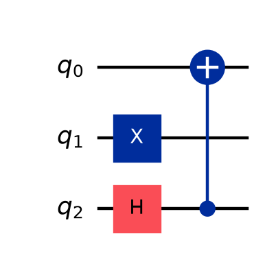
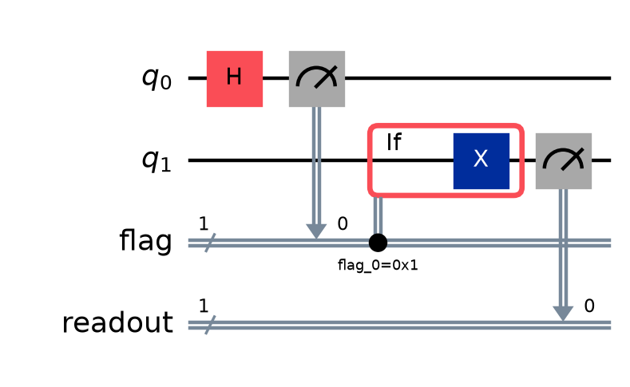

# 3. QuantumCircuitの構築

[← 測定と可視化](02-visualization-measurement.md) | [次: transpile・実行 →](04-transpile-execution.md)

第1章ではゲートによる状態の変化を、第2章では測定と結果の読み方を学びました。この章では、それらを使って、調べたいことに合う回路を自分で組み立てます。必要な量子ビットと測定結果の保存先を決め、小さな回路を組み合わせ、同じ構造を異なるパラメータ値で再利用するところまで進みます。

`QuantumCircuit`は、量子ビットと古典ビットに対して、どの操作をどの順に行うかを記録するオブジェクトです。`qc.h(0)`と書く段階では、実機の量子ビットをその場で操作しているのではなく、回路へHの命令を追加しています。この**回路を構築する時点**と**回路を実行する時点**の区別は、後半の条件分岐でも重要になります。

コードはQiskit 2.5.2を基準とし、各Python例は独立して実行できます。測定例にはローカルの`StatevectorSampler`を使い、ゲートだけの回路は`Statevector`や`Operator`で確認します。実行中の測定結果を使う回路については、回路の構築と、理想的な各分岐の計算を分けて示します。認証や実QPUへの送信は必要ありません。

回路図を保存する例では、Matplotlibとpylatexencも使います。[第2章](02-visualization-measurement.md)と同じ可視化用の環境で実行でき、生成したPNGは実行したディレクトリへ保存します。

<a id="construct-registers"></a>
## qubitとclassical bitを作る

最初に決めるのは、コンストラクタへ渡す数値ではなく、**どの量子系を操作し、どの測定結果を残したいか**です。量子ビットは状態を保持してゲートを作用させる対象であり、古典ビットは測定して得た0または1などを保存する場所です。役割が異なるので、両者を同じ数だけ用意するとは限りません。

### 目的から量子ビット数と保存先を決める

二つの量子ビット$q_0,q_1$を使い、次の処理を行うことにします。

1. $|q_1q_0\rangle=|00\rangle$から始める。
2. $q_0$へXを適用し、$|01\rangle$にする。
3. $q_0$を制御、$q_1$を標的とするCXを適用し、$|11\rangle$にする。
4. $q_1$を測定し、その結果だけを保存する。

この目的には、量子ビットが二つ、古典ビットが一つ必要です。操作に使った量子ビットを、すべて測定して保存する必要はありません。この例の状態の変化は

$$
|00\rangle\xrightarrow{X\text{ on }q_0}|01\rangle
\xrightarrow{\operatorname{CX}(q_0,q_1)}|11\rangle
$$

なので、最後に$q_1$をZ基底で測れば、理想的には必ず1になります。ここでは、既知の計算基底状態から回路を組んでいます。CXが任意の未知の量子状態をコピーする、という意味ではありません。

Qiskitでは、関連するビットを名前付きでまとめる入れ物を**レジスタ**（**register**）と呼びます。`QuantumRegister`は量子ビット、`ClassicalRegister`は古典ビットをまとめます。

```python
from qiskit import QuantumCircuit, QuantumRegister, ClassicalRegister
from qiskit.primitives import StatevectorSampler

q = QuantumRegister(2, "q")
readout = ClassicalRegister(1, "readout")
qc = QuantumCircuit(q, readout)
qc.x(q[0])
qc.cx(q[0], q[1])
qc.measure(q[1], readout[0])

result = StatevectorSampler(seed=7).run([qc], shots=16).result()[0]
print("qubits:", qc.num_qubits)
print("classical bits:", qc.num_clbits)
print("registers:", [(reg.name, len(reg)) for reg in qc.cregs])
print("readout counts:", result.data.readout.get_counts())
```

出力:

```text
qubits: 2
classical bits: 1
registers: [('readout', 1)]
readout counts: {'1': 16}
```

`q[0]`はレジスタ`q`の先頭の量子ビット、`readout[0]`は測定結果の保存先です。`qc.measure(q[1], readout[0])`の引数は、**測る量子ビット、保存する古典ビット**の順です。これも測定の命令を回路へ追加する操作であり、この行の戻り値から測定された0や1を取り出すわけではありません。

`StatevectorSampler`は、この例の各試行を全量子ビットが0の状態から始めます。`shots=16`は、回路全体を準備から測定まで16回試す指定です。最後の出力は「16回とも、保存先`readout`に1が得られた」と読みます。一つの量子系を準備せずに16回続けて測った、という意味ではありません。

結果の`data.readout`という名前は、`ClassicalRegister(1, "readout")`に由来します。レジスタ名は回路図のラベルだけでなく、結果を取り出すときにも使います。全体の結果から`[0]`で最初の回路の結果を選び、`data`からレジスタの記録を選ぶ構造は、[第5章](05-sampler.md#sampler-result-registers)でも扱います。

### 個数だけで作る場合と、レジスタを分ける場合

同じ個数のビットを簡潔に用意するなら、`QuantumCircuit(2, 1)`と書けます。一つ目の整数が量子ビット数、二つ目が古典ビット数です。`QuantumCircuit(4)`なら量子ビットが四つで、古典ビットはありません。「量子ビット二つと古典ビット二つ」にはなりません。

| 設計したいもの | 作り方の例 | 使い分けの理由 |
|---|---|---|
| ゲートだけを調べる2量子ビット回路 | `QuantumCircuit(2)` | 状態ベクトルや行列を計算する段階では、測定結果の保存先を使わない |
| 2量子ビットを操作し、一つの結果を残す | `QuantumCircuit(2, 1)` | 操作対象の個数と、保存する結果の個数を分ける |
| 結果を意味のある名前で取り出す | `QuantumCircuit(q, readout)` | 名前付きの古典レジスタを結果の項目として使う |
| 途中の判定と最後の結果を分けて保存する | `QuantumCircuit(q, flag, readout)` | それぞれの記録の用途を区別する。後半の条件分岐で使う |

最後の二行の`q`、`flag`、`readout`は、あらかじめ作ったレジスタを表しています。例えば二つの古典レジスタへ同じ測定値を自動で複製するわけではなく、測定ごとに保存先を指定します。

また、レジスタで量子ビットをグループ分けしても、それだけで状態がもつれたり、独立になったりはしません。状態を変えるのは、回路に加えた操作です。この段階の量子ビットの番号は回路内の番号であり、実機のどの量子ビットを使うかは[第4章のlayout](04-transpile-execution.md#isa-layout)で扱います。

### 確認問題

3量子ビットを操作し、最後に$q_2$だけを測って一つの結果を残したいとします。量子ビットと古典ビットをそれぞれいくつ用意し、どのように測定を追加しますか。

**解答**: 量子ビット三つ、古典ビット一つを用意します。例えば`QuantumCircuit(3, 1)`で作り、必要なゲートを加えた後に`qc.measure(2, 0)`とします。量子ビットの番号2を、古典ビットの番号2へ保存する必要はありません。保存先は回路内に存在する古典ビット0です。

<a id="measure-mapping"></a>
## 測定mapping

**mapping**は、ここでは量子ビットと測定結果の保存先の対応を意味します。第2章ではbitstringから状態を読みました。この節では、どの結果をどの順に記録するかを、自分で設計します。

### 測る対象と表示する位置を対応させる

3量子ビットのうち$q_2$と$q_0$を測り、二つの古典ビットへ保存するとします。保存先を次のように決めます。

| 測る量子ビット | 保存先 | 古典レジスタのbitstringでの位置 |
|---|---|---|
| $q_2$ | $c_0$ | 右端 |
| $q_0$ | $c_1$ | 左端 |

この対応は`qc.measure([2, 0], [0, 1])`と書けます。二つのリストを同じ位置で対応させるので、`measure(2, 0)`と`measure(0, 1)`を追加したことになります。

結果が左右で異なる例を使って、対応を確かめます。$q_2$だけへXを加えると、測定前の量子状態は$|q_2q_1q_0\rangle=|100\rangle$です。上の対応では$c_0=1,c_1=0$となり、古典レジスタの文字列$c_1c_0$は`"01"`になります。

```python
from qiskit import QuantumCircuit
from qiskit.primitives import StatevectorSampler

qc = QuantumCircuit(3, 2)
qc.x(2)
qc.measure([2, 0], [0, 1])

swapped = QuantumCircuit(3, 2)
swapped.x(2)
swapped.measure([2, 0], [1, 0])

sampler = StatevectorSampler(seed=7)
results = sampler.run([qc, swapped], shots=16).result()
print("q2 -> c0, q0 -> c1:", results[0].data.c.get_counts())
print("q2 -> c1, q0 -> c0:", results[1].data.c.get_counts())
```

出力:

```text
q2 -> c0, q0 -> c1: {'01': 16}
q2 -> c1, q0 -> c0: {'10': 16}
```

後半の回路では保存先を入れ替えただけで、Xを加える量子ビットは同じです。したがって、測定前の量子状態は同じでも、結果の文字列は変わります。文字列の長さが2なのも、回路の量子ビット数が3だからではなく、選んだ古典レジスタが2ビットだからです。測っていない$q_1$の値を、この文字列から読み取ることはできません。

### `measure_all()`が用意する保存先

全量子ビットの測定をまとめて追加するには、`measure_all()`が使えます。ただし、**既定では測定用の古典ビットを新しく追加する**ことに注意します。既に古典ビットを用意していても、自動でその保存先を選ぶとは限りません。

次の例では、量子ビット二つと古典ビット二つを持つ回路から、二種類の測定回路を作ります。

```python
from qiskit import QuantumCircuit
from qiskit.primitives import StatevectorSampler

base = QuantumCircuit(2, 2)
base.x(0)
added = base.measure_all(inplace=False)
reused = base.measure_all(inplace=False, add_bits=False)

print("base registers:", [(reg.name, len(reg)) for reg in base.cregs])
print("added registers:", [(reg.name, len(reg)) for reg in added.cregs])
print("reused registers:", [(reg.name, len(reg)) for reg in reused.cregs])

results = StatevectorSampler(seed=7).run([added, reused], shots=16).result()
print("new meas register:", results[0].data.meas.get_counts())
print("existing c register:", results[1].data.c.get_counts())
```

出力:

```text
base registers: [('c', 2)]
added registers: [('c', 2), ('meas', 2)]
reused registers: [('c', 2)]
new meas register: {'01': 16}
existing c register: {'01': 16}
```

`added`では、既存の`c`とは別に`meas`が追加され、その新しいレジスタへ測定結果を保存します。`reused`では`add_bits=False`を指定し、回路にある古典ビットを使います。この指定では、回路内の量子ビット番号$n$の結果を、回路内の古典ビット番号$n$へ保存するため、十分な数の古典ビットが必要です。任意の並べ替えや一部だけの測定には、先ほどの`measure`を使います。

両方で`inplace=False`としたのは、元の`base`を測定なしで残すためです。`measure_all()`の既定は`inplace=True`で、呼び出した回路そのものに測定を追加します。後で出てくる`compose()`とは既定値が異なるので、「回路を扱うメソッドはすべて同じ」と思い込まないようにします。

### 同じ保存先を再び使うとどうなるか

途中で得た結果と、最後の結果の両方を残したいなら、別の古典ビットへ保存します。同じ古典ビットへ再び測定すると、そのビットの値は新しい結果で上書きされます。最後に取り出すbitstringが、途中の測定履歴すべてを含むわけではありません。

例えば、途中の値で分岐し、最後に同じビットへ測定結果を書き込むこと自体は可能です。分岐にはその時点の値が使われます。ただし、後から途中の判定を結果と照合したいなら、`flag`と`readout`のように保存先を分ける設計が適しています。

### 確認問題

`QuantumCircuit(3, 1)`で作った回路へ、`measure_all(add_bits=False)`を使って全量子ビットを測定できますか。また、$q_2$だけを残す目的なら、どのようにしますか。

**解答**: 全量子ビットを測るには古典ビットが三つ必要なので、この指定では保存先が足りません。$q_2$だけを保存したい場合は、`qc.measure(2, 0)`で足ります。エラーを避けるために保存先を増やす前に、本当に全量子ビットを記録する必要があるかを確認します。

<a id="compose-control"></a>
## compose、append、inverse、control

回路を大きくするたびに、すべてのゲートを最初から書き直す必要はありません。準備、基底変換、測定などのまとまりを部品として作り、使う場所へ組み込めます。この節では、**部品のどのビットを本体のどのビットへ対応させるか**と、**部品をどの順に実行するか**を分けて考えます。

### `compose`: 小さな回路を本体へ組み込む

二つの量子ビットを使う部品を考えます。部品の0番目へHを加え、部品の0番目を制御、1番目を標的としてCXを加えます。これを3量子ビットの回路へ組み込む場合でも、部品の番号と本体の番号が同じである必要はありません。

`base.compose(block, qubits=[2, 0])`なら、対応は次のようになります。

| 部品`block`内の番号 | 本体`base`内の番号 | この例の役割 |
|---|---|---|
| 0 | 2 | Hを加える量子ビット、CXの制御 |
| 1 | 0 | CXの標的 |

`qubits=[2, 0]`は、単に「2番と0番を使う」という集合の指定ではありません。**リストの順序が部品のビットとの対応を決めます**。一方、本体の1番はこの部品では使いません。

```python
import numpy as np
from qiskit import QuantumCircuit
from qiskit.quantum_info import Statevector

block = QuantumCircuit(2, name="pair")
block.h(0)
block.cx(0, 1)
base = QuantumCircuit(3)
base.x(1)
combined = base.compose(block, qubits=[2, 0])

print("base operations:", [item.operation.name for item in base.data])
print("combined operations:", [item.operation.name for item in combined.data])
print("probabilities:", np.round(Statevector.from_instruction(combined).probabilities(), 3))

updated = base.copy()
returned = updated.compose(block, qubits=[2, 0], inplace=True)
print("inplace return:", returned)
print("updated operations:", [item.operation.name for item in updated.data])
figure = combined.draw(output="mpl", fold=-1)
figure.savefig("03-compose-mapping.png", dpi=160, bbox_inches="tight")
print("figure: 03-compose-mapping.png")
```

出力:

```text
base operations: ['x']
combined operations: ['x', 'h', 'cx']
probabilities: [0.  0.  0.5 0.  0.  0.  0.  0.5]
inplace return: None
updated operations: ['x', 'h', 'cx']
figure: 03-compose-mapping.png
```



図では、もともとのXが中央の$q_1$に残り、部品のHとCXの制御点が下の$q_2$、CXの標的が上の$q_0$に置かれています。HとXは異なる量子ビットに作用して順番を入れ替えられるため、図では同じ列に並んでいます。上から並ぶ量子ビットの順序と、`qubits=[2, 0]`による部品の対応を照合できます。

`base.data`は回路に記録された命令の列で、`item.operation.name`は各命令の名前です。最初の二行から、`base`にはXだけが残り、返された`combined`へHとCXが加わったことが分かります。`compose()`は既定では元の回路を変更しません。戻り値を捨てると、合成した回路を使うこともできなくなります。

後半の`copy()`は独立した回路のコピーを作り、`inplace=True`はその`updated`自体を変更します。この場合、`compose()`の戻り値は`None`です。したがって、`updated = updated.compose(..., inplace=True)`のように代入すると、回路を指す変数に`None`を入れてしまいます。

状態の計算でも対応を確かめます。最初のXで$|010\rangle$を準備し、Hを$q_2$へ加えるので

$$
|010\rangle\longmapsto
\frac{|010\rangle+|110\rangle}{\sqrt2}.
$$

続くCXは$q_2$が1の成分で$q_0$を反転するため、最後は

$$
\frac{|010\rangle+|111\rangle}{\sqrt2}
$$

です。確率配列の順序は`000, 001, 010, 011, 100, 101, 110, 111`なので、添字2と7だけが0.5になる出力と一致します。

### ビットの対応と、時間の順序は別に指定する

既定の`base.compose(block)`は、`base`にある操作の後へ`block`の操作を続けます。`front=True`を指定すると、`block`を先に実行する順序で合成します。これは`qubits=`によるビットの対応とは別の指定です。

ゲートだけの二つの回路が同じ量子ビットに作用し、それぞれの行列を$U$と$V$とします。先に$U$、次に$V$を適用する合成行列は$VU$です。したがって、`u_circuit.compose(v_circuit)`に対応する行列は$VU$、`front=True`なら$UV$になります。コードを記述する順序と、状態へ掛ける行列の左右の関係は、[第1章](01-quantum-operations.md#matrix-order)と同じです。

例えば`u_circuit`がH、`v_circuit`がZなら、既定の合成はHの後にZを適用して$|0\rangle$を$|-\rangle$へ移します。`front=True`ではZの後にHを適用し、同じ入力から$|+\rangle$を得ます。回路に含まれるゲートの種類が同じでも、順序が違えば演算は変わります。

部品が測定を含む場合は、古典ビットの対応も必要です。例えば部品の古典ビット0を本体の古典ビット1へ対応させる指定が`clbits=[1]`です。**量子ビットの対応だけを決めても、測定結果の保存先は決まりません**。同じ番号の古典ビットが既定で対応する場合でも、意図した保存先かを確認します。

### `append`: ゲートや命令を一つの部品として追加する

`compose`が回路同士を組み合わせる場面で便利なのに対し、`append`はゲートや命令を指定したビットへ追加するときに使います。`append`は呼び出した回路自体を変更します。その戻り値は、追加した命令を扱うための`InstructionSet`であり、新しい`QuantumCircuit`ではありません。

**ゲート**（**Gate**）はユニタリな演算を表し、より一般的な**命令**（**Instruction**）には測定なども含まれます。ゲートだけで構成され、古典ビットを持たない回路は、`to_gate()`で一つのゲート部品にまとめられます。

```python
import numpy as np
from qiskit import QuantumCircuit
from qiskit.quantum_info import Operator

block = QuantumCircuit(1, name="basis_change")
block.h(0)
block.s(0)
gate = block.to_gate()

qc = QuantumCircuit(3)
qc.append(gate, [2])
expanded = qc.decompose()
expected = QuantumCircuit(3)
expected.h(2)
expected.s(2)

print("stored operations:", [item.operation.name for item in qc.data])
print("expanded operations:", [item.operation.name for item in expanded.data])
print("same matrix:", np.allclose(Operator(qc).data, Operator(expected).data))
```

出力:

```text
stored operations: ['basis_change']
expanded operations: ['h', 's']
same matrix: True
```

`qc.append(gate, [2])`で、部品の唯一の量子ビットを本体の2番へ対応させています。`qc`には名前付きの部品が一つ記録され、`decompose()`でその定義を展開すると、HとSが見えます。`Operator`で本体全体の行列を比べると、最初から2番へH、Sを追加した回路と一致します。

`decompose()`は、この例では部品の中身を見るために使っています。これだけで、特定の実機が使えるゲートや接続へ変換し終えたとは限りません。実行先に合わせた変換は次章の役割です。

測定を含む小さな回路は、`to_gate()`ではなく、`to_instruction()`で命令としてまとめられます。その命令が使う量子ビットと古典ビットを、それぞれ`qargs`と`cargs`で対応させます。

```python
from qiskit import QuantumCircuit
from qiskit.primitives import StatevectorSampler

read_z = QuantumCircuit(1, 1, name="read_z")
read_z.measure(0, 0)
read_instruction = read_z.to_instruction()

qc = QuantumCircuit(2, 2)
qc.x(1)
qc.append(read_instruction, qargs=[1], cargs=[0])
expanded = qc.decompose()

result = StatevectorSampler(seed=7).run([expanded], shots=16).result()[0]
print("instruction qubits:", read_instruction.num_qubits)
print("instruction classical bits:", read_instruction.num_clbits)
print("counts:", result.data.c.get_counts())
```

出力:

```text
instruction qubits: 1
instruction classical bits: 1
counts: {'01': 16}
```

ここでは部品の量子ビット0が本体の$q_1$へ、部品の古典ビット0が本体の$c_0$へ対応します。Xで$q_1$を1にした結果は$c_0$に保存され、使っていない$c_1$はこのローカル実行では0のままなので、文字列は`"01"`です。実行例では、部品を展開して末尾の測定が見える形にしてから`StatevectorSampler`へ渡しています。

### `inverse`: 逆順に、各ゲートの逆を適用する

ゲートだけの回路を一度適用し、その作用を取り消したいとします。逆操作を作るには、**ゲートを並べる順序を逆にし、それぞれを逆ゲートへ置き換える**必要があります。

先にH、次にSを適用する回路の行列は$U=SH$です。その逆行列は

$$
U^{-1}=U^\dagger=(SH)^\dagger=H^\dagger S^\dagger=HS^\dagger.
$$

行列の右側から作用するため、逆回路の実行順序は、先に$S^\dagger$、次にHです。Sの逆を作るだけで、H→$S^\dagger$の順序を保ってしまうと、この逆回路にはなりません。

```python
import numpy as np
from qiskit import QuantumCircuit
from qiskit.quantum_info import Operator, Statevector

forward = QuantumCircuit(1)
forward.h(0)
forward.s(0)
backward = forward.inverse()
round_trip = forward.compose(backward)

initial = Statevector([np.sqrt(3) / 2, 1j / 2])
final = initial.evolve(round_trip)
print("inverse order:", [item.operation.name for item in backward.data])
print("identity matrix:", np.allclose(Operator(round_trip).data, np.eye(2)))
print("original amplitudes restored:", np.allclose(final.data, initial.data))
```

出力:

```text
inverse order: ['sdg', 'h']
identity matrix: True
original amplitudes restored: True
```

`sdg`は$S^\dagger$の命令名です。`inverse()`は逆回路を返し、元の`forward`はそのまま残します。この例は特定の入力だけでなく、合成行列が$I$であることも確認しています。任意の入力を元に戻せるという根拠は$U^\dagger U=I$というユニタリの性質であり、数値比較はその具体例の確認です。

測定や`reset`を含む回路へ、同じ考え方をそのまま適用することはできません。例えば`reset`は、入力が$|0\rangle$でも$|1\rangle$でも$|0\rangle$へ戻すので、出力だけから入力を一意に復元できません。測定でも、失われた重ね合わせの情報を一般に一つの逆ゲートで復元できません。部品化できる命令が、必ず反転可能であるとは限らないのです。

### `control`: 制御ビットを追加したゲートを作る

**制御ゲート**（**controlled gate**）は、制御量子ビットの状態に応じて標的へ演算を行うゲートです。標準的な制御Xは、制御が0の成分では何もせず、1の成分で標的へXを適用します。

`XGate().control(1)`は、Xゲートに制御量子ビットを一つ追加したゲートを作ります。元のXが使う標的は一つなので、できたゲートは合計二つの量子ビットを使います。作っただけでは、まだどの回路にも追加されていません。

```python
import numpy as np
from qiskit import QuantumCircuit
from qiskit.circuit.library import XGate
from qiskit.quantum_info import Operator, Statevector

controlled_x = XGate().control(1)
qc = QuantumCircuit(2)
qc.h(0)
qc.append(controlled_x, [0, 1])

expected = QuantumCircuit(2)
expected.h(0)
expected.cx(0, 1)
print("controlled gate qubits:", controlled_x.num_qubits)
print("same matrix as H then CX:", np.allclose(Operator(qc).data, Operator(expected).data))
print("probabilities:", np.round(Statevector.from_instruction(qc).probabilities(), 3))
```

出力:

```text
controlled gate qubits: 2
same matrix as H then CX: True
probabilities: [0.5 0.  0.  0.5]
```

このゲートの`[0, 1]`は、**制御が$q_0$、標的が$q_1$**という対応です。`[1, 0]`なら制御と標的が逆になります。量子ビットを二つ渡せばどちらの順でもよい、ということではありません。

Hで制御側を重ね合わせにしたため、この回路は$|00\rangle$から$(|00\rangle+|11\rangle)/\sqrt2$を作ります。ゲートの「制御」は、その場で制御ビットを測ってPythonが0か1を選んでいるわけではありません。重ね合わせの各成分に対して、ゲートが線形に作用しています。後半の測定結果による条件分岐と、ここを区別します。

`control()`は、ユニタリなゲートや、それをゲート化できる回路に対して使う操作です。測定を含む一般の`Instruction`に、一律にこのメソッドを使えるわけではありません。また、制御ゲート化する前の全体位相が、制御の0・1の成分の間では相対位相になる場合があります。部品の位相を捨ててよいかは、[第1章の制御操作と位相の説明](01-quantum-operations.md#multi-entanglement)も踏まえて判断します。

### 確認問題

1. `block`が「部品の0番を制御、1番を標的とするCX」だけを持つとします。本体の$q_1$を制御、$q_2$を標的にするには、`qubits=`へ何を渡しますか。
2. Hの後にSを適用する回路の逆を作るとき、Sの後にHを適用すればよいでしょうか。
3. 測定を含む回路を`to_instruction()`で部品化できたら、`control()`も必ず使えるでしょうか。

**解答**:

1. `[1, 2]`です。部品の0番を本体の1番、部品の1番を本体の2番へ対応させます。
2. いいえ。先に$S^\dagger$、次にHです。順序を逆にすることと、各ゲートを逆にすることの両方が必要です。
3. いいえ。部品として記録できることと、ユニタリな制御ゲートを作れることは別の性質です。

<a id="parameters"></a>
## parameterized circuit

同じ形の回路について、回転角だけを変えて結果を比較したい場合があります。そのたびにゲートの並びを書き直す代わりに、角度の場所へ記号を置いた**パラメータ付き回路**（**parameterized circuit**）を作ります。

### 回転角を変えたときの確率を予測する

例として、$|0\rangle$へ$R_y(\theta)$を適用する回路を使います。[第1章の回転ゲート](01-quantum-operations.md#basic-gates)から、

$$
R_y(\theta)|0\rangle
=\cos\frac{\theta}{2}|0\rangle+\sin\frac{\theta}{2}|1\rangle.
$$

Z基底で1が出る確率は、$|1\rangle$の振幅の絶対値二乗なので

$$
p(1)=\sin^2\frac{\theta}{2}
$$

です。したがって、$\theta=0$なら0、$\theta=\pi/2$なら$1/2$、$\theta=\pi$なら1になります。Qiskitの回転角はラジアンで指定し、$\pi$が180度に対応します。

コードでは、この記号を`Parameter`で作ります。記号に値を割り当てることを**束縛**（**binding**）と呼び、回路の`assign_parameters()`を使います。

```python
import numpy as np
from qiskit import QuantumCircuit
from qiskit.circuit import Parameter
from qiskit.quantum_info import Statevector

theta = Parameter("theta")
pqc = QuantumCircuit(1)
pqc.ry(theta, 0)

for angle in (0.0, np.pi / 2, np.pi):
    bound = pqc.assign_parameters({theta: angle})
    state = Statevector.from_instruction(bound)
    print(f"theta/pi={angle / np.pi:.1f}, p(1)={state.probabilities()[1]:.3f}")

print("template parameters:", pqc.num_parameters)
print("last bound parameters:", bound.num_parameters)
```

出力:

```text
theta/pi=0.0, p(1)=0.000
theta/pi=0.5, p(1)=0.500
theta/pi=1.0, p(1)=1.000
template parameters: 1
last bound parameters: 0
```

`{theta: angle}`は、Pythonの辞書で「このパラメータへ、この値を割り当てる」と指定しています。既定の`assign_parameters()`は新しい回路を返すので、元の`pqc`には`theta`が残ります。そのため、一つの雛形から角度の異なる回路を何度でも作れます。

最後の`bound`は$\theta=\pi$を割り当て済みで、未確定のパラメータ数は0です。出力の確率は状態ベクトルから計算した理論値で、有限shotsの測定頻度ではありません。測定回路を付けてサンプリングすれば、$\theta=\pi/2$で毎回必ず半数ずつになるとは限らないことは、第2章で扱ったとおりです。

ここでの`theta`は、実行中の量子状態や測定結果を保持する変数ではありません。`Parameter`は、回路構築時点では数値を未定としておくための記号です。後でPython変数`theta`へ別の値を代入するだけでは、既に回路へ記録した記号の値は変わりません。回路へ値を反映する操作が必要です。

### 複数パラメータでは、ゲートを書いた順と値の順を分ける

次に、先に$R_y(z)$、次に$R_z(a)$を適用する回路を考えます。ここでの$z,a$はパラメータの名前であり、回転軸を表す記号ではありません。コードでは順序の違いが分かるように`z_angle`、`a_angle`と名付けます。

`assign_parameters()`へリストを渡す場合、値は**`circuit.parameters`が示す順序**に割り当てられます。通常の`Parameter`は名前順に並ぶので、この例では`a_angle`、`z_angle`の順です。ゲートに最初に登場した順序とは一致しません。

```python
import numpy as np
from qiskit import QuantumCircuit
from qiskit.circuit import Parameter
from qiskit.quantum_info import Statevector

z_angle = Parameter("z_angle")
a_angle = Parameter("a_angle")
pqc = QuantumCircuit(1)
pqc.ry(z_angle, 0)
pqc.rz(a_angle, 0)

by_name = pqc.assign_parameters({z_angle: np.pi, a_angle: 0.0})
by_list = pqc.assign_parameters([np.pi, 0.0])
correct_list = pqc.assign_parameters([0.0, np.pi])
partial = pqc.assign_parameters({z_angle: np.pi})

print("parameter order:", [p.name for p in pqc.parameters])
for label, circuit in (("dictionary", by_name), ("list", by_list), ("correct list", correct_list)):
    p1 = Statevector.from_instruction(circuit).probabilities()[1]
    print(f"{label}: p(1)={p1:.3f}")
print("remaining after partial binding:", [p.name for p in partial.parameters])
```

出力:

```text
parameter order: ['a_angle', 'z_angle']
dictionary: p(1)=1.000
list: p(1)=0.000
correct list: p(1)=1.000
remaining after partial binding: ['a_angle']
```

辞書の指定では、意図どおり$R_y(\pi)$で$|0\rangle$を$|1\rangle$へ移し、$R_z(0)$は何もしません。ところが`[np.pi, 0.0]`をリストで渡すと、$a=\pi,z=0$となります。$R_y(0)$では$|0\rangle$のままで、その後の$R_z(\pi)$はこの状態に全体位相を付けるだけなので、1の確率は0です。値の並べ方だけで、全く異なる回路を実行してしまいます。

`ParameterVector`で作った要素にはベクトル内の順序も反映されます。名前の見た目から一般的な並びを推測するより、実際の`pqc.parameters`を確認するか、対応を明示する辞書を使うと確実です。

一部だけを束縛することもできます。`partial`では`z_angle`を確定しましたが、`a_angle`は未確定です。この状態を、そのまま数値の状態ベクトルとして計算することはできません。さらに`a_angle`を束縛してから計算します。

### 記号の再利用と、値を決める時点

同じ`Parameter`を複数のゲートに使えば、それらの値を連動させられます。例えば同じ`theta`を使って`ry(theta, 0)`と`rz(2 * theta, 0)`を記録すると、自由に決める記号は一つで、後者の回転角は前者の二倍になります。ゲートが二つあるからパラメータも二つ、とは数えません。

`assign_parameters()`は、数値だけでなく別のパラメータや式への置換にも使えます。例えば新しい`Parameter`として`phi`を用意し、`{theta: phi / 2}`と指定すれば、二つの角度はそれぞれ$\phi/2$と$\phi$で表されます。この置換では、まだ数値を確定したことにはなりません。

本節では、各条件の数値を割り当てた回路を作ってから計算しました。[Sampler](05-sampler.md#sampler-pub)や[Estimator](06-estimator.md#estimator-pub)へ、未束縛の回路とパラメータ値を組にして渡す方法もあります。どちらの方法でも、実際に各条件の回路を実行するときには必要な数値が定まっていなければなりません。実行中に得た測定結果を、`Parameter`が自動で受け取るわけではありません。

### 確認問題

1. $R_y(\theta)|0\rangle$をZ基底で測って、1の確率を$1/4$にしたいとします。$0\leq\theta\leq\pi$の範囲では、どの角度を選びますか。
2. 一つの`theta`を使い、`ry(theta, 0)`と`rz(2 * theta, 0)`を加えました。`theta=\pi/3`を束縛すると、各ゲートの角度はいくつになりますか。
3. 未確定のパラメータが二つある回路で、一つだけ束縛したら、そのまま数値の状態ベクトルを計算できますか。

**解答**:

1. $\theta=\pi/3$です。$\sin^2(\theta/2)=1/4$を満たし、指定範囲では$\theta/2=\pi/6$となります。
2. $R_y$は$\pi/3$、$R_z$は$2\pi/3$です。一つの値の割当てが、同じ記号を含む両方のゲートへ反映されます。
3. できません。残りのパラメータも数値として確定する必要があります。一部束縛は、さらに別の条件を試すための途中段階として使えます。

<a id="dynamic-circuits"></a>
## dynamic circuitとclassical feedforward

ここまでは、実行前にゲートとパラメータを決めていました。次に、**回路の途中で測定し、その結果に応じて後の操作を変える**場合を考えます。こうした仕組みを使う回路を**動的回路**（**dynamic circuit**）、測定結果を後の操作の判断に使う仕組みを**古典的フィードフォワード**（**classical feedforward**）と呼びます。

### 途中の判定と最後の測定結果を分けて残す

$q_0$を$|+\rangle$にして測り、その結果が1なら$q_1$へXを加え、0なら何もしない回路を作ります。最後に$q_1$を測り、途中の判定と照合できるようにします。最初の状態は$|q_1q_0\rangle=|00\rangle$です。

保存先は、途中の測定に`flag`、最後の測定に`readout`を使います。理想的な各分岐は次のとおりです。

| `flag`の値 | その値を得る確率 | $q_0$の測定後状態 | $q_1$への操作 | 最後の`readout` |
|---|---|---|---|---|
| 0 | $1/2$ | $\lvert0\rangle$ | 何もしない | 0 |
| 1 | $1/2$ | $\lvert1\rangle$ | X | 1 |

各試行ではどちらか一方が選ばれます。表の1行目と2行目を、一つの試行で順番に実行するのではありません。

```python
from qiskit import QuantumCircuit, QuantumRegister, ClassicalRegister

q = QuantumRegister(2, "q")
flag = ClassicalRegister(1, "flag")
readout = ClassicalRegister(1, "readout")
dynamic = QuantumCircuit(q, flag, readout)
dynamic.h(q[0])
dynamic.measure(q[0], flag[0])
with dynamic.if_test((flag[0], 1)):
    dynamic.x(q[1])
dynamic.measure(q[1], readout[0])

branch = dynamic.data[2].operation
print("top-level operations:", [item.operation.name for item in dynamic.data])
print("condition uses flag[0]:", branch.condition[0] == flag[0])
print("condition value:", branch.condition[1])
print("true branch:", [item.operation.name for item in branch.blocks[0].data])
figure = dynamic.draw(output="mpl", fold=-1)
figure.savefig("03-feedforward.png", dpi=160, bbox_inches="tight")
print("figure: 03-feedforward.png")
```

出力:

```text
top-level operations: ['h', 'measure', 'if_else', 'measure']
condition uses flag[0]: True
condition value: 1
true branch: ['x']
figure: 03-feedforward.png
```



最初の測定は`flag`へ保存され、中央の条件付きブロック内に$q_1$へのXがあります。条件のラベルにある`0x1`は、16進数で1を表します。最後の測定は別の`readout`へ保存されます。図でも、条件の参照先と二つの測定の保存先をたどれます。

`if_test((flag[0], 1))`は、回路実行中に`flag[0]`が1なら、囲んだブロックを実行する条件を記録します。出力の`if_else`は、その条件分岐を表す命令名です。この例にはelse側の操作を指定していませんが、内部では同じ種類の命令が使われます。

`branch.blocks[0]`は条件が成り立つ場合の回路ブロックです。出力から、Xが無条件の命令として並んでいるのではなく、このブロックの中に入っていることを確認できます。ここで表示しているのは**回路に記録された構造**であり、測定結果のサンプルではありません。

### Pythonの`if`と、回路に記録した条件分岐

Pythonで普通の`if`を書くと、そのPythonコードを実行して回路を組み立てている時点で条件を評価します。その時点では、これから実機やシミュレータで行う測定の結果はまだ得られていません。`flag[0]`も、その場所に将来保存する値をPythonが今読み出せるような整数ではなく、回路内の古典ビットを指すオブジェクトです。

一方、`if_test`では「この古典ビットの値が1なら」という条件そのものを回路へ残します。`with`の中のPythonコードは構築時に実行され、Xの命令を条件付きブロックへ追加します。そのXゲートを実際に行うかは、後で回路を実行する際に判断されます。

| 時点 | 上の例で行うこと |
|---|---|
| Pythonでの回路構築時 | H、測定、条件、条件付きのX、最後の測定を回路へ記録する |
| 各試行の実行中 | 最初の測定結果を`flag`へ保存し、その値でXを行うか決める |
| 実行後 | 保存された`flag`と`readout`の結果を取り出して分析する |

Pythonで角度を変える`for`を書いて複数の回路を作ることや、shotsを変えることは、この実行中のフィードフォワードとは異なります。パラメータ付き回路も、測定結果を使う分岐を自動で含むわけではありません。

### 各分岐の結果をローカルで計算する

上の回路の理想的な振る舞いは、測定の各分岐を計算することでも確かめられます。最初の$q_0$は$|+\rangle$なので、測定結果0・1の確率は各$1/2$です。結果が$b$なら測定後の$q_0$は$|b\rangle$です。その条件付き状態を作り、$b=1$のときだけ$q_1$へXを適用します。

```python
import numpy as np
from qiskit import QuantumCircuit
from qiskit.quantum_info import Statevector

plus = Statevector.from_label("+")
for bit in (0, 1):
    probability = plus.probabilities()[bit]
    q0_after = Statevector.from_label(str(bit))
    branch_state = Statevector.from_label("0").tensor(q0_after)
    correction = QuantumCircuit(2)
    if bit == 1:
        correction.x(1)
    final = branch_state.evolve(correction)
    q1_probabilities = np.round(final.probabilities([1]), 3)
    print(f"flag={bit}, probability={probability:.1f}, q1 probabilities={q1_probabilities}")
```

出力:

```text
flag=0, probability=0.5, q1 probabilities=[1. 0.]
flag=1, probability=0.5, q1 probabilities=[0. 1.]
```

`Statevector.from_label("0").tensor(q0_after)`は、順序を$|q_1q_0\rangle$として、$q_1$が0、$q_0$が測定結果に対応する状態を作っています。最後の配列は$q_1$の0・1の確率です。先ほどの表と同じく、`flag`が0なら`readout`は0、1なら1になります。

このコード中のPythonの`if`は、既に0または1と決めて列挙した`bit`を使っています。将来の測定結果をPythonで先取りしているのではありません。また、この計算は、動的回路を対応backendで実行した結果ではなく、**各測定結果を仮定した後の理想状態の計算**です。

制御Xで作ったBell状態もZ測定では00・11を各半分で与えますが、ここでは途中に測定があります。`flag`の値を区別せず二つの分岐を平均すれば、量子系は00と11の古典的な混合として扱われます。Bell状態の二成分の間にある位相の情報を、同じように保っているわけではありません。[第2章の密度行列の説明](02-visualization-measurement.md#state-plots)のように、測定分布の一致と量子状態の一致を分けて考えます。

### 条件が成り立たない場合にも、操作を指定する

1の場合は$q_1$へXを加え、0の場合は$q_1$へHを加える、といった二通りの操作を指定することもできます。`if_test`が用意するelse側の記述を使います。

```python
from qiskit import QuantumCircuit

qc = QuantumCircuit(2, 2)
qc.h(0)
qc.measure(0, 0)
with qc.if_test((qc.clbits[0], 1)) as otherwise:
    qc.x(1)
with otherwise:
    qc.h(1)
qc.measure(1, 1)

branch = qc.data[2].operation
print("number of branch blocks:", len(branch.blocks))
print("if branch:", [item.operation.name for item in branch.blocks[0].data])
print("else branch:", [item.operation.name for item in branch.blocks[1].data])
```

出力:

```text
number of branch blocks: 2
if branch: ['x']
else branch: ['h']
```

`otherwise`は測定結果ではなく、else側の命令を記録するためのオブジェクトです。一つの試行では、条件に応じてXかHの片方だけを$q_1$へ適用します。

この例の理想的な最終結果を、$c_1c_0$の順で考えます。$c_0=1$になる確率は$1/2$で、その場合はXによって$c_1=1$も確定し、`"11"`を確率$1/2$で得ます。$c_0=0$の場合はHにより$q_1$が$|+\rangle$となるので、`"00"`と`"10"`がそれぞれ$(1/2)\times(1/2)=1/4$で生じます。二つの分岐があるから、すべてのbitstringが同確率になるわけではありません。

### 繰返しも、構築時と実行時を分ける

条件分岐や繰返しによって処理の進み方を指定する仕組みを、**制御フロー**（**control flow**）と呼びます。Qiskitでは`if_test`のほか、値に応じた多方向の分岐や、繰返しを回路内に表現できます。

まず、同じXを三回行う例で、Pythonのループと回路のループの記録の違いを見ます。

```python
from qiskit import QuantumCircuit

unrolled = QuantumCircuit(1)
for _ in range(3):
    unrolled.x(0)

looped = QuantumCircuit(1)
with looped.for_loop(range(3)):
    looped.x(0)

loop_operation = looped.data[0].operation
print("Python loop records:", [item.operation.name for item in unrolled.data])
print("circuit loop records:", [item.operation.name for item in looped.data])
print("iterations:", list(loop_operation.params[0]))
print("loop body:", [item.operation.name for item in loop_operation.blocks[0].data])
```

出力:

```text
Python loop records: ['x', 'x', 'x']
circuit loop records: ['for_loop']
iterations: [0, 1, 2]
loop body: ['x']
```

前半はPythonが構築時に三周し、Xを三つ追加します。後半は、Xを一回行う本体と、三回繰り返す指定を一つの回路内ループとして記録します。理想的な演算としては、どちらも$X^3=X$です。ただし、記録の形と、実行先に必要な対応が異なります。この固定回数の例自体は、測定結果で処理を変えてはいません。

| 決めたい処理 | 回路内の仕組み | 条件や値の役割 |
|---|---|---|
| 条件が成立するかで操作を分ける | `if_test` | 古典ビットや式の条件が真なら一方のブロックを行う |
| レジスタの値などで複数の操作から選ぶ | `switch` | 対象の値に対応するcaseを選ぶ |
| 指定した値の列を使って繰り返す | `for_loop` | 列の各値に対して本体を実行する |
| 条件が成立する間、繰り返す | `while_loop` | 条件を確認しながら本体を繰り返す |

例えば「測定値0・1・2・3で四通りの補正を選ぶ」なら`switch`、「測定値が目的の条件を満たすまで処理を繰り返す」なら`while_loop`を検討します。後者では本体の中で条件に関わる値がどう変わるかを考え、いつ終了するかも設計する必要があります。構文がSDKに存在することと、利用する実機でその処理を実行できることは、次の節で分けて確認します。

### 確認問題

1. 最初の動的回路で、`flag`が1のときに加えていたXをZへ変えます。$q_1$は最初に$|0\rangle$ですが、最後の`readout`はどうなりますか。
2. 途中の測定と最後の測定を同じ古典ビットへ保存した場合、最後に取り出すそのビットだけで、途中の結果を一般に復元できますか。
3. `with qc.if_test(...)`の中のPythonコードは、測定結果が分かるまで実行を待つのでしょうか。

**解答**:

1. 両方の分岐で0になります。`flag=0`では何もせず、`flag=1`でも$Z|0\rangle=|0\rangle$です。条件付きゲートの名前を変えたら、各分岐の入力状態へそのゲートを作用させて考えます。
2. 一般にはできません。最後の測定で上書きされるためです。途中の判定も結果として残したいなら、保存先を分けます。
3. 待ちません。Pythonは構築時に条件付きの回路ブロックを記録します。そのブロックのゲートを実際に行うかが、回路実行中に判断されます。

<a id="sdk-hardware-boundary"></a>
## SDK表現とhardware supportの境界

回路を作れた後は、**何を確認できたか**を整理します。Pythonで例外が出ずに`QuantumCircuit`を作れたことだけでは、想定した状態になることや、実機で実行できることまで確認したとはいえません。

### 回路の構造、理想的な動作、実行先の対応を順に確認する

| 確認する対象 | この章での方法、または次の作業 | 確認できること |
|---|---|---|
| 回路に記録した操作とビットの対応 | `data`、レジスタ、回路図を見る | 操作の順序、測定先、条件付きブロックが意図した形か |
| ゲートだけの回路の作用 | `Statevector`や`Operator`で計算する | 特定の入力状態の変化や、全体の演算行列が意図したものか |
| 末尾の測定から得るサンプル | `StatevectorSampler`で試す | 理想的な状態からのサンプリングと、古典レジスタごとの結果 |
| 途中測定後の条件付き操作 | 各分岐を計算し、必要なら対応シミュレータで実行する | 分岐の確率と状態、条件の使い方が意図に合うか |
| 特定の実機での実行可否 | backend、変換後の回路、サービスの条件を調べる | 実行先が必要な操作を扱えるか |

Qiskit 2.5.2の`StatevectorSampler`は、途中測定や回路内の制御フローを実行するための実装ではありません。この章の動的回路を作った後、そのまま同じSamplerへ渡せばよいとは判断できません。一方、そこで実行できないからといって、SDKで表現した回路が直ちに無効ということでもありません。用いた実行手段の対応範囲を確認します。

実行先となる装置やシミュレータをQiskitでは**backend**と呼びます。その実行先が扱う命令や量子ビットの対応などを表す情報が**Target**です。例えば条件分岐を表す命令への対応が必要になりますが、操作名が載っていることだけで、任意の構文、条件式、組合せを実行できるとまでは判断しません。

[第4章](04-transpile-execution.md#transpile-preset)では、回路を実行先のゲートや接続の制約へ合わせる変換を扱います。IBM Quantumの実機で動的回路を使う場合は、[動的回路の実行ガイド](https://quantum.cloud.ibm.com/docs/en/guides/execute-dynamic-circuits)で、利用する構文や実行先の条件も確認します。Runtimeの誤差抑制などを併用する場合は、[Samplerの機能の組合せ条件](https://quantum.cloud.ibm.com/docs/en/guides/sampler-options#feature-compatibility)も関係します。これらの実行条件を、SDKのバージョンだけで固定された性質として扱わないようにします。

この実行ガイドでは、サービスが対応する制御フローを`if`として説明しています。SDKに`switch`や`for_loop`、`while_loop`があることを根拠に、それらを同じ条件で実機へ送れるとは判断しません。ガイドは更新されるため、使用時には対応範囲を確認します。

同じ分岐や繰返しをテキストで表す例は、[第8章のOpenQASM](08-openqasm3.md#qasm-semantics)で扱います。回路の構築、テキストへの出力、読込み、実機実行という各段階の対応も区別して確かめます。

### 回路を組み立てた後の確認手順

1. 入力状態と、最終的に知りたい量を言葉で説明する。
2. 操作に必要な量子ビットと、残したい測定結果の保存先を決める。
3. 部品を使う場合は、量子・古典ビットの対応と、操作の時間順序を確認する。
4. 未確定のパラメータと、実行中に使う古典的な条件を分ける。
5. 状態の計算、サンプリング、各分岐の計算のうち、目的に合う方法で確かめる。
6. 実機を使う場合は、実行先への変換と機能の対応を確認する。

構築時の判断をこの順に説明できれば、ゲートの追加方法を覚えるだけでなく、測定対象や保存先、部品の配置が変わった回路にも対応できます。

## 章末チェック

1. 4量子ビットのうち$q_3$と$q_1$だけを保存します。`q3 -> c0`、`q1 -> c1`とすると、最小の量子・古典ビット数と測定の指定はどうなりますか。測定前が$|q_3q_2q_1q_0\rangle=|1000\rangle$なら、得る文字列は何ですか。
2. 部品`read_z`が量子ビット一つと古典ビット一つを持ち、部品の0番を測定して部品の古典ビット0へ保存します。これを本体の$q_2$へ適用して$c_1$へ残す、`compose`の対応を示してください。
3. `base`がH、`other`がSを持つ1量子ビット回路です。既定の`base.compose(other)`と、`front=True`の場合の行列をそれぞれ書いてください。
4. $R_y(\theta)$を、$\theta=\pi/3$と$2\pi/3$で比較します。$|0\rangle$から始めるとき、Z測定で1を得る確率はそれぞれいくつですか。
5. 二通りの操作を持つ動的回路の例では、`flag=1`なら$q_1$へX、0ならHを加えました。なぜ最後の`"01"`は、理想的には生じないのでしょうか。文字列は$c_1c_0$です。
6. `with qc.for_loop(range(3))`を使った回路を構築できました。これで、どのbackendでも実行できると分かったことになりますか。

**解答と理由**:

1. `QuantumCircuit(4, 2)`で作り、`qc.measure([3, 1], [0, 1])`とします。$q_3=1,q_1=0$なので、$c_0=1,c_1=0$となり、文字列は`"01"`です。測定しない二つの量子ビットについて、保存先を追加する必要はありません。
2. `base.compose(read_z, qubits=[2], clbits=[1])`です。既定では新しい回路を返すため、戻り値を使います。本体を変更したい場合は`inplace=True`を指定します。
3. 既定ではHの後にSなので$SH$、`front=True`ではSの後にHなので$HS$です。ゲートを適用する時間順序と、行列の積の順序を対応させます。
4. $\sin^2(\pi/6)=1/4$と、$\sin^2(\pi/3)=3/4$です。入力に適用する回路を変える前に、この違いを予測できます。
5. `"01"`は、途中の$c_0$が1、最後の$c_1$が0を意味します。しかし$c_0=1$なら、初期状態$|0\rangle$の$q_1$へXを加えるので、$c_1=1$が確定します。したがって、この組合せは生じません。
6. なりません。確認したのはSDKでその制御フローを表現できることです。実行先がその操作を扱えるか、対応する変換が可能かを別に確認します。

公式参照: [回路の構築](https://quantum.cloud.ibm.com/docs/en/guides/construct-circuits)、[QuantumCircuit API](https://quantum.cloud.ibm.com/docs/en/api/qiskit/qiskit.circuit.QuantumCircuit)、[Gate](https://quantum.cloud.ibm.com/docs/en/api/qiskit/qiskit.circuit.Gate)、[Parameter](https://quantum.cloud.ibm.com/docs/en/api/qiskit/qiskit.circuit.Parameter)、[古典的フィードフォワードと制御フロー](https://quantum.cloud.ibm.com/docs/en/guides/classical-feedforward-and-control-flow)、[StatevectorSampler](https://quantum.cloud.ibm.com/docs/en/api/qiskit/qiskit.primitives.StatevectorSampler)

参照資料の版とローカルで検証した範囲は、[第3章の改稿・検証記録](../validation/chapter3-revision-2026-09-15.md)にまとめています。

[← 測定と可視化](02-visualization-measurement.md) | [次: transpile・実行 →](04-transpile-execution.md)
