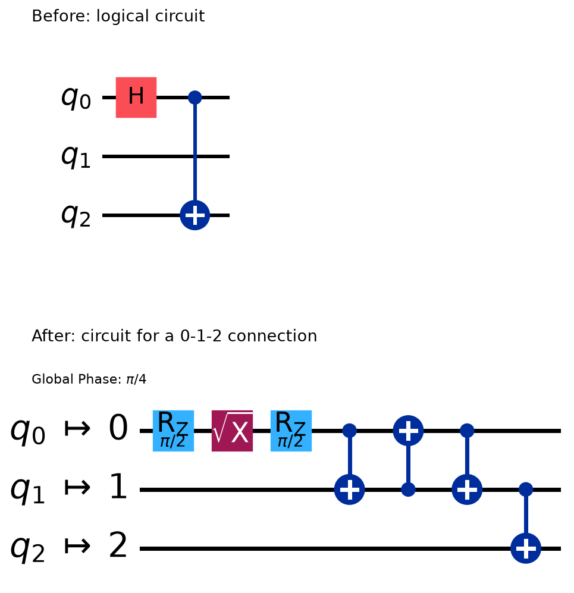
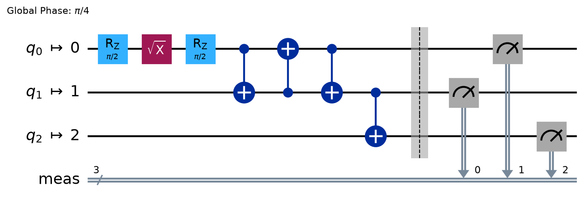

# 4. Transpile、ISA、IBM Quantum実行方式

[← 回路の構築](03-circuit-construction.md) | [次: Sampler V2 →](05-sampler.md)

第3章では、量子ビットに加える操作と測定先を決め、回路を組み立てました。しかし、回路として正しく記述できることと、そのまま実機で実行できることは別です。実機には、利用できるゲートや、2量子ビットゲートを実行できる量子ビットの組合せに制約があります。

この章では、まず実行先の制約に合わせて回路を変換し、変換後も意図した量子ビットを測っていることを確かめます。その後、回路を送る方法と結果を受け取る流れへ進みます。読み終えたときの目標は、次の三つです。

- 元の回路と変換後の回路を見比べ、ゲートや配置が変わった理由を説明できる。
- 測定先やobservableにも量子ビットの配置を反映する必要性を説明できる。
- 一回の依頼、結果を使う反復、独立した複数の依頼に応じて実行方法を選べる。

掲載コードの検証対象はQiskit 2.5.2、qiskit-ibm-runtime 0.49.0です。出力付きの例は認証なしでローカル実行できます。Runtimeを使う例は、実行先を引数で受け取る関数として示します。関数の定義だけではQPUにジョブを送信しません。利用プラン、待ち行列、実行時間の上限などはサービス側の条件でもあり、パッケージのバージョンだけでは決まりません。

<a id="transpile-preset"></a>
## preset pass manager

### なぜ回路を変換するのか

例えば、`qc.h(0)`に続けて`qc.cx(0, 2)`と書くと、「量子ビット0へHを適用し、0を制御、2を標的とするCXを適用する」という回路を表せます。ここで量子ビット番号は、プログラム内で対象を区別するための番号です。実機のどの量子ビットに割り当てるかは、まだ決めていません。

一方、実行先には次のような条件があります。

| 条件 | 回路への影響 |
|---|---|
| 利用できるゲート | Hを直接使えなければ、対応する別のゲート列へ分解する |
| 量子ビット間の接続 | CXを直接実行できない組合せには、配置の変更や状態の交換が必要になる |
| 命令の向き・パラメータなど | 接続があっても、制御と標的の向きや命令ごとの条件を満たす必要がある |
| 時間に関する条件 | 実行時間の調整が必要な場合は、命令の所要時間やタイミングの制約も扱う |

このような条件に合わせて、元の回路が表す計算を保ちながら回路を変換する処理が**トランスパイル**（**transpile**）です。**pass manager**は、回路を調べる処理や変換する処理を組み合わせて実行する仕組みです。`generate_preset_pass_manager`を使うと、標準的な処理の組合せを生成できます。

**backend**は実行先を表すオブジェクトで、その`target`には、対応する命令と、それぞれの命令を適用できる量子ビットなどの情報が入っています。変換先のゲートの集合を**basis gates**と呼びます。これは回路を表すための基本ゲートの集合であり、第2章の「計算基底」「X基底」のような、状態や測定を表す基底とは役割が異なります。

### 3量子ビットの実行先をローカルに作る

実機のアカウントがなくても、制約を持つbackendを作って変換を試せます。次の`GenericBackendV2`は、説明用に構成を指定したbackendです。特定のIBM実機の構成や性能を再現する例ではありません。

```python
from qiskit.providers.fake_provider import GenericBackendV2

backend = GenericBackendV2(
    num_qubits=3,
    basis_gates=["rz", "sx", "x", "cx"],
    coupling_map=[[0, 1], [1, 0], [1, 2], [2, 1]],
    seed=7,
    noise_info=False,
)

print("qubits:", backend.num_qubits)
print("connections:", sorted(backend.coupling_map.get_edges()))
print("H on 0:", backend.target.instruction_supported("h", (0,)))
print("CX on 0, 2:", backend.target.instruction_supported("cx", (0, 2)))
print("CX on 0, 1:", backend.target.instruction_supported("cx", (0, 1)))
```

出力:

```text
qubits: 3
connections: [(0, 1), (1, 0), (1, 2), (2, 1)]
H on 0: False
CX on 0, 2: False
CX on 0, 1: True
```

**coupling map**は、2量子ビットゲートに利用する接続を表します。この例では`0 ↔ 1 ↔ 2`という並びです。`[0, 1]`と`[1, 0]`を両方指定したので、隣り合う量子ビット間のCXを両方向に実行できます。0と2には直接の接続がありません。

指定したゲートのうち、`rz`はZ軸回りの回転、`x`と`cx`は既に扱ったXとCXです。`sx`は、2回適用するとXになるゲートで、$\mathrm{SX}\,\mathrm{SX}=X$を満たします。ここで$\mathrm{SX}$は一つのゲートの名前で、SとXの積ではありません。Hを直接利用できなくても、これらのゲートを組み合わせてHと同じ操作を表せます。

`noise_info=False`は、この教材用backendにランダムな誤差情報を付けないための指定です。以降では、まずゲートと接続への適合を調べます。

### preset pass managerで変換し、変わった箇所を読む

次の例はbackendの生成から書いているため、単独で実行できます。`initial_layout=[0, 1, 2]`で最初の配置を固定し、`routing_method="basic"`で状態を移す手順を追いやすくしています。これらは説明のための指定であり、常に最良の設定という意味ではありません。

```python
import matplotlib.pyplot as plt
from qiskit import QuantumCircuit
from qiskit.providers.fake_provider import GenericBackendV2
from qiskit.transpiler import generate_preset_pass_manager

backend = GenericBackendV2(
    3, basis_gates=["rz", "sx", "x", "cx"],
    coupling_map=[[0, 1], [1, 0], [1, 2], [2, 1]],
    seed=7, noise_info=False,
)
qc = QuantumCircuit(3)
qc.h(0)
qc.cx(0, 2)

pm = generate_preset_pass_manager(
    backend=backend,
    optimization_level=0,
    initial_layout=[0, 1, 2],
    routing_method="basic",
    seed_transpiler=7,
)
isa_circuit = pm.run(qc)

print("before:", dict(sorted(qc.count_ops().items())))
print("after:", dict(sorted(isa_circuit.count_ops().items())))

fig = plt.figure(figsize=(12, 7))
before_ax = fig.add_axes([0.08, 0.59, 0.27, 0.30])
after_ax = fig.add_axes([0.08, 0.09, 0.84, 0.30])
qc.draw("mpl", ax=before_ax, fold=-1)
isa_circuit.draw("mpl", ax=after_ax, fold=-1)
for axis in (before_ax, after_ax):
    axis.set_anchor("W")
    for label in axis.texts:
        label.set_clip_on(False)
before_ax.set_title("Before: logical circuit", loc="left", pad=22)
after_ax.set_title("After: circuit for a 0-1-2 connection", loc="left", pad=32)
fig.savefig("04-transpile-before-after.png", dpi=160, bbox_inches="tight")
plt.close(fig)
```

出力:

```text
before: {'cx': 1, 'h': 1}
after: {'cx': 4, 'rz': 2, 'sx': 1}
```



上段が元の回路、下段が変換後の回路です。下段の左端にある$q_0\mapsto0$などのラベルは、元の量子ビットの**最初の割当て**を表します。回路を進む途中でも、その状態が同じ行にとどまるという意味ではありません。下段のゲートが増えた理由を二つに分けて読みます。

まず、Hは時間順に`Rz(π/2)`、`SX`、`Rz(π/2)`へ置き換わっています。図の$\sqrt{X}$が`SX`です。この分解は、次の行列を掛けて確かめられます。

$$
\mathrm{SX}=\frac12
\begin{pmatrix}1+i&1-i\\1-i&1+i\end{pmatrix},
\qquad
R_z(\pi/2)=
\begin{pmatrix}e^{-i\pi/4}&0\\0&e^{i\pi/4}\end{pmatrix}
$$

両側から対角行列を掛けると、

$$
R_z(\pi/2)\,\mathrm{SX}\,R_z(\pi/2)
=\frac{1-i}{2}\begin{pmatrix}1&1\\1&-1\end{pmatrix}
=e^{-i\pi/4}H
$$

です。したがって、行列を右から作用させる書き方では、

$$
H=e^{i\pi/4}R_z(\pi/2)\,\mathrm{SX}\,R_z(\pi/2)
$$

という行列の等式です。図にある`Global Phase: π/4`は、右辺の係数$e^{i\pi/4}$に対応します。全体位相の意味は[第1章の位相](01-quantum-operations.md#phase)で扱いました。

次に、物理量子ビット0と1の間にCXが3個並んでいます。この3個は、両者が保持する量子状態を交換する**SWAP**を表します。時間順では、

$$
CX_{0\to1},\quad CX_{1\to0},\quad CX_{0\to1}
$$

です。この3個のCXだけを取り出した2量子ビット回路で確かめましょう。例えば$|q_1q_0\rangle=|01\rangle$へ適用すると、$|01\rangle\to|11\rangle\to|10\rangle\to|10\rangle$と変化し、最初の0と1が交換されます。他の計算基底状態にも適用すると、次の対応になります。

| 入力 $\lvert q_1q_0\rangle$ | 3個のCXの後 |
|---|---|
| $\lvert00\rangle$ | $\lvert00\rangle$ |
| $\lvert01\rangle$ | $\lvert10\rangle$ |
| $\lvert10\rangle$ | $\lvert01\rangle$ |
| $\lvert11\rangle$ | $\lvert11\rangle$ |

任意の2量子ビット状態はこの4状態の線形結合で表せ、ゲートの作用は線形なので、この交換は重ね合わせにも適用されます。最初に0が持っていた状態を1へ移すことで、最後のCXを、接続のある1と2の間で実行できるようになります。物理的な装置を移動するのではなく、ゲートによって状態を交換しています。

もとのCXが1個、SWAPを表すCXが3個なので、変換後は合計4個です。回路を実行可能にするためにゲートが増えることもあります。「transpileは必ず回路を短くする処理」と考えないことが大切です。

### 変換処理の各段階と最適化の強さ

標準のpass managerは、主に次の段階で処理を組み立てます。実際に使われる処理は、回路、backend、指定した方法によって変わります。

| 段階 | この章の例で考える役割 |
|---|---|
| `init` | 回路を後続の変換で扱える形に整える |
| `layout` | 元の量子ビットを、どの物理量子ビットへ割り当てるか決める |
| `routing` | 接続に合わせ、必要ならSWAPなどで状態を移す |
| `translation` | HやSWAPなどを、実行先が対応するゲートへ書き換える |
| `optimization` | 同じ計算を保ちながら、冗長なゲートなどを減らす |
| `scheduling` | 指定に応じて、命令を実行するタイミングを調整する |

`scheduling`という段階があることと、すべての例で各命令の開始時刻を決めることは同じではありません。上の例では`scheduling_method`を指定していません。

`optimization_level`は0〜3で指定します。高い値では一般に、より多くの最適化や探索を試みます。ただし、レベルを上げるたびにゲート数やdepthが必ず減るわけではありません。

次の回路は、Xを2回、Hを2回、CXを2回ずつ続けています。それぞれの組は恒等操作なので、回路全体も恒等操作です。最適化でその冗長さが取り除かれるかを調べます。

```python
from qiskit import QuantumCircuit
from qiskit.providers.fake_provider import GenericBackendV2
from qiskit.transpiler import generate_preset_pass_manager

backend = GenericBackendV2(
    3, basis_gates=["rz", "sx", "x", "cx"],
    coupling_map=[[0, 1], [1, 0], [1, 2], [2, 1]],
    seed=7, noise_info=False,
)
qc = QuantumCircuit(3)
qc.x(0)
qc.x(0)
qc.h(1)
qc.h(1)
qc.cx(0, 1)
qc.cx(0, 1)

for level in range(4):
    pm = generate_preset_pass_manager(
        backend=backend, optimization_level=level,
        initial_layout=[0, 1, 2], seed_transpiler=7,
    )
    compiled = pm.run(qc)
    print(level, compiled.size(), compiled.depth())
```

出力:

```text
0 10 8
1 0 0
2 0 0
3 0 0
```

各行は、レベル、命令数、depthの順です。この例ではレベル1で既に命令がなくなり、2や3へ上げても改善の余地がありません。レベル0でも実行先に合わせた分解は行われるので、Hの分解によって元の6個より命令が増えています。

**depth**は、同じ量子ビットなどの依存関係を考慮した回路の段数です。異なる命令の所要時間は同じとは限らないので、depthをそのまま実行時間と読み替えることはできません。実務では2量子ビットゲートの数、配置された量子ビットの誤差情報、変換にかかる時間なども比較します。

`seed_transpiler`は、乱数を使う探索の再現を助けます。同じseedでも、Qiskitのバージョン、backendの情報、設定が変われば、同じ回路になる保証はありません。

<a id="isa-layout"></a>
## ISA circuitとlayout

### 論理量子ビットと物理量子ビットを区別する

**ISA**は**Instruction Set Architecture**の略です。本章でいう**ISA circuit**は、実行先の`target`が対応する命令と量子ビットの組合せなどに適合した回路を指します。IBMのQPUへRuntime primitivesで送る回路には、この適合が必要です。さらに、回路の大きさや利用機能など、サービス側の実行条件も満たす必要があります。

元の回路で操作対象として使う量子ビットを**論理量子ビット**、実行先で状態を保持する量子ビットを**物理量子ビット**と呼んで区別します。ここでの「論理」は回路上の役割を表し、量子誤り訂正で符号化した論理量子ビットを意味していません。

これからの説明では、元の回路の量子ビットを$q_0,q_1,q_2$、物理量子ビットを$p_0,p_1,p_2$と書きます。両者の対応を表す情報が**layout**です。

先ほどの例では、最初は$q_0$を$p_0$へ割り当てました。その後のSWAPにより、$q_0$の状態は$p_1$へ移っています。したがって、最初の配置と最後の配置を分けて読む必要があります。

| 元の回路の量子ビット | 最初に割り当てた物理量子ビット | routing後の物理量子ビット |
|---|---|---|
| $q_0$ | $p_0$ | $p_1$ |
| $q_1$ | $p_1$ | $p_0$ |
| $q_2$ | $p_2$ | $p_2$ |

次の例で、この対応と状態の表記を照合します。

```python
import numpy as np
from qiskit import QuantumCircuit
from qiskit.providers.fake_provider import GenericBackendV2
from qiskit.quantum_info import Operator, Statevector
from qiskit.transpiler import generate_preset_pass_manager

backend = GenericBackendV2(
    3, basis_gates=["rz", "sx", "x", "cx"],
    coupling_map=[[0, 1], [1, 0], [1, 2], [2, 1]],
    seed=7, noise_info=False,
)
qc = QuantumCircuit(3)
qc.h(0)
qc.cx(0, 2)
pm = generate_preset_pass_manager(
    backend=backend, optimization_level=0,
    initial_layout=[0, 1, 2], routing_method="basic", seed_transpiler=7,
)
isa_circuit = pm.run(qc)

print("initial:", isa_circuit.layout.initial_index_layout())
print("final:", isa_circuit.layout.final_index_layout())
for name, circuit in [("logical", qc), ("physical", isa_circuit)]:
    probabilities = Statevector.from_instruction(circuit).probabilities_dict()
    print(name, {str(key): round(float(p), 3)
                 for key, p in probabilities.items() if p > 1e-12})
print("same operator after accounting for layout:", np.allclose(
    Operator.from_circuit(isa_circuit).data, Operator(qc).data,
))
```

出力:

```text
initial: [0, 1, 2]
final: [1, 0, 2]
logical {'000': 0.5, '101': 0.5}
physical {'000': 0.5, '110': 0.5}
same operator after accounting for layout: True
```

`final_index_layout()`の戻り値は、「元の回路の量子ビット番号 → 最後の物理量子ビット番号」という対応です。先頭の`1`は$q_0\to p_1$を表します。`initial_index_layout()`は最初の割当てを調べるために使います。追加された補助量子ビットを含めるかどうかにも設定があり、この例では元と変換後の幅が同じなので、その違いは現れません。

名前が似ている`layout.final_layout`属性は、routingによる入れ替えを表す情報です。それだけを元の回路からの最終的な対応と読み替えず、最初の割当ても含めた対応を知りたいときは`final_index_layout()`を使います。

元の回路の状態は、$\lvert q_2q_1q_0\rangle$の順で

$$
\frac{|000\rangle+|101\rangle}{\sqrt{2}}
$$

です。変換後は$q_0$と$q_1$の位置が入れ替わり、$\lvert p_2p_1p_0\rangle$の順では

$$
\frac{|000\rangle+|110\rangle}{\sqrt{2}}
$$

になります。状態ベクトルの成分を物理量子ビットの順番のまま比較すれば、異なる配列になります。

`Operator.from_circuit`はlayoutを考慮して回路の演算子を求めます。この例では、その結果が元の回路の行列と数値誤差の範囲で一致します。これは$|000\rangle$を入力した一例の確認より強く、この測定を含まない回路について、すべての入力への作用が一致することの確認です。大きな回路では行列を作る計算量が急増するため、ここでは3量子ビットの教材例として使っています。

### 測定先も配置に合わせて変わる

Samplerで欲しいのは、もとの$q_0,q_1,q_2$を測った結果です。そのため、元の回路で測定先の古典ビットを決めてからtranspileします。変換器は、移動後の物理量子ビットから、指定した古典ビットへ結果を保存するように測定も変換します。

```python
import matplotlib.pyplot as plt
from qiskit import QuantumCircuit
from qiskit.primitives import StatevectorSampler
from qiskit.providers.fake_provider import GenericBackendV2
from qiskit.transpiler import generate_preset_pass_manager

backend = GenericBackendV2(
    3, basis_gates=["rz", "sx", "x", "cx"],
    coupling_map=[[0, 1], [1, 0], [1, 2], [2, 1]],
    seed=7, noise_info=False,
)
qc = QuantumCircuit(3)
qc.h(0)
qc.cx(0, 2)
qc.measure_all()
pm = generate_preset_pass_manager(
    backend=backend, optimization_level=0,
    initial_layout=[0, 1, 2], routing_method="basic", seed_transpiler=7,
)
isa_circuit = pm.run(qc)

mapping = [
    (isa_circuit.find_bit(item.qubits[0]).index,
     isa_circuit.find_bit(item.clbits[0]).index)
    for item in isa_circuit.data if item.operation.name == "measure"
]
print("physical -> classical:", mapping)
result = StatevectorSampler(seed=7).run([qc, isa_circuit], shots=32).result()
for pub_result in result:
    print(dict(sorted(pub_result.data.meas.get_counts().items())))

fig = isa_circuit.draw("mpl", fold=-1)
fig.savefig("04-layout-readout.png", dpi=160, bbox_inches="tight")
plt.close(fig)
```

出力:

```text
physical -> classical: [(1, 0), (0, 1), (2, 2)]
{'000': 15, '101': 17}
{'000': 15, '101': 17}
```



`(1, 0)`は、物理量子ビット$p_1$を測って古典ビット0へ保存するという意味です。ここには$q_0$の状態があるため、保存先は元の指定どおりです。出力文字列は物理量子ビットの並びではなく、古典ビットの並びを表すので、変換後も`101`が得られます。

2行のcountsは、このローカル実装・seed・回路では一致しています。一般に独立にサンプリングした回数まで一致する必要はありません。ここで保持したいのは、各古典文字列が表す内容と、その理想的な出現確率です。実機ではノイズによる違いも加わります。

測定を含まない回路をtranspileした後で、単に`measure_all()`を加えると、その時点の物理量子ビット番号に従った測定先になります。元の論理量子ビット順で読みたい場合は、先ほどの対応を考慮する必要があります。

### observableを変換する理由

Estimatorでは、何を測るかを**observable**として回路とは別に渡します。そのため、回路をtranspileしただけでは、別の変数に入っているobservableは更新されません。

簡単な例で確かめます。元の回路は2量子ビットで、$q_0$にXを適用して$|q_1q_0\rangle=|01\rangle$を作ります。$q_0$のZを測るobservableは`"IZ"`で、期待値は$-1$です。

これを3物理量子ビットのbackendへ割り当て、最初の配置を`[2, 0]`とすると、$q_0\to p_2$、$q_1\to p_0$です。残る$p_1$は、この回路では補助の量子ビットとして使われます。測りたい対象は$p_2$に移ったので、変換後のPauli文字列は`"ZII"`になります。右端が番号0であるという[第1章の規則](01-quantum-operations.md#bit-pauli-order)を思い出してください。

```python
from qiskit import QuantumCircuit
from qiskit.providers.fake_provider import GenericBackendV2
from qiskit.quantum_info import SparsePauliOp, Statevector
from qiskit.transpiler import generate_preset_pass_manager

backend = GenericBackendV2(
    3, basis_gates=["rz", "sx", "x", "cx"],
    coupling_map=[[0, 1], [1, 0], [1, 2], [2, 1]],
    seed=7, noise_info=False,
)
qc = QuantumCircuit(2)
qc.x(0)
observable = SparsePauliOp("IZ")
pm = generate_preset_pass_manager(
    backend=backend, optimization_level=0,
    initial_layout=[2, 0], seed_transpiler=7,
)
isa_circuit = pm.run(qc)
isa_observable = observable.apply_layout(isa_circuit.layout)

logical_state = Statevector.from_instruction(qc)
physical_state = Statevector.from_instruction(isa_circuit)
wrong_observable = SparsePauliOp("IIZ")
print("final:", isa_circuit.layout.final_index_layout())
print("mapped observable:", isa_observable.paulis.to_labels())
print("logical:", float(logical_state.expectation_value(observable).real))
print("mapped:", float(physical_state.expectation_value(isa_observable).real))
print("wrong location:", float(physical_state.expectation_value(wrong_observable).real))
```

出力:

```text
final: [2, 0]
mapped observable: ['ZII']
logical: -1.0
mapped: -1.0
wrong location: 1.0
```

`"IIZ"`は、幅だけを3量子ビットに広げて、Zの位置を変えなかった例です。これは$p_0$を測るため、意図した値と異なる$+1$になります。元の`"IZ"`を幅も変えずにRuntime Estimatorへ渡すと、今度は回路とobservableの量子ビット数が合いません。

`apply_layout(isa_circuit.layout)`は、最初の配置とrouting後の入れ替えを考慮し、追加された量子ビットにはIを対応させます。最初の3量子ビットの例でも、$q_0$のZを表す`"IIZ"`は、SWAP後には$p_1$のZを表す`"IZI"`になります。

この操作の目的は、配置を変えても**同じ論理的な対象の期待値を計算すること**です。量子ビット数が同じで、並べ替えを表すユニタリ行列を$P$と書ける場合を考えます。状態とobservableをそれぞれ

$$
|\psi_{\mathrm{phys}}\rangle=P|\psi\rangle,
\qquad A_{\mathrm{phys}}=PAP^\dagger
$$

と変換すると、

$$
\begin{aligned}
\langle\psi_{\mathrm{phys}}|A_{\mathrm{phys}}|\psi_{\mathrm{phys}}\rangle
&=\langle\psi|P^\dagger(PAP^\dagger)P|\psi\rangle\\
&=\langle\psi|A|\psi\rangle
\end{aligned}
$$

です。最後の等号では$P^\dagger P=I$を使いました。これは並べ替えに対する期待値の等式です。量子ビット数が増える場合は、補助量子ビットへのIの追加も必要になるので、幅の異なる状態ベクトルをそのまま同じ$P$で結ぶことはできません。

Estimator用の回路には通常、末尾の測定を加えません。observableに応じた測定をEstimatorに任せます。Sampler用の回路には、結果を古典ビットへ取り出す測定を含めます。

<a id="execution-modes"></a>
## Job / Session / Batch

### 「次の入力をいつ決められるか」で選ぶ

ここからは、準備した回路を実行へ渡す流れを考えます。Samplerは測定結果のサンプルを、Estimatorはobservableの期待値を求める**primitive**です。primitiveへの一回の`run(...)`呼出しは、実行の依頼を表す**job**を返します。一つの依頼には複数の回路を含められるため、「1回路が必ず1jobになる」という意味ではありません。

RuntimeのJob・Session・Batchは、依頼をどのようにまとめ、実行を進めるかを選ぶ方法です。

| mode | 仕事の例 | 入力を決める時点 | primitiveへの指定 |
|---|---|---|---|
| Job | 準備した回路の結果を一度取得する | 実行前に決まる | `mode=backend` |
| Session | 前の結果で角度を変え、次の回路を実行する | 各結果を受け取った後 | `mode=session` |
| Batch | 独立した実験を複数のjobに分けて送る | すべて実行前に決められる | `mode=batch` |

これは選び方の目安です。独立した少数の回路なら、一つのJobにまとめて渡す方法もあります。逆に、Pythonで結果を待って次を送る処理はJob modeでも書けます。Sessionの役割は、そのような反復をサービス上で進めるための実行枠を提供することです。

### Job: 一回の依頼を送り、jobを受け取る

次は、実行先のbackendを受け取り、$|1\rangle$を準備して測定する関数です。各Runtime例は、importを含めて独立に定義できます。実機backendを引数にして**関数を呼ぶと**QPUへの送信が生じるため、利用するアカウント・実行先・利用枠を決めたうえで呼び出します。

<!-- validation: runtime-function -->
```python
def submit_one(backend, shots=128):
    from qiskit import QuantumCircuit
    from qiskit.transpiler import generate_preset_pass_manager
    from qiskit_ibm_runtime import SamplerV2

    qc = QuantumCircuit(1)
    qc.x(0)
    qc.measure_all()
    pm = generate_preset_pass_manager(
        backend=backend, optimization_level=1, seed_transpiler=7,
    )
    isa_circuit = pm.run(qc)
    sampler = SamplerV2(mode=backend)
    return sampler.run([isa_circuit], shots=shots)
```

`submit_one(backend)`が返すのはcountsではなくjobです。`shots`は、その測定回路を繰り返す回数です。返されたjobに対して`job.result()`を呼び、結果からcountsを取り出す手順は[本章後半](#pub-job)で実行して確かめます。

この関数では、transpileで使うbackendと、`SamplerV2`へ渡すbackendを同じ引数にしています。別の実行先へ変える場合は、その実行先の制約に合わせて回路も変換し直します。

### Batch: 独立した依頼を先にそろえる

例えば、$|0\rangle$を測る実験と$|1\rangle$を測る実験を比較するとします。二つ目の回路は、一つ目の結果を待たずに決められます。

次の例は、Batchの流れを示すために二つのjobへ分けています。この程度の小さな例なら、一つの`run`にまとめる方法でも十分です。

<!-- validation: runtime-function -->
```python
def run_independent(backend, shots=128):
    from qiskit import QuantumCircuit
    from qiskit.transpiler import generate_preset_pass_manager
    from qiskit_ibm_runtime import Batch, SamplerV2

    circuits = []
    for bit in [0, 1]:
        qc = QuantumCircuit(1)
        if bit == 1:
            qc.x(0)
        qc.measure_all()
        circuits.append(qc)

    pm = generate_preset_pass_manager(
        backend=backend, optimization_level=1, seed_transpiler=7,
    )
    isa_circuits = pm.run(circuits)
    with Batch(backend=backend) as batch:
        sampler = SamplerV2(mode=batch)
        jobs = [sampler.run([circuit], shots=shots) for circuit in isa_circuits]

    return [job.result()[0].data.meas.get_counts() for job in jobs]
```

`jobs`を作る行では、両方を送信してから結果を待ちます。送信ごとに`result()`で待つと、次のjobの準備処理を先に進める利点が小さくなります。

Batchは、複数jobの古典的な前処理を並行して進め、QPUで続けて処理しやすくする仕組みです。同一QPUが二つの回路を同時に実行するという意味ではなく、送信順の実行や専有も保証しません。このコードの返却順は`jobs`リストの順なので、実行が完了した順番とは別です。

`with`を抜けるとBatchは追加のjobを受け付けなくなります。これは送信済みjobを取り消す操作ではなく、送信済みの結果は後から取得できます。ただし、サービスの最大実行枠などの制約は引き続き適用されます。

### Session: 前の結果から次の入力を決める

今度は、$R_y(\theta)|0\rangle$を測り、1の割合が約半分になる角度を探す場面を考えます。理想的な確率は

$$
P(1)=\sin^2(\theta/2)
$$

です。$0\leq\theta\leq\pi$では、角度を増やすと1の確率が増えます。そこで、最初に$\theta=\pi/4$で測り、1の割合が半分未満なら角度を$\pi/4$増やし、そうでなければ$\pi/4$減らして、もう一度測ります。

これは結果に依存する入力変更を示す2段階の例で、一般的な最適化アルゴリズムではありません。有限回の測定結果には揺らぎがあるため、一度の比較で常に正しい更新ができるわけでもありません。

<!-- validation: runtime-function -->
```python
def run_adaptive(backend, shots=128):
    import numpy as np
    from qiskit import QuantumCircuit
    from qiskit.circuit import Parameter
    from qiskit.transpiler import generate_preset_pass_manager
    from qiskit_ibm_runtime import Session, SamplerV2

    theta = Parameter("theta")
    qc = QuantumCircuit(1)
    qc.ry(theta, 0)
    qc.measure_all()
    pm = generate_preset_pass_manager(
        backend=backend, optimization_level=1, seed_transpiler=7,
    )
    isa_template = pm.run(qc)
    angle = np.pi / 4

    with Session(backend=backend) as session:
        sampler = SamplerV2(mode=session)
        first = isa_template.assign_parameters({theta: angle})
        first_job = sampler.run([first], shots=shots)
        first_counts = first_job.result()[0].data.meas.get_counts()
        fraction_one = first_counts.get("1", 0) / shots

        next_angle = angle + np.pi / 4 if fraction_one < 0.5 else angle - np.pi / 4
        second = isa_template.assign_parameters({theta: next_angle})
        second_job = sampler.run([second], shots=shots)
        second_counts = second_job.result()[0].data.meas.get_counts()

    return [(angle, first_counts), (next_angle, second_counts)]
```

この例では最初の`result()`が必要です。その結果がなければ、二つ目の角度を決められません。入力をすべて先に決められるBatchの例との違いはここにあります。パラメータを残してtranspileしているため、この例では角度を変えるたびに回路全体を変換し直す必要もありません。

また、この`if`は、**job全体の測定結果を受け取ったPython側**で実行します。[第3章の`if_test`](03-circuit-construction.md#dynamic-circuits)が、量子回路の実行中に一回の測定結果を使って分岐するのとは、実行される時点と使う値が異なります。

### 実行枠とサービスの条件

Sessionの最初のjobは通常の待ち行列を通ります。Sessionが有効な実行枠では、専有・優先の扱いによって、結果を使う反復を進めやすくなります。ただし、Sessionを使えば最初から待ち時間がなくなるわけではありません。入力が途切れたときの有効期間や、全体の時間上限もあります。

SessionやBatchの`max_time`は、実行枠の最大存続時間を指定するための引数です。個々の回路の実行時間を短くする指定や、「この時間以内に結果を返す」という保証ではありません。利用可否や上限はプラン・instance・サービス設定に依存します。具体的な条件は、利用する環境と[Sessionの公式ガイド](https://quantum.cloud.ibm.com/docs/en/guides/run-jobs-session)、[Batchの公式ガイド](https://quantum.cloud.ibm.com/docs/en/guides/run-jobs-batch)で確認します。

公開資料の`dedicated`や`priority`という語は、専有や優先の性質を説明する文脈でも使われます。これらの語を、そのままJob・Session・Batchに続く独立したPythonの実行モード名として追加しません。実行の性質、APIの引数、サービス上の利用条件を分けて読みます。

<a id="backend-selection"></a>
## serviceとbackend選択

### serviceが表すものとbackendが表すもの

実機を利用するとき、`QiskitRuntimeService`はIBM Quantumのサービスへアクセスする窓口になります。アカウントや**instance**という利用枠の情報をもとに、利用可能なbackendを探したり、過去のjobを取得したりします。backendは、その中から選んだ具体的な実行先です。

次の関数は、利用するアカウントを既定の設定として保存済みであることを前提にしています。アカウント設定は[公式のセットアップ手順](https://quantum.cloud.ibm.com/docs/en/guides/cloud-setup)を参照してください。

<!-- validation: service-function -->
```python
def choose_backend(min_num_qubits=3):
    from qiskit_ibm_runtime import QiskitRuntimeService

    service = QiskitRuntimeService()
    return service.least_busy(
        operational=True,
        simulator=False,
        min_num_qubits=min_num_qubits,
    )
```

この関数は、`choose_backend()`と呼び出した時点でサービスへ接続し、条件に合うbackendを探します。回路の送信はまだ行いません。`operational=True`は稼働中、`simulator=False`は実機、`min_num_qubits=3`は少なくとも3量子ビットという条件です。

前節の関数とつなぐ場合は、`backend = choose_backend()`で実行先を決め、`job = submit_one(backend)`で変換と送信を行い、`result = job.result()`で結果を受け取る順番です。各変数がどの段階で生成されるかを区別してください。

### 「空いている」だけで実行先を決めない

`least_busy`は、指定した条件を満たす候補の中から、保留中jobの数を基準に選ぶためのメソッドです。最も短い待ち時間、最も高い精度、最も低い費用を保証するものではありません。

選ぶ前に、必要な量子ビット数、利用するゲートや動的回路への対応、接続、利用プランと実行枠を確認します。そのうえで、候補ごとにtranspileした結果の2量子ビットゲート数などを比べると、なぜそのbackendを選ぶのかを説明しやすくなります。量子ビット数が足りることだけでは、意図した回路の実行条件をすべて満たしたことになりません。

一度変換した回路は、変換時に参照したbackendの構成を前提とします。別のbackendへ送るときは、同じISAで実行できると決めつけず、選び直したbackendへ合わせて変換します。

<a id="runtime-local"></a>
## local primitivesとRuntime primitives

### まずローカルで入力と結果の意味を確かめる

`StatevectorSampler`と`StatevectorEstimator`は、状態ベクトルに基づくローカルの実装です。実機の待ち行列やアカウントを使わず、回路や結果の読み方を確かめられます。

同じ$|1\rangle$でも、Samplerへは「測定して文字列を得る」回路を渡し、Estimatorへは「状態を準備する」回路とZを別々に渡します。

```python
from qiskit import QuantumCircuit
from qiskit.primitives import StatevectorSampler, StatevectorEstimator
from qiskit.quantum_info import SparsePauliOp

preparation = QuantumCircuit(1)
preparation.x(0)
measured = preparation.copy()
measured.measure_all()

sampler = StatevectorSampler(seed=7)
sampler_result = sampler.run([measured], shots=16).result()
estimator = StatevectorEstimator()
estimator_result = estimator.run([(preparation, SparsePauliOp("Z"))]).result()

print("counts:", sampler_result[0].data.meas.get_counts())
print("expectation:", float(estimator_result[0].data.evs))
```

出力:

```text
counts: {'1': 16}
expectation: -1.0
```

Samplerでは16回ともビット値1を得ています。Zの測定ではビット値1が固有値$-1$に対応するため、Estimatorの期待値は$-1$です。「1を得る」と「期待値が$-1$」は矛盾していません。

### 同じV2でも、計算する環境は異なる

| 実装と実行先 | 調べられること | その例だけでは確認できないこと |
|---|---|---|
| `StatevectorSampler` / `StatevectorEstimator` | 理想状態、入力と出力の対応、有限回のサンプル取得や期待値 | QPUのノイズ、待ち行列、Runtime固有の設定の効果 |
| Runtimeの`SamplerV2` / `EstimatorV2`にローカルbackendを指定 | 対応するローカル実装での送信処理・結果取得の流れ | 実際のSessionの優先処理や利用プランの権限 |
| Runtimeの`SamplerV2` / `EstimatorV2`に実機backendを指定 | そのQPUとサービスでの実行 | 別の実機や別の利用条件で同じ値・待ち時間になること |

`StatevectorSampler`は理想状態から有限回のサンプルを生成します。`StatevectorEstimator`は、このようなユニタリ回路と既定の精度設定では状態ベクトルから期待値を計算します。どちらも、一般に実機のノイズを再現するものではありません。

ローカルの状態ベクトル実装は、特定の実機の接続へ回路を合わせなくても計算できます。ただし、あらゆる回路命令に対応するわけではありません。例えば`StatevectorSampler`で回路途中の測定を含む動的回路をそのまま扱うことはできません。

Runtimeには、fake backendや対応するシミュレータを指定する**local testing mode**もあります。本章のRuntime関数は小さな`GenericBackendV2`を使ってローカルで検証していますが、これはQPUでの実行結果ではありません。特にSessionやBatchの構文が通ることと、サービスのスケジューリングが再現されることは別です。対応するシミュレータや設定の範囲は[local testing modeの公式ガイド](https://quantum.cloud.ibm.com/docs/en/guides/local-testing-mode)を参照してください。

Runtimeの`options`をローカルの`StatevectorSampler`へそのまま設定することもできません。クラスを切り替える際は、コンストラクタ、実行先、設定項目も確認します。

<a id="pub-job"></a>
## PUB、run、job

### 一回のrunと、一つのPUBを区別する

**PUB**（**Primitive Unified Bloc**）は、一つの回路を中心に、実行に必要な入力をまとめる単位です。パラメータ値やobservableを複数まとめることもできるので、一つのPUBが常に一つの数値だけを返すわけではありません。

`primitive.run([pub1, pub2])`では、二つのPUBを一つのjobとして依頼します。関係は次の順にたどれます。

1. `run(...)`にPUBのリストを渡す。
2. 戻り値のjobを受け取る。
3. `job.result()`で完了を待ち、結果全体を受け取る。
4. 結果の`[0]`や`[1]`で、入力したPUBに対応する結果を選ぶ。
5. Samplerならcounts、Estimatorなら期待値などを取り出す。

次のローカル例では、パラメータのない測定回路をそのままSampler PUBとして渡します。

```python
from qiskit import QuantumCircuit
from qiskit.primitives import StatevectorSampler

zero = QuantumCircuit(1)
zero.measure_all()
one = QuantumCircuit(1)
one.x(0)
one.measure_all()

sampler = StatevectorSampler(seed=7)
job = sampler.run([zero, one], shots=16)
result = job.result()

print("job:", type(job).__name__)
print("result:", type(result).__name__)
print("PUB results:", len(result))
print("PUB 0:", result[0].data.meas.get_counts())
print("PUB 1:", result[1].data.meas.get_counts())
```

出力:

```text
job: PrimitiveJob
result: PrimitiveResult
PUB results: 2
PUB 0: {'0': 16}
PUB 1: {'1': 16}
```

この例は、1job、2PUB、各PUBに16shotsです。`len(result)`はshots数の32でも、古典ビット数の1でもなく、PUB数の2です。

`meas`は`measure_all()`が作った古典レジスタの名前です。任意の回路の結果で常に`meas`という名前になるわけではありません。名前付きレジスタの結果やパラメータごとの取り出し方は、[第5章](05-sampler.md)で扱います。

この出力のjob型はローカル実装の`PrimitiveJob`です。Runtimeではjobの型やmetadataが異なりますが、`run`で依頼し、jobを介して結果を得る流れは共通です。`run`が返ったことは、QPUでの実行が完了したことを意味しません。

### Estimator PUBの各位置には役割がある

Estimator PUBの一般形は、

```text
(circuit, observables, parameter_values, precision)
```

です。3番目は回路のパラメータに入れる値、4番目は期待値について指定する精度です。ここでは位置関係を確認し、精度と測定回数の関係は[第6章](06-estimator.md#estimator-options)へ進んでから扱います。

パラメータのない回路でも、4番目を指定するときは3番目の位置を`None`で残します。次はローカルEstimatorの例で、`precision=0.0`を指定して、状態ベクトルから期待値を計算します。

```python
from qiskit import QuantumCircuit
from qiskit.primitives import StatevectorEstimator
from qiskit.quantum_info import SparsePauliOp

qc = QuantumCircuit(1)
qc.x(0)
observable = SparsePauliOp("Z")
pub = (qc, observable, None, 0.0)
job = StatevectorEstimator().run([pub])
result = job.result()
print("expectation:", float(result[0].data.evs))
```

出力:

```text
expectation: -1.0
```

例えば正の精度`0.01`を4番目に置くときも、`(qc, observable, None, 0.01)`と書きます。`None`を省いて3要素にすると、その数値は精度ではなくパラメータ値の位置へ入ってしまいます。

この例のゼロ精度はローカルの`StatevectorEstimator`での指定です。実機Runtimeに、有限回の測定で誤差ゼロの期待値を要求できるという意味ではありません。

<a id="broadcasting-preview"></a>
## Estimator broadcasting予告

ここまでの例では、一つの状態に対して一つのobservableを指定しました。実際には、「回転角を3通りに変え、それぞれでZとXの期待値を知りたい」という用途もあります。

そのとき欲しい値は、次の6個です。

| 測る対象 | 角度 $0$ | 角度 $\pi/2$ | 角度 $\pi$ |
|---|---|---|---|
| Z | 最初の条件のZ期待値 | 2番目の条件のZ期待値 | 3番目の条件のZ期待値 |
| X | 最初の条件のX期待値 | 2番目の条件のX期待値 | 3番目の条件のX期待値 |

これらを一つのPUBへまとめると、回路のパラメータ条件とobservableを配列で渡すことになります。配列の形に従って対応する組合せを決める規則が**broadcasting**です。

「両方をリストにすれば、自動的に全組合せになる」とは限りません。何を行、何を列にしたいかを決めてから入力を構成します。[第6章のbroadcasting](06-estimator.md#estimator-broadcasting)では、この表に対応する配列を作り、shapeの読み方から結果の各要素まで順に確認します。

## 章末チェック

1. 0と1、1と2だけにCXの接続がある実行先で、元の回路に`cx(0, 2)`があります。元の量子ビット番号を見て、直ちに実行不可能と判断できますか。
2. `final_index_layout()`が`[2, 0, 1]`でした。元の$q_0$を測る物理量子ビットはどれですか。また、元の$q_0$のZを測るPauli文字列`"IIZ"`は、変換後にどの文字列になりますか。
3. 元の回路で$q_0$の測定結果を古典ビット1に保存すると決めました。routingで$q_0$の状態が$p_2$へ移った場合、変換後の測定はどこからどこへ保存すればよいですか。
4. 最初のjobで得た期待値をPythonで使って次の回転角を決めます。これは回路内の`if_test`と同じ処理ですか。どの実行モードが用途に合いますか。
5. 独立した10個の実験を10jobとしてBatchへ送ります。各jobの送信直後に`result()`で待つ必要がありますか。また、QPUでの実行順は送信順と保証されますか。
6. `sampler.run([pub_a, pub_b], shots=100)`を実行しました。`run`の戻り値は何ですか。両方がパラメータなしの単一回路PUBなら、`job.result()`の要素数と、各回路のshots数はいくつですか。
7. `optimization_level=3`で得た回路のdepthが、レベル2と同じでした。最適化の失敗と判断してよいですか。

### 解答と理由

1. **直ちには判断できません。** 元の番号は論理量子ビットの番号です。最初の配置を工夫して隣り合わせにしたり、routingで状態を移したりできる場合があります。実行可能かどうかは、配置と変換を含めて考えます。
2. **$p_2$で、文字列は`"ZII"`です。** 配列の先頭が元の$q_0$の移動先です。Pauli文字列は$p_2p_1p_0$の順なので、番号2のZを左端に置きます。
3. **$p_2$を測って古典ビット1へ保存します。** 古典ビットの保存先は元の指定を保ち、測定する物理量子ビットを移動後の位置へ合わせます。
4. **異なる処理であり、Sessionが適する用途です。** この例ではjob全体の結果をPython側で受け取り、次のjobの入力を決めます。`if_test`は回路の実行中の分岐です。Sessionの利用可否はサービスの条件に依存し、Job modeで結果を待ちながら反復するコードも書けます。
5. **先に送信をそろえられ、実行順は保証されません。** 入力が独立していれば結果待ちを挟む必要はありません。入力とjobを対応付けて保存すれば、完了順が変わっても結果を整理できます。
6. **戻り値はjobです。結果は2要素で、各回路に100shotsです。** PUBの数と、回路を繰り返す回数は別の数です。
7. **同じdepthだけでは失敗と判断できません。** 高いレベルが常に厳密な改善を与えるわけではなく、既に十分に単純な回路なら変わらないこともあります。depth以外のゲート数、配置、変換時間なども判断材料です。

公式参照: [Transpile to ISA circuits](https://quantum.cloud.ibm.com/docs/en/guides/transpile)、[TranspileLayout](https://quantum.cloud.ibm.com/docs/en/api/qiskit/qiskit.transpiler.TranspileLayout)、[Execution modes](https://quantum.cloud.ibm.com/docs/en/guides/execution-modes)、[QiskitRuntimeService](https://quantum.cloud.ibm.com/docs/en/api/qiskit-ibm-runtime/qiskit-runtime-service)、[Primitive input/output](https://quantum.cloud.ibm.com/docs/en/guides/primitive-input-output)

[← 回路の構築](03-circuit-construction.md) | [次: Sampler V2 →](05-sampler.md)
