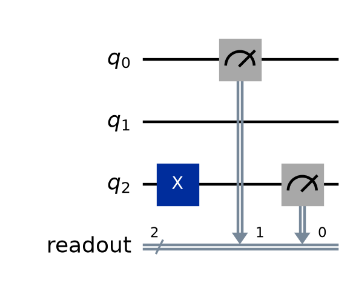
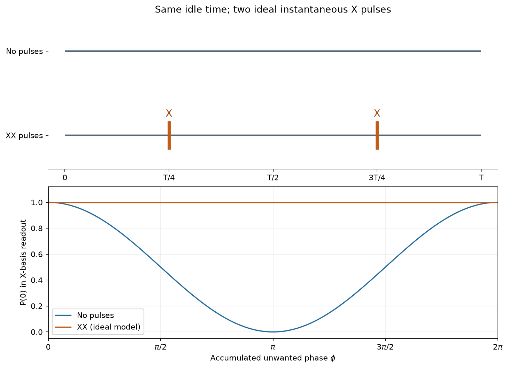

# 5. Sampler V2

[← transpile・実行](04-transpile-execution.md) | [次: Estimator V2 →](06-estimator.md)

第4章では、回路を実行先へ合わせて変換し、jobを通じて結果を受け取る流れを扱いました。この章では、その結果のうち「測定で得たビット列」を詳しく読みます。理論上の確率、各試行の記録、出現回数の集計を区別し、パラメータ条件や保存先が増えたときも、どのデータを見ているのか判断できることが目標です。

コードの基準はQiskit 2.5.2 / qiskit-ibm-runtime 0.49.0です。出力付きの例は、認証なしで実行できるローカルの計算を使います。Runtimeへ送信する例は関数として示し、関数を定義する段階と、backendを渡して実行を依頼する段階を分けます。実機の機能や利用条件は、SDKの版だけでは決まりません。

<a id="sampler-purpose"></a>
## 何を計算するか

### 一回の測定記録と、その集計

**Sampler**は、回路の測定結果を古典ビットへ保存し、その記録を繰り返し取得するためのprimitiveです。状態を準備して回路を実行し、測定する一回の試行を**shot**、その回数を**shots**と呼びます。本章では、各shotを量子ビットが0の状態から始め、測定結果を0と1に分類して得る場合を扱います。

例えばBell状態

$$
|\Phi^+\rangle=\frac{|00\rangle+|11\rangle}{\sqrt{2}}
$$

を計算基底で測ると、理想的には`00`と`11`がそれぞれ確率$1/2$で現れます。ただし、「8回測れば必ず4回ずつ」という意味ではありません。次の例は、まず8回分の記録をそのまま表示し、その後で出現回数を集計します。

```python
from qiskit import QuantumCircuit
from qiskit.primitives import StatevectorSampler

qc = QuantumCircuit(2)
qc.h(0)
qc.cx(0, 1)
qc.measure_all()

sampler = StatevectorSampler(seed=7)
job = sampler.run([qc], shots=8)
result = job.result()
bits = result[0].data.meas
print("records:", bits.get_bitstrings())
counts = bits.get_counts()
print("counts:", dict(sorted(counts.items())))
print("shots:", bits.num_shots)
print("frequency of 11:", counts.get("11", 0) / bits.num_shots)
```

出力:

```text
records: ['11', '11', '11', '00', '00', '11', '00', '11']
counts: {'00': 3, '11': 5}
shots: 8
frequency of 11: 0.625
```

`get_bitstrings()`は各shotのビット列をリストとして取り出します。例えば最初の`'11'`は、古典ビット1と0の両方に1が保存された記録です。`measure_all()`で$q_0$を古典ビット0、$q_1$を古典ビット1へ保存したので、この例では両量子ビットの測定値も1と読めます。

`get_counts()`は同じ記録を数えた辞書です。`'11': 5`は、5個の異なる試行で`11`が得られたという意味です。countsに集約すると、どの試行が`11`だったかという並びは失われます。辞書の表示順も、測定された順番を表しません。

8回のうち5回なので、`11`の**相対度数**は$5/8=0.625$です。これを確率の推定値として使えます。結果の文字列を$x$、その出現回数を$n_x$、総shots数を$N$とすると、

$$
\hat p(x)=\frac{n_x}{N}
$$

と書きます。$p(x)$を理論上の確率、$\hat p(x)$を標本から求めた推定値として区別します。今回の$0.625$は理論値$0.5$と異なりますが、有限回の試行から得る結果として矛盾ではありません。

`counts.get("11", 0)`の第2引数は、その文字列が辞書にない場合に使う値です。出現しなかった文字列は通常countsに含まれません。ただし「今回は一度も出なかった」ことだけで、真の確率が0だと証明できるわけではありません。この理想的なBell回路で`01`と`10`の確率が0だと分かるのは、状態の式からも確認できるためです。

### shotsを増やしたとき、何が変わるか

次は同じ回路を8回、32回、256回で試す例です。回路と乱数の設定を明示し、出現回数と相対度数を分けて比較します。

```python
from qiskit import QuantumCircuit
from qiskit.primitives import StatevectorSampler

qc = QuantumCircuit(2)
qc.h(0)
qc.cx(0, 1)
qc.measure_all()

for shots in [8, 32, 256]:
    result = StatevectorSampler(seed=7).run([qc], shots=shots).result()[0]
    counts = result.data.meas.get_counts()
    frequency = counts.get("11", 0) / result.data.meas.num_shots
    print(shots, dict(sorted(counts.items())), f"{frequency:.5f}")
```

出力:

```text
8 {'00': 3, '11': 5} 0.62500
32 {'00': 15, '11': 17} 0.53125
256 {'00': 120, '11': 136} 0.53125
```

32回と256回の相対度数は、この例では同じ値です。shotsを増やせば一回の実験の推定値が必ず理論値へ近づく、という保証はありません。安定した同じ分布から独立に標本を得る場合、shotsが増えるほど、繰り返し実験したときの推定値のばらつきが小さくなるという性質を使います。不確かさの数値的な目安は[第7章](07-results-analysis.md#empirical-analysis)で扱います。

`seed=7`はローカル計算の再現を助けるための指定です。この例では毎回同じseedから始めています。実機の測定列を同じものに固定する指定ではありません。また、shotsを増やすだけで、装置の読み出し誤差などによる偏りまで消えるわけではありません。

### Samplerから分かることと、別の情報が必要なこと

Samplerが返す中心的なデータは、指定した測定から得たビット列です。状態ベクトルの複素振幅を直接返すものではありません。例えば$(|00\rangle+|11\rangle)/\sqrt{2}$と$(|00\rangle-|11\rangle)/\sqrt{2}$は、計算基底で同じ分布を与えます。この測定のcountsだけでは、両者の相対位相を区別できません。

X基底で調べたいなら、[第2章の測定基底の変更](02-visualization-measurement.md#measurement-basis)のように、測定前の操作も含めて回路を用意します。測定したいobservableを別入力で指定して期待値を求める方法は[第6章のEstimator](06-estimator.md#estimator-purpose)です。Sampler PUBへobservableを追加する方法ではありません。

ローカルの`StatevectorSampler`は、内部で理想的な状態ベクトルを使ってサンプルを生成します。内部で状態を計算することと、戻り値として状態ベクトルを渡すことは別です。実機で使うRuntimeの`SamplerV2`との違いは、[第4章](04-transpile-execution.md#runtime-local)も参照してください。

探索の目的から測定結果までを通して扱う例は、[補章AのGrover](09-algorithm-worked-examples.md#algorithm-grover)です。オラクルだけでは測定確率が変わらず、その後の振幅への操作が必要なことを確かめます。

<a id="sampler-pub"></a>
## Sampler PUBとshots優先順位

### 回路・パラメータ値・shotsをまとめる

**PUB**（**Primitive Unified Bloc**）は、一つの回路を中心に実行に必要な入力をまとめる単位です。Sampler PUBの一般形は次のとおりです。

```text
(circuit, parameter_values, shots)
```

| 位置 | 役割 | 例 |
|---|---|---|
| 1番目 | 測定を含む回路 | `qc` |
| 2番目 | 未定のパラメータへ入れる値 | 1パラメータなら`[[0.0], [1.0]]`など |
| 3番目 | 各パラメータ条件で測定する回数 | `128` |

パラメータのない回路なら、回路だけを渡せます。shotsをPUB内で指定したい場合は、`(qc, None, 128)`と書きます。`None`はパラメータ値の位置を空けるために必要です。`(qc, 128)`では、128はshotsではなく2番目のパラメータ値の位置へ入ります。

一つのjobへ渡す入力はPUBのリストです。例えば`run([pub_a, pub_b])`は2PUBを送ります。一方、一つのPUBの中で角度を3通りに変えることもできます。この場合、jobの結果が3PUBに分かれるわけではありません。

### 角度を3通りに変え、各条件の結果を選ぶ

$R_y(\theta)|0\rangle$を測る回路を使います。1を得る理論確率は$\sin^2(\theta/2)$なので、$\theta=0,\pi/2,\pi$では、それぞれ$0,1/2,1$です。

値を並べた`values`の各行を、一回分の**パラメータの割当て**として読みます。今回はパラメータが1個なので、一行の中に入る数値も1個です。

```python
import numpy as np
from qiskit import QuantumCircuit
from qiskit.circuit import Parameter
from qiskit.primitives import StatevectorSampler

theta = Parameter("theta")
qc = QuantumCircuit(1)
qc.ry(theta, 0)
qc.measure_all()
values = np.array([[0.0], [np.pi / 2], [np.pi]])

pub = (qc, values, 32)
result = StatevectorSampler(seed=7).run([pub]).result()
bits = result[0].data.meas
print("PUB results:", len(result))
print("values shape:", values.shape)
print("result shape:", bits.shape)
print("shots per condition:", bits.num_shots)
print("bits per shot:", bits.num_bits)

for index, angle in enumerate(values[:, 0]):
    counts = bits.get_counts(index)
    frequency = counts.get("1", 0) / bits.num_shots
    print(index, f"{angle:.3f}", dict(sorted(counts.items())), f"{frequency:.5f}")
print("pooled:", dict(sorted(bits.get_counts().items())))
```

出力:

```text
PUB results: 1
values shape: (3, 1)
result shape: (3,)
shots per condition: 32
bits per shot: 1
0 0.000 {'0': 32} 0.00000
1 1.571 {'0': 15, '1': 17} 0.53125
2 3.142 {'1': 32} 1.00000
pooled: {'0': 47, '1': 49}
```

`shape`は、配列の各方向に要素がいくつ並ぶかを表す組です。入力の`values.shape == (3, 1)`は、3通りの割当てがあり、各割当てに1個のパラメータ値があることを示します。結果の`bits.shape == (3,)`は、3条件の結果が並ぶことを示します。最後の長さ1は回路へ渡すパラメータの個数なので、結果を並べる軸には残りません。

`bits.num_shots == 32`は**一つの条件につき32回**です。3条件なので、測定記録は合計$3\times32=96$個あります。条件の数、shots数、各shotのビット数は、それぞれ別の数です。

`get_counts(0)`は最初の角度、`get_counts(1)`は2番目の角度の結果です。**この引数はshotの番号ではなく、パラメータ条件の位置**を指定します。`get_counts()`と位置を省略すると、3条件すべての記録を合算するため、最後の辞書の合計は96になります。

合算して得た1の割合$49/96$を、例えば角度0の確率として使うことはできません。角度0のデータは`get_counts(0)`から選び、その条件の32shotsを分母にします。

`BitArray`は、このような条件ごとのビットの記録を保持するクラスです。`bits.shape`は条件の並びを表し、内部のバイト配列`bits.array.shape`とは意味が異なります。通常の結果の読み取りでは、まず`shape`、`num_shots`、`num_bits`を使って意味を確かめます。内部のバイト配列をビット番号の配列だと思って直接添字を付ける必要はありません。

### パラメータが2個なら、各行に2個の値を置く

パラメータ値の列は、回路中でゲートが登場した順とは限りません。[第3章](03-circuit-construction.md#parameters)で扱った`qc.parameters`の順に合わせます。

次の回路は$q_0$の角度`z`を先に記述していますが、`qc.parameters`では`a`、`z`の順です。そのため`[0.0, np.pi]`は、$q_1$の角度`a`を0、$q_0$の角度`z`を$\pi$にする指定です。

```python
import numpy as np
from qiskit import QuantumCircuit
from qiskit.circuit import Parameter
from qiskit.primitives import StatevectorSampler

a = Parameter("a")
z = Parameter("z")
qc = QuantumCircuit(2)
qc.ry(z, 0)
qc.ry(a, 1)
qc.measure_all()
values = np.array([[0.0, np.pi], [np.pi, 0.0]])

result = StatevectorSampler(seed=7).run([(qc, values)], shots=8).result()[0]
print("parameter order:", [parameter.name for parameter in qc.parameters])
print("values shape:", values.shape)
print("result shape:", result.data.meas.shape)
for index in range(2):
    print(index, result.data.meas.get_counts(index))
```

出力:

```text
parameter order: ['a', 'z']
values shape: (2, 2)
result shape: (2,)
0 {'01': 8}
1 {'10': 8}
```

`values`の2行は、指定した2組の角度です。`a`の候補と`z`の候補を自動的に全組合せへ広げる指定ではありません。全組合せを試したければ、必要な値の組を作って渡します。

### ローカルSamplerでshotsの優先順位を確かめる

まず`StatevectorSampler`を使います。PUB内のshotsが最優先で、指定のないPUBには`run(..., shots=...)`の値が使われます。その両方がないときは、コンストラクタの`default_shots`を使います。

```python
from qiskit import QuantumCircuit
from qiskit.primitives import StatevectorSampler

qc = QuantumCircuit(1)
qc.x(0)
qc.measure_all()
sampler = StatevectorSampler(default_shots=50, seed=7)

first = sampler.run([(qc, None, 16), qc], shots=32).result()
second = sampler.run([qc]).result()
print("first run:", [pub.data.meas.num_shots for pub in first])
print("second run:", second[0].data.meas.num_shots)
```

出力:

```text
first run: [16, 32]
second run: 50
```

最初のPUBには16、次のPUBにはrunの32が使われました。次のrunでshotsを省略すると50に戻っています。つまり、runの指定は、そのSamplerの既定値を恒久的に変更する操作ではありません。

### Runtimeでは生成方法と非推奨の指定も確認する

Runtimeの`SamplerV2`では、`options.default_shots`を使います。`StatevectorSampler`の変数へ、そのまま`sampler.options.default_shots = ...`と書く方法ではありません。

さらに、**qiskit-ibm-runtime 0.49.0では、異なるshotsを持つPUBを同じjobに含める指定は非推奨**です。これは0.48.0で導入された変更であり、[公式リリースノート](https://quantum.cloud.ibm.com/docs/en/api/qiskit-ibm-runtime/release-notes)にも記載されています。直前のローカル例は優先順位を確認するためのもので、Runtimeでは、異なる測定回数を使う実験をjobごとに分けます。独立したjobをまとめて扱う用途には[Batch](04-transpile-execution.md#execution-modes)も使えます。

次は一つのPUBずつ別のjobにして、三つの指定方法を比較する関数です。`backend`は第4章で説明した実行先です。twirlingは、理想的な計算を保つように操作を変えた複数の回路へ実行を分ける手法で、測定回数の配分にも関係します。この例では無効にし、その配分は直後に説明します。

<!-- validation: runtime-function -->
```python
def submit_shot_comparison(backend):
    from qiskit import QuantumCircuit
    from qiskit.transpiler import generate_preset_pass_manager
    from qiskit_ibm_runtime import SamplerV2

    qc = QuantumCircuit(1)
    qc.x(0)
    qc.measure_all()
    pm = generate_preset_pass_manager(
        backend=backend, optimization_level=1, seed_transpiler=7,
    )
    isa_circuit = pm.run(qc)
    sampler = SamplerV2(mode=backend)
    sampler.options.default_shots = 500
    sampler.options.twirling.enable_gates = False
    sampler.options.twirling.enable_measure = False

    pub_job = sampler.run([(isa_circuit, None, 128)], shots=256)
    run_job = sampler.run([isa_circuit], shots=256)
    default_job = sampler.run([isa_circuit])
    return [pub_job, run_job, default_job]
```

関数を定義するだけでは送信しません。実機backendを渡して呼び出すと、3jobを送信し、そのjobのリストを返します。指定される回数は、順に128、256、500です。取得した各jobの`result()[0].data.meas.num_shots`で、返されたデータのshots数も確認できます。

### twirlingを使う場合の測定回数

**Pauli twirling**は、理想的な計算を保つようにランダムなPauli操作を組み合わせ、誤差の現れ方を扱いやすくする手法です。例えばゲートの前後へ組合せを変えた操作を挟み、元の回路から複数の実行回路を作ります。この回路の変種を**randomizations**と呼びます。測定の前の反転と結果の読み替えを組み合わせる測定twirlingもあります。目的やEstimatorでの使い方は[第6章](06-estimator.md#estimator-options)で詳しく扱います。

複数の変種を測るなら、「何通りの回路を、各何回測るか」という数え方が加わります。例えば`num_randomizations=8`、`shots_per_randomization=64`なら、その積は$8\times64=512$です。

Runtimeのshotsの優先順位は、各PUBについて次の順に確認します。

1. PUB内のshots。
2. `run(..., shots=...)`。
3. twirlingを有効にし、回数を明示した場合の`num_randomizations`と`shots_per_randomization`の積。
4. `options.default_shots`。

`"auto"`や未指定の項目は、他の設定も使ってRuntimeが決定します。すべて未指定のときの値を、ローカルの`StatevectorSampler`の既定値から推測しません。

また、優先順位が高い指定をすれば、他の設定との矛盾をすべて無視できるわけではありません。公式の[Sampler options](https://quantum.cloud.ibm.com/docs/en/guides/sampler-options)では、twirlingの固定した回数の積が要求shotsより小さい場合、jobが失敗する条件が説明されています。例えば8通りを各64回と固定したまま1,000shotsを要求する場合は、その配分では足りません。

本章のローカル検証で確かめるのは、PUB・run・defaultの指定の優先順位です。twirlingの配分や実機での誤差への効果は、サービス側の実行条件も含めて確認する必要があります。

<a id="sampler-result-registers"></a>
## result fieldはregister名から来る

### 回路で付けた名前が、結果の入口になる

これまで使った`data.meas`の`meas`は、`measure_all()`が作る古典レジスタの既定名です。Samplerの結果には、回路で使った古典レジスタごとの項目が作られます。自分で`readout`というレジスタを作れば、結果も`data.readout`から取得します。

次は3量子ビットのうち、$q_2$と$q_0$だけを測る例です。保存先は`readout[0]`と`readout[1]`にします。操作する量子ビット、測る量子ビット、保存先の古典ビットを分けて読みます。

```python
import matplotlib.pyplot as plt
from qiskit import QuantumCircuit, QuantumRegister, ClassicalRegister
from qiskit.primitives import StatevectorSampler

q = QuantumRegister(3, "q")
readout = ClassicalRegister(2, "readout")
qc = QuantumCircuit(q, readout)
qc.x(q[2])
qc.measure([q[2], q[0]], [readout[0], readout[1]])

pub_result = StatevectorSampler(seed=7).run([qc], shots=8).result()[0]
bits = pub_result.data.readout
print("fields:", list(pub_result.data.keys()))
print("counts:", bits.get_counts())
print("bits per shot:", bits.num_bits)
print("readout[0]:", bits.slice_bits([0]).get_counts())

fig = qc.draw("mpl", fold=-1)
fig.savefig("05-readout-register.png", dpi=160, bbox_inches="tight")
plt.close(fig)
```

出力:

```text
fields: ['readout']
counts: {'01': 8}
bits per shot: 2
readout[0]: {'1': 8}
```



文字列`01`は`readout[1] readout[0]`の順です。右端の1は$q_2$の結果、左端の0は$q_0$の結果に対応します。$q_1$は測っていないため、この結果に$q_1$の値は含まれません。量子ビットが3個でも、保存したビット列の長さは2です。

`data.keys()`は実際に存在する項目名を調べます。`data.meas`が見つからない場合は、まず回路で付けた古典レジスタ名を確認します。jobの失敗や測定結果の欠落と即断する必要はありません。

`slice_bits([0])`は、**古典レジスタの0番のビット**だけを選んだ新しい`BitArray`を返します。この例では$q_2$の測定値を取り出しています。量子ビット0を選ぶ命令ではありません。

| 操作 | 選ぶ対象 |
|---|---|
| `result[0]` | jobへ渡した最初のPUB |
| `result[0].data.readout` | そのPUBの`readout`レジスタ |
| `bits.get_counts(0)` | パラメータ条件が並ぶ場合の、最初の条件のcounts |
| `bits.slice_bits([0])` | レジスタ内の0番の古典ビット |
| `bits.get_bitstrings()` | そのデータに含まれるshotの記録 |

パラメータ条件がないこの例の`bits.shape`は`()`です。これは条件を並べる軸がないという意味であり、測定データが空という意味ではありません。shots数は8、ビット数は2として別に保持されています。

### 複数レジスタの記録は、同じshot同士を対応付ける

今度は、$q_0$の結果を`left`、$q_1$の結果を`right`という別々のレジスタへ保存します。Bell状態を作った後で$q_1$を反転させるので、状態は

$$
\frac{|01\rangle+|10\rangle}{\sqrt{2}}
$$

です。理想的な測定では、両者の値は必ず異なります。

それぞれのレジスタを別々に集計するだけでは、この「同じshotで値が異なる」という対応は失われます。対応を保つため、各shotの文字列を`zip`で組にしてから数えます。

```python
from collections import Counter
from qiskit import QuantumCircuit, QuantumRegister, ClassicalRegister
from qiskit.primitives import StatevectorSampler

q = QuantumRegister(2, "q")
left = ClassicalRegister(1, "left")
right = ClassicalRegister(1, "right")
qc = QuantumCircuit(q, left, right)
qc.h(0)
qc.cx(0, 1)
qc.x(1)
qc.measure(q[0], left[0])
qc.measure(q[1], right[0])

pub_result = StatevectorSampler(seed=7).run([qc], shots=8).result()[0]
left_bits = pub_result.data.left
right_bits = pub_result.data.right
pairs = list(zip(left_bits.get_bitstrings(), right_bits.get_bitstrings()))
joint_counts = Counter(a + b for a, b in pairs)

print("fields:", list(pub_result.data.keys()))
print("left:", dict(sorted(left_bits.get_counts().items())))
print("right:", dict(sorted(right_bits.get_counts().items())))
print("first four pairs:", pairs[:4])
print("joint (left then right):", dict(sorted(joint_counts.items())))
```

出力:

```text
fields: ['left', 'right']
left: {'0': 5, '1': 3}
right: {'0': 3, '1': 5}
first four pairs: [('0', '1'), ('0', '1'), ('0', '1'), ('1', '0')]
joint (left then right): {'01': 5, '10': 3}
```

`pairs`の一要素が、同じshotの`left`と`right`の値です。`Counter`はPython標準ライブラリにあり、ここでは結合した文字列の出現回数を数えています。各レジスタの記録を別々に並べ替えてから結合すると、shot同士の対応を壊してしまいます。また、別のjobから取得した記録同士を同じ添字で結んでも、この同時測定の意味にはなりません。

`a + b`で作った文字列は、ここで明示的に決めた`left`、`right`の順です。通常の状態の表記$|q_1q_0\rangle$とは逆の$q_0,q_1$順なので、集計の見出しにも順番を付けています。

各レジスタの理論的な確率は0と1がそれぞれ$1/2$ですが、両方が0である確率は0です。独立だと仮定して$(1/2)\times(1/2)=1/4$と掛けることはできません。同じshotの対応を保持したデータが、相関を調べるために必要になります。

<a id="sampler-options"></a>
## Runtime optionsとdynamical decoupling

<a id="sampler-dd"></a>
### 待っている量子ビットにも誤差が生じる

実機では、一つの量子ビットが操作を受けている間、別の量子ビットが待っていることがあります。回路図の空いている区間でも、周囲との相互作用などによって状態に望まない変化が生じ得ます。

この待機時間へ、適切な間隔で制御パルスを挿入し、一部の誤差の影響を打ち消すようにするのが**動的デカップリング**（**Dynamical Decoupling**、**DD**）です。パルスは、量子ビットを回転させるために実機へ加える制御信号です。DDは、回路を実行している間の誤差を抑える**error suppression**の手法です。

「Xを2回加えると$XX=I$なのに、なぜ何もしない場合と違うのか」と疑問に思うかもしれません。違いを生むのは、XとXの間にも待機中の変化が進むことです。次の単純なモデルで確かめます。

### 一定の速さで位相がずれるモデル

合計待機時間を$T$とし、その間に意図しないZ軸回りの回転$R_z(\phi)$が加わるとします。$\phi$は待機時間全体で蓄積する角度です。ここでは、待機中のずれの速さは一定、Xは理想的で瞬時の操作と仮定します。実機のすべてのノイズを表すモデルではありません。

何もしなければ、待機中の演算はそのまま$R_z(\phi)$です。そこで、$T/4$待ってX、$T/2$待ってX、最後に$T/4$待つ、という配置を考えます。待機時間の合計は変えません。

まず、Xを両側から掛けると、対角成分が入れ替わるので、

$$
X R_z(\alpha)X
=X\begin{pmatrix}e^{-i\alpha/2}&0\\0&e^{i\alpha/2}\end{pmatrix}X
=\begin{pmatrix}e^{i\alpha/2}&0\\0&e^{-i\alpha/2}\end{pmatrix}
=R_z(-\alpha)
$$

です。この式は、Xの間に生じた位相のずれを、逆向きの回転として表せることを示します。時間順と逆の順に行列を掛けて待機区間全体を書くと、

$$
\begin{aligned}
U_{\mathrm{XX}}
&=R_z(\phi/4)X R_z(\phi/2)X R_z(\phi/4)\\
&=R_z(\phi/4)R_z(-\phi/2)R_z(\phi/4)\\
&=R_z(0)=I
\end{aligned}
$$

となります。同じZ軸回りの回転は角度を足せるため、$\phi/4-\phi/2+\phi/4=0$です。したがって、このモデルでは任意の入力状態への位相のずれを打ち消せます。Xを続けて2回加えてから長く待つ配置では、同じ計算になりません。**どの操作を加えるかに加え、その間隔も重要**です。

位相のずれを測定結果から確かめるには、$|+\rangle$を用意し、待機後にX基底で測ります。測定前のHを含めると、DDなしの場合は

$$
H R_z(\phi)H|0\rangle
=\cos(\phi/2)|0\rangle-i\sin(\phi/2)|1\rangle
$$

なので、0を得る確率は$\cos^2(\phi/2)$です。DDありで待機区間がIになれば、$HH|0\rangle=|0\rangle$となり、0を得る確率は1です。計算基底で$|+\rangle$をそのまま測るだけでは、Z軸回りの位相のずれが確率に現れないことにも注意してください。

次の例は、$\phi=\pi/2$での理想計算と、そのモデルの図を作ります。コード中の`rz`は、待機中に意図せず生じる変化をモデル化するために置いています。RuntimeのDDを有効にするコードとは区別してください。

```python
import numpy as np
import matplotlib.pyplot as plt
from qiskit import QuantumCircuit
from qiskit.quantum_info import Operator, Statevector

phi = np.pi / 2
idle = QuantumCircuit(1)
idle.rz(phi, 0)
echo = QuantumCircuit(1)
echo.rz(phi / 4, 0)
echo.x(0)
echo.rz(phi / 2, 0)
echo.x(0)
echo.rz(phi / 4, 0)

for name, wait_circuit in [("idle", idle), ("XX", echo)]:
    readout = QuantumCircuit(1)
    readout.h(0)
    readout.compose(wait_circuit, inplace=True)
    readout.h(0)
    probabilities = Statevector.from_instruction(readout).probabilities()
    print(name, np.round(probabilities, 6).tolist())
print("XX is identity:", np.allclose(Operator(echo).data, np.eye(2)))

fig, axes = plt.subplots(2, 1, figsize=(9, 6.5), layout="constrained")
axes[0].hlines([1, 0], 0, 1, color="#536878", linewidth=2)
for time in [0.25, 0.75]:
    axes[0].vlines(time, -0.17, 0.17, color="#c15b16", linewidth=4)
    axes[0].text(time, 0.22, "X", ha="center", color="#a7470e", fontsize=13)
axes[0].set(ylim=(-0.4, 1.4), xlim=(-0.04, 1.04),
            yticks=[0, 1], yticklabels=["XX pulses", "No pulses"],
            xticks=[0, 0.25, 0.5, 0.75, 1],
            xticklabels=["0", "T/4", "T/2", "3T/4", "T"],
            title="Same idle time; two ideal instantaneous X pulses")
axes[0].spines[["top", "right", "left"]].set_visible(False)
angles = np.linspace(0, 2 * np.pi, 201)
axes[1].plot(angles, np.cos(angles / 2)**2, label="No pulses", color="#246c9c")
axes[1].plot(angles, np.ones_like(angles), label="XX (ideal model)", color="#c15b16")
axes[1].set(xlim=(0, 2 * np.pi), ylim=(-0.05, 1.12),
            xticks=[0, np.pi / 2, np.pi, 3 * np.pi / 2, 2 * np.pi],
            xticklabels=["0", r"$\pi/2$", r"$\pi$", r"$3\pi/2$", r"$2\pi$"],
            xlabel=r"Accumulated unwanted phase $\phi$", ylabel="P(0) in X-basis readout")
axes[1].grid(alpha=0.2)
axes[1].legend(loc="lower left")
fig.savefig("05-dd-echo-model.png", dpi=160, bbox_inches="tight")
plt.close(fig)
```

出力:

```text
idle [0.5, 0.5]
XX [1.0, 0.0]
XX is identity: True
```



上段は同じ待機時間へのパルスの配置、下段は位相のずれの大きさと測定確率の関係です。図のXXの直線は、理想パルスと一定のずれを仮定した計算結果です。実機でDDを有効にすれば常に0の確率が1になる、という性能の予測ではありません。

実際にはパルスの長さや誤差があり、待機中の変化も一定とは限りません。不可逆なエネルギー緩和など、上の式だけでは取り消せない変化もあります。待機区間がほとんどない回路では挿入の余地が小さく、追加のパルスによる誤差で結果が悪くなることもあります。

### RuntimeへDDを指定する

Runtimeでは、待機区間への挿入処理を`dynamical_decoupling`の設定で依頼します。qiskit-ibm-runtime 0.49.0で指定できる代表的な項目は次のとおりです。

| 設定 | 何を決めるか |
|---|---|
| `enable` | DDを有効にするか |
| `sequence_type` | 挿入するパルス列を`"XX"`、`"XpXm"`、`"XY4"`から選ぶ |
| `scheduling_method` | 他の制約の中で命令を早く置く`"asap"`か、遅く置く`"alap"`か |
| `extra_slack_distribution` | 装置の時間刻みへの丸めで余った待機時間を、列の中央か両端へ配分するか |

先ほどの理想モデルは、2回のXを使う`"XX"`の考え方に対応します。`"XpXm"`はX軸の正方向と負方向の回転、`"XY4"`はX軸とY軸の回転を組み合わせる4パルスの列です。API資料ではXY4の符号を含む並びを、時間順に`+X, +Y, -X, -Y`と説明しています。

ここで`-X`は、Pauli行列Xの数値全体をマイナスにする指示ではなく、逆方向の$\pi$回転を表すパルスの記法です。理想的な$R_x(\pi)=-iX$と$R_x(-\pi)=iX$は全体位相を除いて同じ作用ですが、物理的な制御の向きは異なります。実機のパルス列と、説明用にPauli行列を使ったモデルを区別します。各列やタイミングの定義は[DD optionsのAPI資料](https://quantum.cloud.ibm.com/docs/en/api/qiskit-ibm-runtime/options-dynamical-decoupling-options)で確認できます。

次の関数は、測定を含む回路と実行先を受け取り、ISAへ変換して、DDを指定したRuntime Samplerへ渡します。回路は末尾で測定するものを想定し、動的回路との組合せは次節で扱います。

<!-- validation: runtime-function -->
```python
def submit_with_dd(circuit, backend, shots=256):
    from qiskit.transpiler import generate_preset_pass_manager
    from qiskit_ibm_runtime import SamplerV2

    pm = generate_preset_pass_manager(
        backend=backend, optimization_level=1, seed_transpiler=7,
    )
    isa_circuit = pm.run(circuit)
    sampler = SamplerV2(mode=backend)
    sampler.options.dynamical_decoupling.enable = True
    sampler.options.dynamical_decoupling.sequence_type = "XY4"
    return sampler.run([isa_circuit], shots=shots)
```

例えば最初のBell回路を`qc`として作り、実行先`backend`を取得済みなら、`submit_with_dd(qc, backend)`を呼んでjobを受け取ります。関数を定義しただけでは送信しません。

この設定は、元のPython変数`circuit`へ目に見えるXやYをその場で追加する操作ではありません。Runtimeへ送る実行設定なので、設定後に元の回路を描画しただけでは、実際に挿入されたパルスの位置や効果を確認したことにはなりません。

ローカルbackendでこの関数の送信・結果取得の流れを試すことはできますが、RuntimeのDDが実機でどのように働くかの検証にはなりません。効果を比較するときは、同じ回路・実行先・測定回数を基準にし、DD以外の条件も記録します。

<a id="sampler-compatibility"></a>
## feature compatibilityは都度確認する

### 回路を表せること、設定できること、併用できること

**dynamic circuits**は、回路途中の測定結果を使って後続の処理を変えるような動的回路です。[第3章の`if_test`](03-circuit-construction.md#dynamic-circuits)がその例です。Pythonで角度を変えて複数のPUBを用意することは、それだけでは動的回路を意味しません。

IBMの[Samplerの機能の組合せ条件](https://quantum.cloud.ibm.com/docs/en/guides/sampler-options#feature-compatibility)では、動的回路とDDは同じjobで併用できないとされています。`if_test`を含む回路を作れたことと、`dynamical_decoupling.enable=True`を設定できたことから、その組合せをサービスへ送って実行できるとは判断できません。

| 確認する段階 | 分かること |
|---|---|
| SDKで回路を構築する | 命令や条件分岐を回路として表せるか |
| optionsへ値を設定する | APIがその設定名・値を受け付けるか |
| backendへ合わせてtranspileする | その実行先の命令や配置へ変換できるか |
| サービスの組合せ条件を確認する | 回路と設定を同じjobで利用できるか |

### 一つの組合せの条件を、他の機能へ広げない

同じ公式資料には、**fractional gates**と動的回路はqiskit-ibm-runtime 0.42.0以降で併用できるという条件があります。fractional gatesは、対応する実機で回転角を指定して使えるネイティブなゲート群です。単にPythonの角度へ小数を書いたという意味ではありません。

本書のRuntime 0.49.0は上の版の条件を満たします。ただし、この記述は「fractional gatesと動的回路」の組合せについてのもので、DDと動的回路の併用条件を変えるものではありません。実行先が必要なゲートに対応することも別に確認します。

実行前には、回路途中の測定・条件分岐の有無、DDやtwirlingなどの設定、backendが対応する機能、サービスの組合せ条件を照合します。これらのサービス条件を、Pythonパッケージのバージョンだけで固定されたものとして扱わないようにします。

## 典型的な誤答

次のような読み違いは、入力と結果のどの単位を見ているかを確認すると整理できます。

| 読み違い | 判断を分けるポイント |
|---|---|
| Samplerのcountsは厳密な確率である | countsは有限shotsの回数。総数で割った値も確率の推定値 |
| 3条件を一つのPUBへ入れると、結果は3PUBになる | PUB数は1。条件の軸がそのPUBの結果に残る |
| `get_counts(0)`は最初のshotを取り出す | 条件が並ぶ場合の、最初の条件を指定する |
| `data.meas`は全Sampler結果で固定である | 古典レジスタの名前を確認する |
| Sampler PUBへobservableやprecisionを入れる | observableとprecisionはEstimatorの入力。Samplerの回数指定はshots |
| DDの設定が通れば、どの回路でも誤差が減る | 待機区間、パルスの誤差、実行先とサービスの組合せ条件を確認する |

## 章末チェック

1. 200shotsで`11`が70回出ました。相対度数はいくつですか。その値を真の確率と断定できますか。
2. 一つのPUBで、2パラメータの回路に5組の値を渡し、各条件を100shots測ります。値を2次元配列で渡す場合のshape、結果の条件のshape、測定記録の総数はどうなりますか。
3. その5条件の結果で`bits.get_counts()`の辞書の合計が500でした。3番目の条件の確率を求めるには、どう取り出し、何を分母にしますか。
4. `StatevectorSampler(default_shots=100)`で`run([(qc, None, 40), qc], shots=60)`を実行し、続けて`run([qc])`を呼びます。各PUBのshotsはいくつですか。Runtime 0.49.0へ移す場合、最初のrunについて何を変えますか。
5. `readout[0]`へ$q_3$、`readout[1]`へ$q_1$の測定結果を保存しました。`data.readout`の文字列が`10`なら、どちらの量子ビットが1でしたか。
6. 二つのレジスタで、それぞれ0と1が半分ずつ出ました。両方が0である確率を$1/4$と判断してよいですか。
7. 一定のZ位相のずれを考えるモデルで、Xを続けて2回加えてから時間$T$だけ待てば、本文のXXの配置と同じようにずれを取り消せますか。
8. `if_test`を含む回路とDDの設定をSDKで作れました。実機実行の準備が完了したと判断できますか。

### 解答と理由

1. **$70/200=0.35$です。** これは標本からの推定値であり、真の確率と断定できません。測定回数による揺らぎと装置の誤差を区別して考えます。
2. **入力は`(5, 2)`、結果の条件は`(5,)`、総記録数は500です。** 一行の2個の数値が一組の割当てで、各組について100回測ります。量子ビット数や古典ビット数は、この2個のパラメータ数とは別です。
3. **`bits.get_counts(2)`で選び、100を分母にします。** 添字は0から始まります。位置を省略した500回の集計は、異なる条件を合算したものです。
4. **最初は40と60、次のrunは100です。** PUBがrunより優先し、runの指定は既定値を変更しません。Runtimeでは異なるshotsを持つPUBの同一jobへの混在が非推奨なので、測定回数ごとにjobを分けます。
5. **$q_1$が1です。** 文字列の左端は`readout[1]`、右端は`readout[0]`です。`slice_bits([0])`で選ぶのは、この場合$q_3$の結果です。
6. **独立性が分からなければ判断できません。** 同じshotで二つの値がどう組み合わされたかを見る必要があります。各レジスタのcountsだけからは、その対応を復元できません。
7. **一般には取り消せません。** 先に加えた2個のXは$XX=I$となり、その後の待機の$R_z(\phi)$が残ります。本文の配置は、待機を挟んだXによってずれの符号を反転させています。
8. **まだ判断できません。** backendへの適合とサービスの機能の組合せ条件が必要です。公式ガイドでは動的回路とDDは同じjobで併用できないとされており、設定の受理と実行可否は別です。

公式参照: [Sampler input/output](https://quantum.cloud.ibm.com/docs/en/guides/sampler-input-output)、[Sampler optionsとcompatibility表](https://quantum.cloud.ibm.com/docs/en/guides/sampler-options)、[StatevectorSampler](https://quantum.cloud.ibm.com/docs/en/api/qiskit/qiskit.primitives.StatevectorSampler)、[BitArray](https://quantum.cloud.ibm.com/docs/en/api/qiskit/qiskit.primitives.BitArray)、[Error mitigation and suppression techniques](https://quantum.cloud.ibm.com/docs/en/guides/error-mitigation-and-suppression-techniques)

[← transpile・実行](04-transpile-execution.md) | [次: Estimator V2 →](06-estimator.md)
