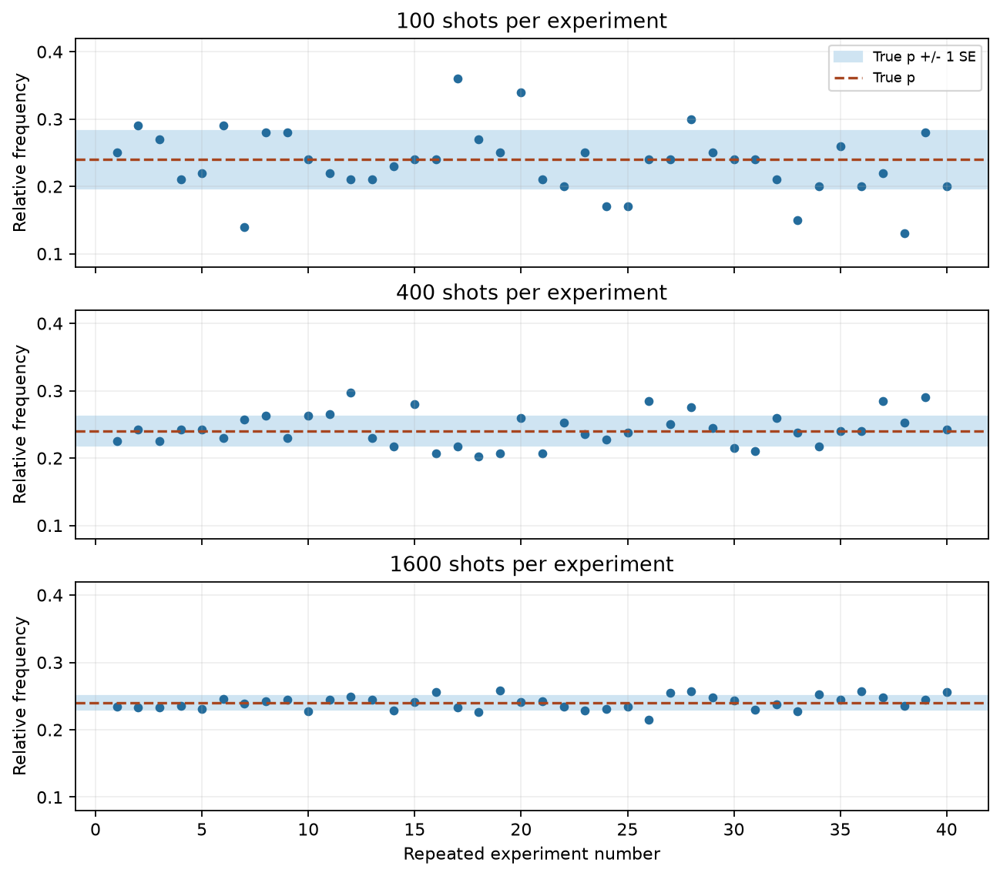
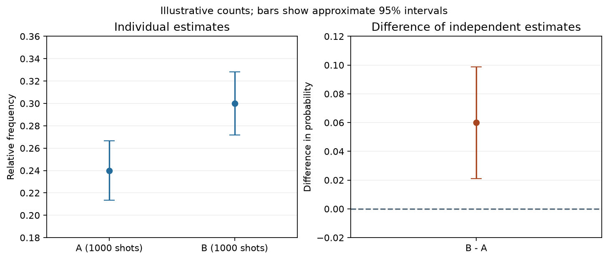

# 7. Job、PrimitiveResult、結果分析

[← Estimator V2](06-estimator.md) | [次: OpenQASM 3 →](08-openqasm3.md)

第5章では測定記録を、第6章では期待値を受け取りました。この章では、実行の完了を確かめ、調べたい条件のデータを選び、有限回数の測定からどこまで判断できるかを考えます。「結果を取得できた」「二つの値が違った」「誤差が小さいと表示された」は、それぞれ別の判断です。

コードの基準はQiskit 2.5.2 / qiskit-ibm-runtime 0.49.0です。出力付きの例は認証なしで実行できます。Runtimeの過去jobを扱う例は関数として示し、接続済みのserviceや取得済みのjobを引数にします。関数の定義だけでは、サービスへの問合せやQPUでの実行を始めません。

<a id="job-lifecycle"></a>
## jobを取得・監視する

### jobと結果は、役割が異なる

primitiveの`run()`は、実行の依頼を表す**job object**を返します。jobは実行状態の確認や結果の取得の入口です。`run()`がjobを返した時点で、全測定と結果の処理が終わっているとは限りません。

`job.result()`は、そのjobの結果を取得します。実行中なら完了を待つことがあるので、Python側の処理もその呼出しで待ちます。次はローカルの例です。

```python
from qiskit import QuantumCircuit
from qiskit.primitives import StatevectorSampler

qc = QuantumCircuit(1)
qc.h(0)
qc.measure_all()
job = StatevectorSampler(seed=7).run([qc], shots=16)
result = job.result()
print("status after result:", job.status().name)
print("counts:", dict(sorted(result[0].data.meas.get_counts().items())))
again = job.result()
print("counts again:", dict(sorted(again[0].data.meas.get_counts().items())))
```

出力:

```text
status after result: DONE
counts: {'0': 8, '1': 8}
counts again: {'0': 8, '1': 8}
```

2回目の`result()`も、同じ16shotsの結果を読みます。さらに16shotsを測る操作ではありません。新しい測定を依頼するには、改めて`run()`を呼びます。実機では新しいjobによって追加の実行が発生するので、結果を読み直すつもりで再送信しないようにします。

この例のローカルjobの`status()`は列挙値`JobStatus`を返すため、`.name`で名前を表示しました。一方、**Runtime 0.49.0の`RuntimeJobV2.status()`は文字列を返します。** 同じメソッド名でも、次のRuntime例に`.name`をそのまま付けません。

### 過去のjobをIDで取得する

Runtimeのjobには、実行を識別する**job ID**があります。送信後に`job.job_id()`を記録しておくと、別のPythonセッションからも`service.job(job_id)`で取得できます。この取得は、そのIDの実行をやり直す操作ではありません。

`service`は、[第4章](04-transpile-execution.md#runtime-local)で説明した`QiskitRuntimeService`の接続済みインスタンスです。次の関数は、既知のjob IDを受け取り、その時点の状態に応じて情報を表示します。

<!-- validation: runtime-function -->
```python
def inspect_past_job(service, job_id):
    job = service.job(job_id)
    status = job.status()
    print("job:", job.job_id())
    print("status:", status)
    if status == "DONE":
        print("PUB results:", len(job.result()))
    elif status == "ERROR":
        print("error:", job.error_message())
    elif status == "CANCELLED":
        print("This job was cancelled.")
    else:
        print("The job has not reached a final state.")
    return job
```

例えば、保存済みのIDを文字列変数`job_id`へ入れ、`inspect_past_job(service, job_id)`と呼びます。jobを参照できるアカウントとinstanceの設定が必要です。出力は実際のjobに依存します。

| Runtimeの状態 | 読み方 |
|---|---|
| `INITIALIZING` | 実行の初期処理中 |
| `QUEUED` | 実行を待っている |
| `RUNNING` | 実行中 |
| `DONE` | 正常に完了した |
| `ERROR` | 失敗して終了した。エラー内容も確認する |
| `CANCELLED` | 取り消されて終了した |

`DONE`、`ERROR`、`CANCELLED`が**最終状態**です。最終状態に達したことと、正常な結果を取得できることは同じではありません。また、状態は問合せの間にも変わります。上の関数は一時点の確認であり、監視を続ける関数ではありません。

### 一覧の検索と、一つのjobの取得を分ける

IDを指定して一つ取得する`service.job(...)`に対し、`service.jobs(...)`は条件に合うjobを検索します。次の例は、特定backendの、最終状態にある最近のjobを最大5件調べます。

<!-- validation: runtime-function -->
```python
def list_finished_jobs(service, backend_name, limit=5):
    jobs = service.jobs(
        backend_name=backend_name,
        pending=False,
        limit=limit,
        descending=True,
    )
    return [(job.job_id(), job.status()) for job in jobs]
```

`pending=False`は、成功したjobだけに限定する指定ではありません。失敗や取消しも含むため、返された状態を確認します。`limit=5`は最大取得件数であり、測定回数ではありません。条件に合うjobが少なければ、5件未満になることもあります。

基準版では、作成時刻の範囲を`created_after`・`created_before`、タグを`job_tags`などで絞れます。時刻で検索する場合はタイムゾーンを明示します。検索条件の引数は[serviceのAPI資料](https://quantum.cloud.ibm.com/docs/en/api/qiskit-ibm-runtime/qiskit-runtime-service)で確認できます。

### 待機時間切れを、実行の取消しと混同しない

完了まで待ちたい場合は、`RuntimeJobV2.result(timeout=..., poll_interval=...)`を使えます。`timeout`はこの呼出しで完了を待つ時間の上限、`poll_interval`は状態を問い合わせる間隔です。実機で使える実行時間の上限とは別です。

<!-- validation: runtime-function -->
```python
def wait_for_result(job, timeout=30):
    from qiskit_ibm_runtime.exceptions import RuntimeJobTimeoutError

    try:
        return job.result(timeout=timeout, poll_interval=5)
    except RuntimeJobTimeoutError:
        print("Stopped waiting; check this job again:", job.job_id())
        return None
```

Runtime 0.49.0では、完了待ちの時間切れは`RuntimeJobTimeoutError`です。この例の`None`は、関数が待つのをやめた印であり、空の測定結果ではありません。**待機時間切れだけではjobは取り消されません。** 同じIDの状態を後から調べられます。

実行失敗、取消し、サービスでの実行時間超過、通信の問題は別です。この関数では、それらを「まだ待機中」として握りつぶさず、例外を呼出し元へ伝えます。基準版では実行時間超過に関する`RuntimeJobMaxTimeoutError`と、上で捕まえる待機の`RuntimeJobTimeoutError`も別のクラスです。

`wait_for_final_state()`は、結果そのものを取り出さず、最終状態まで待つメソッドです。失敗や取消しも最終状態なので、その後も状態や結果を確認します。短い間隔で手動のループを回す必要はありません。各メソッドの説明は[RuntimeJobV2](https://quantum.cloud.ibm.com/docs/en/api/qiskit-ibm-runtime/runtime-job-v2)を参照してください。

<a id="result-hierarchy"></a>
## result階層

### PUB番号から、条件と測定値へ進む

正常に取得した結果の全体が**PrimitiveResult**です。一つの入力PUBに対して、一つのPUB結果があります。そこから`data`を開き、Samplerなら古典レジスタ、Estimatorなら期待値の配列を選びます。

```text
PrimitiveResult
├─ metadata                  結果全体の付随情報
└─ result[i]                 i番目の入力PUBの結果
   ├─ metadata               そのPUBの付随情報
   └─ data: DataBin           結果の各項目を保持する入れ物
      ├─ Sampler: レジスタ名 → BitArray
      │                        条件ごとの、各shotのビット列
      └─ Estimator: evsなど → 配列
                               観測量とパラメータ条件に対応する推定値
```

Samplerでは、PUB結果の具体的なクラスとして`SamplerPubResult`を使います。これは`PubResult`を継承したものです。`result[0]`の0はPUB番号であり、最初の量子ビットでも、最初のshotでもありません。

次は2PUBを送る例です。最初のPUBは3条件を持ち、結果を`readout`へ保存します。2番目はパラメータなしの回路で、保存先は`measure_all()`が作る`meas`です。

```python
import numpy as np
from qiskit import QuantumCircuit, ClassicalRegister
from qiskit.circuit import Parameter
from qiskit.primitives import StatevectorSampler

theta = Parameter("theta")
sweep = QuantumCircuit(1)
sweep.add_register(ClassicalRegister(1, "readout"))
sweep.ry(theta, 0)
sweep.measure(0, 0)
values = np.array([[0.0], [np.pi / 2], [np.pi]])
fixed = QuantumCircuit(1)
fixed.x(0)
fixed.measure_all()

result = StatevectorSampler(seed=7).run(
    [(sweep, values), fixed], shots=64,
).result()
print("result type:", type(result).__name__)
print("PUB count:", len(result))
for index, pub_result in enumerate(result):
    print(index, type(pub_result).__name__, list(pub_result.data.keys()))
print("first condition shape:", result[0].data.readout.shape)
print("second condition shape:", result[1].data.meas.shape)
print("second counts:", result[1].data.meas.get_counts())
```

出力:

```text
result type: PrimitiveResult
PUB count: 2
0 SamplerPubResult ['readout']
1 SamplerPubResult ['meas']
first condition shape: (3,)
second condition shape: ()
second counts: {'1': 64}
```

最初のPUBには$3\times64=192$件、2番目には64件の測定記録があります。それでもPUB結果は2個です。`shape == ()`は、パラメータ条件を並べる軸がないという意味で、結果が空という意味ではありません。

Estimatorでは、`evs`の各要素を観測量とパラメータ条件へ対応させます。どの軸が何を表すかは、[第6章のbroadcasting](06-estimator.md#estimator-broadcasting)で決めた入力の形から読みます。Samplerの条件数や古典ビット数から推測するものではありません。

<a id="bitarray-counts"></a>
## BitArrayからcountsを得る

### 二つの条件の軸を持つ場合

第5章の`get_counts(index)`を、角度の組合せを表す二つの軸へ広げます。$q_0$の角度を$a$、$q_1$の角度を$b$とし、それぞれ$0,\pi/2$を試します。`values[i, j]`へ、$a$の候補番号$i$と$b$の候補番号$j$に対応する一組の値を置きます。

```text
values[0, 0] = [0,   0   ]
values[0, 1] = [0,   π/2 ]
values[1, 0] = [π/2, 0   ]
values[1, 1] = [π/2, π/2 ]
```

`values.shape`は`(2, 2, 2)`です。最初の二つの軸が条件の並び、最後の長さ2が、各条件で束縛するパラメータの個数です。3個の2は同じ数ですが、役割は異なります。パラメータの列は`qc.parameters`の`a, b`順に合わせます。

```python
import numpy as np
from qiskit import QuantumCircuit
from qiskit.circuit import Parameter
from qiskit.primitives import StatevectorSampler

a, b = Parameter("a"), Parameter("b")
qc = QuantumCircuit(2)
qc.ry(a, 0)
qc.ry(b, 1)
qc.measure_all()
values = np.array([
    [[0.0, 0.0], [0.0, np.pi / 2]],
    [[np.pi / 2, 0.0], [np.pi / 2, np.pi / 2]],
])
bits = StatevectorSampler(seed=7).run([(qc, values)], shots=100).result()[0].data.meas
print("values shape:", values.shape)
print("condition shape:", bits.shape)
for loc in np.ndindex(bits.shape):
    counts = bits.get_counts(loc)
    print(loc, dict(sorted(counts.items())))
selected = bits.get_counts((1, 1))
pooled = bits.get_counts()
print("selected frequency:", selected.get("11", 0) / sum(selected.values()))
print("pooled frequency:", pooled.get("11", 0) / sum(pooled.values()))
```

出力:

```text
values shape: (2, 2, 2)
condition shape: (2, 2)
(0, 0) {'00': 100}
(0, 1) {'00': 50, '10': 50}
(1, 0) {'00': 50, '01': 50}
(1, 1) {'00': 28, '01': 22, '10': 26, '11': 24}
selected frequency: 0.24
pooled frequency: 0.06
```

`np.ndindex(bits.shape)`は、条件の位置`(0, 0)`、`(0, 1)`、`(1, 0)`、`(1, 1)`を順に作ります。`get_counts((1, 1))`は両角度が$\pi/2$の条件を選びます。ここで`(1, 1)`はビット列`11`でも、量子ビットの組でもありません。

この回路は二つの量子ビットを独立に回転させます。両方が1である理論確率は

$$
p(11\mid a,b)=\sin^2(a/2)\sin^2(b/2)
$$

です。縦棒の右側の$a,b$は、指定した角度を条件としていることを表します。両角度が$\pi/2$なら$p=1/4$で、得られた$24/100=0.24$はその推定値です。

位置を省略した`get_counts()`は4条件を合算します。分母が400になり、$24/400=0.06$です。**これは角度$(\pi/2,\pi/2)$の確率の推定値ではありません。** 今回の4条件を同じ回数ずつ混ぜた集計を表します。

### 合算してよいかは、調べたい量から決める

同じ回路、パラメータ、測定基底、保存先で、同じ安定した分布から得た測定を追加するなら、countsを足して全shotsで割る方法が使えます。一方、DDの有無などを比較したい場合に先に足すと、比較するための区別を失います。

測定回数が異なる二つの集計を足した場合は、各相対度数の単純平均にもなりません。例えば、Aが100回中20回、Bが900回中720回なら、合算は

$$
\frac{20+720}{100+900}=0.74
$$

です。$(0.20+0.80)/2=0.50$とは異なり、測定回数の多いBが強く反映されています。どちらを計算するかは、全測定記録の割合を求めるのか、二つの条件を等しい重みで平均するのかで決まります。

異なる時刻の実行を足す場合も、装置の状態が変わっていないかを考えます。複数の古典レジスタ間の相関を調べる場合は、別々のcountsだけでは不足します。[第5章](05-sampler.md#sampler-result-registers)のように同じshotの対応を残します。

### countsから対角な観測量の平均を計算する

測定値へ数値を割り当てれば、countsから期待値の推定値も計算できます。例えば、計算基底で測った2量子ビットの記録を、$q_0$→古典ビット0、$q_1$→古典ビット1の順で保存したとします。Zではビット0を固有値$+1$、ビット1を$-1$へ対応させます。

| 記録 | ZIの値 | IZの値 | ZZの値 |
|---|---|---|---|
| `00` | +1 | +1 | +1 |
| `01` | +1 | −1 | −1 |
| `10` | −1 | +1 | −1 |
| `11` | −1 | −1 | +1 |

ZIは$q_1$のZ、IZは$q_0$のZです。ZZでは二つの固有値を掛けるので、ビットが同じなら$+1$、異なれば$-1$です。したがって、

$$
\widehat{\langle ZZ\rangle}
=\frac{n_{00}-n_{01}-n_{10}+n_{11}}{N}
$$

となります。次は計算を追いやすい例示countsです。QPUから取得した値ではありません。

```python
import numpy as np
from qiskit.primitives.containers import BitArray

counts = {"00": 40, "01": 10, "10": 20, "11": 30}
shots = sum(counts.values())
manual_zz = (counts["00"] - counts["01"] - counts["10"] + counts["11"]) / shots
bits = BitArray.from_counts(counts, num_bits=2)
print("manual ZZ:", manual_zz)
print("ZI, IZ, ZZ:", np.round(bits.expectation_values(["ZI", "IZ", "ZZ"]), 6).tolist())
```

出力:

```text
manual ZZ: 0.4
ZI, IZ, ZZ: [0.0, 0.2, 0.4]
```

`expectation_values(...)`は指定した観測量の平均の配列を返し、counts辞書は返しません。このAPIで使う観測量は、記録したビットの基底で**対角**なものに限られます。ここで示したIとZの組合せがその例です。保存済みのZ基底のビット列に`"XX"`を渡して、測っていない基底の情報を取り出すことはできません。

X基底での測定操作をあらかじめ回路へ入れた場合は、その測定回路に合わせて固有値を割り当てます。また、保存先を入れ替えた場合は、上のPauli文字列と元の量子ビットとの対応も読み替えます。`BitArray`だけから測定回路は復元されません。

`from_counts`は既存の集計から`BitArray`を作りますが、失われたshotの順序を復元するものではありません。時間順やレジスタ間の対応を残したい場合は、元の測定記録を保存します。

<a id="empirical-analysis"></a>
## 経験確率と不確かさ

### 一回の測定値と、その平均のばらつき

特定の結果$x$が一定の確率$p$で起こる、独立な$N$回の測定を考えます。$x$は1量子ビットの`1`でも、複数量子ビットの`11`でもかまいません。各shotについて、$x$なら1、それ以外なら0を付け、その数値を$B_j$と書きます。$j$はshotの番号です。

この0か1の変数を**ベルヌーイ変数**（**Bernoulli variable**）と呼びます。合計$n_x=B_1+\cdots+B_N$が、$x$の出現回数です。独立で同じ$p$を持つとき、この回数は**二項分布**（**binomial distribution**）に従います。

$N$で割った平均が、**経験確率**、すなわち測定から求めた相対度数です。

$$
\hat p=\frac{n_x}{N}=\frac{B_1+\cdots+B_N}{N}
$$

帽子のある$\hat p$は、有限の標本から得た推定値です。同じ条件で$N$shotsの実験をやり直すと、$n_x$も$\hat p$も変わり得ます。この平均のばらつきを、式から確かめます。

$\mathrm{E}[B]$は、起こる確率で重み付けした平均、**期待値**を表します。$B$は0か1なので$B^2=B$です。したがって、

$$
\begin{aligned}
\mathrm{E}[B]&=0\,(1-p)+1\,p=p,\\
\mathrm{E}[B^2]&=p,\\
\mathrm{Var}(B)&=\mathrm{E}[B^2]-\mathrm{E}[B]^2=p-p^2=p(1-p).
\end{aligned}
$$

$\mathrm{Var}$は**分散**で、平均との差の二乗の平均を表します。二乗しているため、元の値と同じ尺度へ戻すには平方根を取ります。これが標準偏差です。

独立な変数の和の分散は、各分散の和です。また、値を$N$で割ると分散は$N^2$で割られます。この二つから、

$$
\mathrm{Var}(\hat p)
=\frac{Np(1-p)}{N^2}
=\frac{p(1-p)}{N}
$$

を得ます。この**推定値の標準偏差**を、**標準誤差**（**standard error**、**SE**）と呼びます。

$$
\mathrm{SE}(\hat p)=\sqrt{\frac{p(1-p)}{N}}
$$

一回の0か1の値の標準偏差$\sqrt{p(1-p)}$と、$N$回の平均の標準誤差は別です。shotsを増やして小さくなるのは、後者です。真の$p$が分からない場合は、$p$を$\hat p$へ置き換えた

$$
\widehat{\mathrm{SE}}(\hat p)
=\sqrt{\frac{\hat p(1-\hat p)}{N}}
$$

を目安にします。この置換は推定であり、特に出現回数が0などの場合には注意が必要です。

### 240回という記録に、不確かさを添える

1,000shotsである結果が240回なら、$\hat p=0.24$です。標準誤差の目安は

$$
\sqrt{\frac{0.24\times0.76}{1000}}\simeq0.0135
$$

です。ここでの0.0135は、確率の尺度で約1.35パーセントポイントに当たります。0.24に対する相対誤差が1.35%という意味ではありません。

十分な測定回数があり、出現した回数と出現しなかった回数の両方が小さすぎなければ、平均の分布を釣鐘形の**正規分布**で近似できます。その条件のもとでは、$\hat p\pm1.96\widehat{\mathrm{SE}}$を、約95%の**信頼区間**（**confidence interval**）として使います。1.96は、標準正規分布の中央約95%を挟む係数です。

```python
from math import sqrt

counts = {"0": 760, "1": 240}
shots = sum(counts.values())
p_hat = counts["1"] / shots
se = sqrt(p_hat * (1 - p_hat) / shots)
low, high = p_hat - 1.96 * se, p_hat + 1.96 * se
print("estimate:", f"{p_hat:.6f}")
print("estimated SE:", f"{se:.6f}")
print("approximate 95% interval:", f"[{low:.6f}, {high:.6f}]")
```

出力:

```text
estimate: 0.240000
estimated SE: 0.013506
approximate 95% interval: [0.213529, 0.266471]
```

95%という数字は、**同じ条件で標本を取り、同じ方法で区間を作ることを多数回繰り返すと、その約95%が固定された真の$p$を含む**という手続きの性質です。一度得た区間に真値が必ず入る保証ではありません。また、$\hat p\pm\widehat{\mathrm{SE}}$という1SEの範囲を、そのまま95%区間と呼びません。

この例で理論値0.25は区間内です。今回の差0.01だけから理論と矛盾すると判断する根拠は弱いと読めますが、回路や装置の正しさが証明されたわけではありません。

### shotsを増やす効果を、繰り返す実験で見る

同じ$p$なら、SEは$1/\sqrt{N}$に比例します。標準誤差を半分にするにはshotsを4倍、3分の1にするには9倍必要です。ただし、一回の実験で理論値との距離が必ず縮む、という意味ではありません。

次は$p=0.24$を既知としたモデルで、100、400、1,600shotsの実験をそれぞれ40回生成します。`rng.binomial`は、独立な0か1の試行を合計した回数を生成します。図の一点は一つのshotではなく、**一つの実験から得た相対度数**です。

```python
import numpy as np
import matplotlib.pyplot as plt

p = 0.24
rng = np.random.default_rng(7)
fig, axes = plt.subplots(3, 1, figsize=(8, 7), sharex=True, sharey=True, layout="constrained")
for ax, shots in zip(axes, [100, 400, 1600]):
    estimates = rng.binomial(shots, p, size=40) / shots
    se = np.sqrt(p * (1 - p) / shots)
    ax.axhspan(p - se, p + se, color="#cfe4f2", label="True p +/- 1 SE")
    ax.axhline(p, color="#a74620", linestyle="--", label="True p")
    ax.scatter(np.arange(1, 41), estimates, color="#246c9c", s=18)
    ax.set(title=f"{shots} shots per experiment", ylabel="Relative frequency",
           ylim=(0.08, 0.42))
    ax.grid(alpha=0.2)
    print(shots, "theoretical SE:", f"{se:.6f}")
axes[0].legend(loc="upper right", fontsize=8)
axes[-1].set_xlabel("Repeated experiment number")
fig.savefig("07-repeated-estimates.png", dpi=160, bbox_inches="tight")
plt.close(fig)
```

出力:

```text
100 theoretical SE: 0.042708
400 theoretical SE: 0.021354
1600 theoretical SE: 0.010677
```



横軸は実験番号、縦軸は各実験の相対度数です。破線は仮定した真の$p$、青い帯は$p$の上下1SEです。帯は個々の標本から推定した信頼区間ではありません。3段とも同じ縦軸の範囲を使い、shotsが増えたときのばらつきの違いを見せています。

このモデルは、各shotが独立で確率が一定という前提を満たします。実機の時間変化やshot間の相関が強い場合、$1/\sqrt{N}$だけでは不確かさを十分に表せません。また、読み出し誤差などで観測される確率が理想値からずれていれば、shotsを増やしても、そのずれた確率の周りへ集まることがあります。

### 一度も出なかった結果は、確率0と断定しない

100shotsで対象の結果が0回なら、$\hat p=0$であり、先ほどの置換式は$\widehat{\mathrm{SE}}=0$を返します。しかし、真の確率が0.02でも、100回すべてで出現しない確率は

$$
(1-0.02)^{100}\simeq0.133
$$

もあります。0回という記録から「不確かさも0」と結論してはいけません。

0や1に近い推定値、少ない測定回数では、正規近似の区間を機械的に使わず、二項分布に基づく区間を使います。次はSciPyの`binomtest(...).proportion_ci(...)`で**Clopper–Pearson区間**を計算する例です。この方法は二項分布の確率から端点を求めます。

```python
from scipy.stats import binomtest

interval = binomtest(k=0, n=100).proportion_ci(
    confidence_level=0.95, method="exact",
)
print("probability of zero at p=0.02:", f"{(1 - 0.02)**100:.6f}")
print("exact 95% interval:", f"[{interval.low:.6f}, {interval.high:.6f}]")
```

出力:

```text
probability of zero at p=0.02: 0.132620
exact 95% interval: [0.000000, 0.036217]
```

この例の上端は、両側95%区間で片側へ割り当てる2.5%を使い、$(1-p)^{100}=0.025$を満たす値です。したがって、$p=1-0.025^{1/100}\simeq0.0362$となります。下端は0です。

`exact`は、二項分布に基づく区間計算の方法名です。真の確率を正確に特定したという意味ではありません。この方法は独立で一定の$p$という前提のもと、繰り返し作る区間が真の$p$を含む割合が、少なくとも指定水準になるように作られています。その分、区間が広めになることがあります。正規近似を0と1で切り詰めるだけの方法とは異なります。定義は[SciPyのAPI資料](https://docs.scipy.org/doc/scipy/reference/generated/scipy.stats._result_classes.BinomTestResult.proportion_ci.html)、背景は[NISTの二項比率の信頼区間](https://www.itl.nist.gov/div898/handbook/prc/section2/prc241.htm)も参照できます。

<a id="compare-results"></a>
### 二つの実験結果の差を読む

条件AとBで同じ結果の確率を比べるとします。例えば、同じ回路について一つの設定だけを変えた実験です。Aは1,000回中240回、Bは1,000回中300回でした。推定値の差は

$$
\hat d=\hat p_B-\hat p_A=0.30-0.24=0.06
$$

です。0.06は6パーセントポイントの差です。差の大きさだけで判断せず、差そのものの不確かさも考えます。

AとBの標本が独立なら、差の分散は二つの分散の和になります。引き算でも分散を足すのは、Aの値が増える向きのずれも減る向きのずれも、差を揺らすためです。分散では係数を二乗するので、$-1$も$(-1)^2=1$になります。

$$
\widehat{\mathrm{SE}}(\hat d)
=\sqrt{\frac{\hat p_A(1-\hat p_A)}{N_A}
      +\frac{\hat p_B(1-\hat p_B)}{N_B}}
$$

この値は約0.0198です。正規近似による差の95%区間は、約$[0.0212,0.0988]$になります。次のコードは、例示データから個々の推定値と差を描きます。

```python
import numpy as np
import matplotlib.pyplot as plt

shots = np.array([1000, 1000])
hits = np.array([240, 300])
p_hat = hits / shots
se = np.sqrt(p_hat * (1 - p_hat) / shots)
difference = p_hat[1] - p_hat[0]
se_difference = np.sqrt(np.sum(se**2))
low, high = difference - 1.96 * se_difference, difference + 1.96 * se_difference
print("B - A:", f"{difference:.6f}")
print("SE of difference:", f"{se_difference:.6f}")
print("approximate 95% interval:", f"[{low:.6f}, {high:.6f}]")

fig, axes = plt.subplots(1, 2, figsize=(9, 3.8), layout="constrained")
axes[0].errorbar([0, 1], p_hat, yerr=1.96 * se, fmt="o", capsize=6, color="#246c9c")
axes[0].set(xticks=[0, 1], xticklabels=["A (1000 shots)", "B (1000 shots)"],
            xlim=(-0.5, 1.5), ylim=(0.18, 0.36), ylabel="Relative frequency",
            title="Individual estimates")
axes[1].errorbar([0], [difference], yerr=[1.96 * se_difference],
                 fmt="o", capsize=6, color="#a74620")
axes[1].axhline(0, color="#536878", linestyle="--")
axes[1].set(xticks=[0], xticklabels=["B - A"], xlim=(-0.5, 0.5),
            ylim=(-0.02, 0.12), ylabel="Difference in probability",
            title="Difference of independent estimates")
for ax in axes:
    ax.grid(axis="y", alpha=0.2)
fig.suptitle("Illustrative counts; bars show approximate 95% intervals", fontsize=11)
fig.savefig("07-comparison-intervals.png", dpi=160, bbox_inches="tight")
plt.close(fig)
```

出力:

```text
B - A: 0.060000
SE of difference: 0.019809
approximate 95% interval: [0.021174, 0.098826]
```



左はAとBそれぞれの推定値、右はB−Aの差です。棒はすべて約95%の区間であり、1SEの棒ではありません。右の区間に0が入らないので、このモデルと近似のもとでは、同じ確率からの揺らぎだけでは説明しにくい差だと判断する材料になります。個々の区間の重なりだけを、差の判定規則にしません。

ただし、この計算だけから「変更した設定が差の原因」「Bが目的に照らして良い」とは言えません。測定時刻、backend、回路の配置、他のoptionsなども変わっていれば、それらの影響が混ざります。理論値に近いことを目的とする場合、値が大きい方がよいとも限りません。

逆に、差の区間に0が入っても、二つの確率が同一だと証明されたわけではありません。必要な違いを見分けるには、測定回数が不足している場合もあります。

ここではAとBを独立な標本としました。同じshotから二つの量を計算した場合などは、推定値の連動を表す**共分散**の項も必要です。その場合、$\mathrm{Var}(\hat p_B-\hat p_A)=\mathrm{Var}(\hat p_B)+\mathrm{Var}(\hat p_A)-2\mathrm{Cov}(\hat p_A,\hat p_B)$となります。$\mathrm{Cov}$が共分散です。例えば同じデータをAとBとして二度使った差は常に0であり、独立な二実験として不確かさを足せません。また、多数の条件を調べて差の大きいものだけを選ぶと、偶然の差を拾いやすくなるため、上の一比較の区間をそのまま全比較の保証にしません。

<a id="estimator-uncertainty"></a>
### Estimatorの不確かさは、実装と処理を確かめる

Samplerで一つのビットをZの固有値へ読み替えると、1の割合を$\hat p$として、平均は

$$
\hat\mu=(1-\hat p)-\hat p=1-2\hat p
$$

です。定数1はばらつきを変えず、係数$-2$は標準誤差を2倍にするので、

$$
\widehat{\mathrm{SE}}(\hat\mu)
=2\sqrt{\frac{\hat p(1-\hat p)}{N}}
=\sqrt{\frac{1-\hat\mu^2}{N}}
$$

です。これが、[第6章](06-estimator.md#estimator-options)の単一Pauli観測量の説明につながります。この式は、独立な同じ測定を集計し、誤差軽減をしていない単純な場合の目安です。

一方、`StatevectorEstimator`で測定を含まない回路を`precision=0.0`で評価すると、測定標本を使わず、状態ベクトルから期待値を計算します。次は$R_y(\pi/3)|0\rangle$のZとXを求める例です。

```python
import numpy as np
from qiskit import QuantumCircuit
from qiskit.primitives import StatevectorEstimator

qc = QuantumCircuit(1)
qc.ry(np.pi / 3, 0)
pub = StatevectorEstimator().run([(qc, ["Z", "X"])], precision=0.0).result()[0]
print("fields:", sorted(pub.data.keys()))
print("evs:", np.round(pub.data.evs, 6).tolist())
print("stds:", pub.data.stds.tolist())
print("target precision:", pub.metadata["target_precision"])
```

出力:

```text
fields: ['evs', 'stds']
evs: [0.5, 0.866025]
stds: [0.0, 0.0]
target precision: 0.0
```

Zの期待値は$\cos(\pi/3)=1/2$、Xは$\sin(\pi/3)=\sqrt{3}/2$です。この`stds`の0は、計算に有限shotsの推定を使っていないことに対応します。Zを実際に測れば、0と1が確率$3/4,1/4$で出るため、一回の測定値まで一定になるわけではありません。正のprecisionを使うローカル例も、実機のノイズを再現するものではありません。

Runtimeでは、実装と誤差軽減の設定によって不確かさの計算方法が変わります。公式の[Estimatorの結果と誤差の説明](https://quantum.cloud.ibm.com/docs/en/guides/estimator-input-output)では、`stds`に平均の標準誤差に相当する値が入り、`ensemble_standard_error`などが追加される場合も説明されています。twirlingでは回路の変種間のばらつき、ZNEでは外挿による推定の不確かさも関係します。

したがって、`stds`という名前だけで「一回の測定値の標準偏差」と決めたり、さらにshotsの平方根で割ったりしません。期待値の欄と同じ位置の不確かさを読み、その算出方法と単位を確認します。**項目がないことを0と読み替えるのも誤り**です。`pub.data.keys()`で項目を調べ、必要な情報がない場合は、その範囲では不確かさを評価できないと扱います。

二つの期待値の差を比べる場合にも、独立性が確認でき、各欄が推定値の標準誤差なら、先ほどと同じように分散を足せます。同じ測定や校正結果を共有している場合には独立と限らないので、同じjobか別jobかという区別だけで決めません。target precisionは要求値であり、実際の標準誤差や、理想値からの偏りの保証ではありません。

<a id="metadata"></a>
## metadataを読む

### 結果全体の情報と、各PUBの情報を確認する

**metadata**は、結果に添えられた条件などの付随情報です。`result.metadata`は結果全体、`result[i].metadata`は各PUBに関するものです。どのキーが存在するかは実装やoptionsに依存し、すべてのprimitiveに共通する固定の辞書ではありません。

例えば、PUBの`shots`、`target_precision`、`circuit_metadata`や、結果全体の実行設定などが入ることがあります。`metadata["version"]`のような値があっても、それだけでQiskitパッケージの版と決めません。パッケージ版は実行環境から別に記録します。

回路へ自分で付けた`qc.metadata`は、実験のラベルや測定基底などを残すのに使えます。ただし、そこへ`"basis": "X"`と書いても、測定前にHが自動で追加されるわけではありません。ラベルと実際の回路が一致するように管理します。

次の例は、ローカルSamplerの付随情報と各shotの記録をJSONへ、回路をQPYへ保存します。**QPY**はQiskitの回路を保存するバイナリ形式です。JSONは文字列・数値・辞書などを記録するテキスト形式で、Qiskitの回路自体はそのままJSONへ渡せません。

この例を実行すると、作業ディレクトリの`07-analysis-record.json`と`07-analysis-circuit.qpy`へ書き込みます。JSONの構造は、この例で決めた記録用の構造です。

```python
import json
from importlib.metadata import version
from pathlib import Path
from qiskit import QuantumCircuit, qpy
from qiskit.primitives import StatevectorSampler

qc = QuantumCircuit(1)
qc.h(0)
qc.measure_all()
qc.metadata = {"experiment": "z-readout", "basis": "Z"}
seed, shots = 7, 32
result = StatevectorSampler(seed=seed).run([qc], shots=shots).result()
reg = result[0].data.meas
record = {
    "implementation": "StatevectorSampler",
    "packages": {name: version(name) for name in ["qiskit", "numpy"]},
    "seed": seed,
    "requested_shots": shots,
    "pub_index": 0,
    "parameter_values": [],
    "register": "meas",
    "condition_shape": list(reg.shape),
    "num_bits": reg.num_bits,
    "num_shots": reg.num_shots,
    "bitstrings": reg.get_bitstrings(),
    "counts": reg.get_counts(),
    "result_metadata": result.metadata,
    "pub_metadata": result[0].metadata,
    "circuit_file": "07-analysis-circuit.qpy",
}
Path("07-analysis-record.json").write_text(
    json.dumps(record, ensure_ascii=False, indent=2), encoding="utf-8",
)
with open(record["circuit_file"], "wb") as stream:
    qpy.dump(qc, stream)
loaded = json.loads(Path("07-analysis-record.json").read_text(encoding="utf-8"))
print("result metadata keys:", sorted(result.metadata))
print("PUB metadata keys:", sorted(result[0].metadata))
print("circuit metadata:", loaded["pub_metadata"]["circuit_metadata"])
print("saved shot records:", len(loaded["bitstrings"]))
print("saved files:", "07-analysis-record.json", loaded["circuit_file"])
```

出力:

```text
result metadata keys: ['version']
PUB metadata keys: ['circuit_metadata', 'shots']
circuit metadata: {'experiment': 'z-readout', 'basis': 'Z'}
saved shot records: 32
saved files: 07-analysis-record.json 07-analysis-circuit.qpy
```

読み直したJSONから、32回分の記録と実験のラベルを確認できました。ファイルを読むだけでは、回路を再実行しません。回路の読込みには`qpy.load`を使えます。QPYの読込みには版の互換性があるため、保存に使ったQiskitの版も残します。

回路を他のツールへ渡すためのOpenQASMへの出力は、[第8章の相互運用](08-openqasm3.md#qasm-qiskit-interop)で扱います。そちらでは、往復して回路を読み戻せても、位相やmetadataなどが保持されたかは別に確認する例を示します。

ここではmetadataを文字列・数値などに限っているので`json.dumps`で保存できます。任意のRuntime結果やNumPy配列を含むmetadataまで、そのまま同じ方法で保存できるとは限りません。形や型に合った変換が必要です。また、条件を持つ結果の`get_bitstrings()`は、位置を省略すると複数条件の記録を一つのリストにまとめます。条件との対応を保つため、位置を指定して取り出した記録と、その条件のパラメータ値を一緒に保存します。

### 後から比較できるように残す情報

記録する内容は、何を比較するかから決めます。例えばDDの有無を比べるなら、`counts`と`enable`の値だけでは、回路や実行時刻が同じ条件だったか分かりません。

| 残す情報 | 後から確認したいこと |
|---|---|
| job ID、backend名、実行時刻、実装とパッケージ版 | どの実行環境で得た結果か |
| 元の回路と送信したISA回路、layout | 何を実行し、どの量子ビットを使ったか |
| PUB番号、パラメータの順と値、観測量 | 数値の各位置がどの条件を表すか |
| 測定基底、古典レジスタと保存先 | ビット列をどの測定値へ読み替えるか |
| 要求shots・precision・optionsと、返されたmetadata | 要求した条件と報告された実行条件は何か |
| 条件ごとの測定記録・counts、evsと不確かさの項目 | 何を集計し、何を推定したか |
| 集計式、区間の方法、独立性などの仮定 | 比較や不確かさをどう計算したか |

すべてがmetadataへ自動保存されるとは限りません。入力と解析の記録も合わせて残します。Runtimeで`"auto"`や未指定の設定がある場合は、要求時の値と、結果が報告する値を分けます。実機は時間とともに変化し得るため、記録は結果を説明・再解析する助けになりますが、再実行で同じビット列が出る保証ではありません。

**判断の順序**は、jobの状態、入力PUB、条件と保存先、集計の分母、推定値と不確かさ、実行条件です。`DONE`や一つの数値だけから実験の結論を決めず、この順に対応を確認します。

## 章末チェック

1. Runtimeの`result(timeout=30)`が待機の時間切れになりました。jobを新しく送信し直す前に、何を確認しますか。
2. `service.jobs(pending=False, limit=5)`が4件返しました。4件とも正常終了で、各5shotsだったと読めますか。
3. 20PUBを送り、そのうち一つが6条件を持ちます。通常、PUB結果はいくつありますか。その一つの6条件はどこにありますか。
4. 2パラメータの値を`(2, 3, 2)`の配列で渡し、各条件を200shots測ります。結果の条件のshape、総記録数、2番目の行・3番目の列を選ぶ指定は何ですか。
5. Aは100回中20回、Bは300回中180回でした。合算した相対度数はいくつですか。それはAの確率の推定値ですか。
6. 同じ$p$と独立な試行を仮定して、標準誤差を3分の1にするにはshotsを何倍にしますか。それによって読み出し誤差による偏りも消えますか。
7. 100回で対象の結果が0回でした。置換式のSEが0なので真の確率も0だと判断できますか。
8. 二つの推定値の差の95%区間に0が入りました。二つの真の値が同じだと証明されましたか。同じデータを二度使う場合、独立な二実験の式を使えますか。
9. $R_y(\pi/3)|0\rangle$のZの期待値をローカルで計算すると、`evs=0.5`、`stds=0`でした。Zの一回の測定はいつも0.5を返しますか。
10. `qc.metadata`へ測定基底のラベルを追加しました。それだけでその基底の測定回路になりますか。countsだけを保存すれば、元の回路や各shotの順序も復元できますか。

### 解答と理由

1. **同じIDのjobの状態を確認します。** 完了待ちの時間切れは、jobの取消しではありません。後からそのjobの結果を取得できる場合があります。再送信は新しい実行の依頼です。
2. **どちらも読み取れません。** `pending=False`には失敗・取消しも含みます。`limit`は取得件数の上限で、shots数ではありません。
3. **20個です。** 条件の軸は該当するPUBの`data`内に残ります。例えばSamplerで一列に並べた6条件なら、古典レジスタの`BitArray.shape`が`(6,)`になります。
4. **shapeは`(2, 3)`、総数は1,200、指定は`get_counts((1, 2))`です。** 入力の最後の長さ2はパラメータ数です。一条件の割合を求める分母は200であり、1,200ではありません。
5. **$(20+180)/(100+300)=0.50$です。** 全測定を混ぜた相対度数で、A単独の推定値0.20とは別です。条件を比較したい場合は、先に合算しません。
6. **9倍です。** 標準誤差は$1/\sqrt{N}$に比例します。観測される分布自体が偏っていれば、その偏りは測定を増やすだけでは消えません。
7. **判断できません。** 確率が小さくても正なら、有限回数で一度も出ないことがあります。正規近似の置換式の限界を確認し、二項分布に基づく区間などを使います。
8. **同一だと証明されたわけではありません。** 測定回数が不足している可能性もあります。同じデータを二度使った推定値は独立ではなく、同じ量同士なら差は常に0です。分散を独立な二実験として足せません。
9. **返しません。** 一回のZ測定の固有値は$+1,-1$で、それぞれ確率$3/4,1/4$です。0.5はその平均です。ローカルの`stds=0`は、この例で有限shotsの推定を使っていないことを表します。
10. **どちらもできません。** metadataのラベルは回路の操作を変えません。countsへの集計では順序が失われ、回路や測定基底もcountsだけからは決まりません。入力と必要な測定記録を別に保存します。

公式参照: [Primitive input/output](https://quantum.cloud.ibm.com/docs/en/guides/primitive-input-output)、[QiskitRuntimeService](https://quantum.cloud.ibm.com/docs/en/api/qiskit-ibm-runtime/qiskit-runtime-service)、[RuntimeJobV2](https://quantum.cloud.ibm.com/docs/en/api/qiskit-ibm-runtime/runtime-job-v2)、[BitArray](https://quantum.cloud.ibm.com/docs/en/api/qiskit/qiskit.primitives.BitArray)、[Estimator input/output](https://quantum.cloud.ibm.com/docs/en/guides/estimator-input-output)、[QPY](https://quantum.cloud.ibm.com/docs/en/api/qiskit/qpy)

[← Estimator V2](06-estimator.md) | [次: OpenQASM 3 →](08-openqasm3.md)
