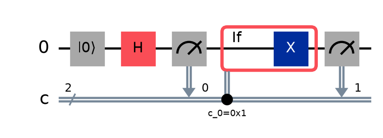

# 8. OpenQASM 3と相互運用

[← jobと結果分析](07-results-analysis.md) | [次: 補章A・基本アルゴリズム →](09-algorithm-worked-examples.md)

これまでPythonで組み立てた回路は、テキストとして読み書きすることもできます。**OpenQASM**は、量子ビットへの操作や、測定結果を使う古典的な処理を記述する言語です。この章では、短いプログラムから量子状態と古典変数の変化を読み取り、Qiskitへ読み込んだ結果も確かめます。

言語の説明は**OpenQASM 3.0仕様**を基準にします。PythonコードはQiskit 2.5.2、OpenQASM 3の読込みは追加パッケージ`qiskit-qasm3-import 0.6.0`を使います。これはRuntime 0.49.0やSampler V2の「版」とは別です。言語で表せる処理、SDKで変換できる処理、サービスで実行できる処理を順に区別します。

<a id="qasm-types"></a>
## version、量子型、古典型

### 短いプログラムの全体を見る

最初は、2量子ビットを初期化し、Bell状態を作って測るプログラムです。セミコロン`;`は文の終わりを表します。`//`から行末まではコメントとして説明を書けます。

<!-- validation: qasm bell -->
```qasm
OPENQASM 3.0;
include "stdgates.inc";
qubit[2] q;
bit[2] c;
reset q;
h q[0];
cx q[0], q[1];
c = measure q;
```

各行を「型と保存場所を決める部分」と「処理を行う部分」に分けて読みます。

| 記述 | この例での役割 |
|---|---|
| `OPENQASM 3.0;` | 言語の版を明示する |
| `include "stdgates.inc";` | hやcxなど、標準ゲートの定義を利用する |
| `qubit[2] q;` | q[0]、q[1]という2量子ビットへの参照を宣言する |
| `bit[2] c;` | c[0]、c[1]という2個の古典ビットの保存場所を宣言する |
| `reset q;` | 両量子ビットを0の状態へ初期化する |
| `h q[0];` | q[0]へHを適用する |
| `cx q[0], q[1];` | q[0]を制御、q[1]を標的とするCXを適用する |
| `c = measure q;` | q[j]を測り、その結果をc[j]へ保存する |

`OPENQASM 3.0;`は、本章では常に先頭に置きます。仕様では版の宣言は省略可能ですが、書く場合はコメント以外の最初の行に、一度だけ置きます。途中で`OPENQASM 2.0;`を書いて言語を切り替える使い方はできません。

`include`は、指定したファイルの内容をその場所へ取り込む仕組みです。Pythonの`import qiskit`とは異なり、標準ゲートを呼び出すためのOpenQASM側の定義を用意しています。`include`を読めることだけで、任意の外部ファイルやその内容を実機へ送信できるとは限りません。

### 量子ビットの宣言と、初期化を分ける

`qubit q;`は一つの量子ビット、`qubit[2] q;`は2個の量子ビットからなる量子レジスタです。`q[0]`は最初の量子ビットを指し、状態ベクトルの0番目の複素振幅ではありません。

**OpenQASM 3.0では、宣言しただけの量子ビットの状態は未定義です。** 上の例に`reset q;`を置いたのは、最初に$|00\rangle$を用意することをプログラム自身で明示するためです。これまでのローカルシミュレータの例が0から始まったことを、言語仕様上の暗黙の初期化と読み替えません。

古典変数も、明示的に初期化されなければ値は未定義です。`bit[2] c;`だけを読んで、cが`00`だとは決めません。最初の例では`c = measure q;`が各ビットへ値を書き込んでから、その結果を利用します。

### 型から、何を保存するかを読む

**型**は、変数へどの種類の値を保存するかを表します。同じ角括弧でも、`bit[32]`は32個のビットのレジスタ、`int[32]`は32ビット幅の整数一つです。量子ビット数とも区別します。

| 宣言の例 | 保存するもの・用途 |
|---|---|
| `bit flag;` | 測定結果などの0または1 |
| `bool ready = false;` | 条件の真偽。値はtrueまたはfalse |
| `int[32] count = -1;` | 符号付きの32ビット整数 |
| `uint[8] count = 5;` | 符号なしの8ビット整数。値の範囲は0〜255 |
| `float[64] theta = pi / 2;` | 浮動小数点数。角度などの数値にも使う |
| `angle[32] theta = pi / 2;` | 一周を2πとして、32ビットの離散的な表現で保持する角度 |
| `complex[float[64]] z = 1.0 + 2.0im;` | 実部と虚部をそれぞれfloat[64]で持つ複素数 |

表はそれぞれ独立した宣言の例です。同じ名前を同じ場所で繰り返し宣言するプログラムではありません。また、これらの型がすべて今回のQiskit importerや実機で使える、という一覧でもありません。

`complex`があるからといって、量子ビットの状態を代入によって直接書き換えられるわけではありません。複素数を古典データとして持つことと、量子系をその振幅の状態に準備することは別で、後者には適切な量子操作が必要です。

`angle[n]`のnは量子ビット数ではなく、角度の表現に使うビット数です。例えば`angle[3]`では、一周を$2^3=8$段階に分け、$k\times2\pi/8$、すなわち$k\pi/4$という値を表します。$k$は0〜7です。`angle`では一周分の違いを同じ角度として扱います。`float[64]`と同じ数値表現だとは考えません。

### ビット列、整数、真偽値を変換する

型を指定して値の表現を変える操作を**型変換**（**cast**）と呼びます。次は古典データだけを扱う言語の例です。Qiskitへの変換には制限があり、その確認を[相互運用の節](#qasm-qiskit-interop)で行います。

<!-- validation: qasm classical -->
```qasm
OPENQASM 3.0;
bit[4] bits = "0101";
uint[8] value = uint[8](bits);
bool odd = bool(bits[0]);
value += 1;
```

文字列の右端が`bits[0]`なので、`bits[0]=1`、`bits[1]=0`、`bits[2]=1`、`bits[3]=0`です。整数へ変換すると、

$$
1\times2^0+0\times2^1+1\times2^2+0\times2^3=5
$$

です。`bool(bits[0])`は1を`true`へ変換します。最後の`value += 1;`は`value = value + 1;`に相当し、valueが6になります。元のbitsは`0101`のままです。valueはbitsの内容をコピーして変換した整数であり、同じ保存場所への別名ではありません。

Pythonの整数のように、どの幅の整数でも際限なく大きな値を保持できるとは考えません。幅を変えるcast、表せる範囲を超える演算、未初期化値には、それぞれ言語の規則があります。詳細は[型とcastの仕様](https://openqasm.com/versions/3.0/language/types.html)を参照してください。

<a id="qasm-semantics"></a>
## programを意味で追う

### Bell状態の準備から、古典ビットへの記録まで

最初のプログラムを、状態と記録に分けて追います。本書では2量子ビットの状態を$|q_1q_0\rangle$の順に書きます。

`reset q;`の後は$|00\rangle$です。`h q[0];`は$q_0$だけにHを適用するので、

$$
|00\rangle\ \longrightarrow\
\frac{|00\rangle+|01\rangle}{\sqrt{2}}
$$

となります。続く`cx q[0], q[1];`は、$q_0=1$の成分で$q_1$を反転します。$|00\rangle$はそのまま、$|01\rangle$は$|11\rangle$になるため、

$$
\frac{|00\rangle+|01\rangle}{\sqrt{2}}
\ \longrightarrow\
\frac{|00\rangle+|11\rangle}{\sqrt{2}}
$$

です。ここまでcの値はまだ決まっていません。量子状態を変えるゲートと、古典ビットへ値を書く操作を区別します。

`c = measure q;`は、同じ長さのレジスタ同士なら`c[0] = measure q[0];`と`c[1] = measure q[1];`へ対応します。Z基底の測定なので、理想的には次の二通りです。

| 生じる確率 | 測定後の量子状態 | 古典記録c[1] c[0] |
|---|---|---|
| 1/2 | $\lvert00\rangle$ | `00` |
| 1/2 | $\lvert11\rangle$ | `11` |

測定は状態ベクトルの二つの振幅をcへコピーする操作ではありません。一つのshotでは、結果に対応する一つのビット列を記録します。cだけを見ても、測定前の相対位相は読み取れません。

次のPythonコードは、このプログラムを`qasm3.loads`で回路へ変換し、ローカルで16shotsを取得します。読込みの準備とAPIの違いは、後の節で整理します。

```python
from qiskit import qasm3
from qiskit.primitives import StatevectorSampler

program = """OPENQASM 3.0;
include "stdgates.inc";
qubit[2] q;
bit[2] c;
reset q;
h q[0];
cx q[0], q[1];
c = measure q;
"""
qc = qasm3.loads(program)
result = StatevectorSampler(seed=7).run([qc], shots=16).result()
print("qubits, classical bits:", qc.num_qubits, qc.num_clbits)
print("operations:", [item.operation.name for item in qc.data])
print("counts:", dict(sorted(result[0].data.c.get_counts().items())))
```

出力:

```text
qubits, classical bits: 2 2
operations: ['reset', 'reset', 'h', 'cx', 'measure', 'measure']
counts: {'00': 8, '11': 8}
```

レジスタ全体へのresetとmeasureは、Qiskitでは量子ビットごとの命令に分かれています。結果の名前が`data.c`なのは、プログラムが`bit[2] c;`を宣言したためです。今回の8回ずつという内訳はseedを固定したローカル例であり、16shotsなら常に半分ずつになる保証ではありません。

### resetはXや逆ゲートではない

Xは$|0\rangle$を$|1\rangle$へ、$|1\rangle$を$|0\rangle$へ入れ替えます。resetは、どちらの入力からも$|0\rangle$を準備します。異なる状態を一つへ移すので、任意の入力について逆ゲートで取り消せる操作ではありません。

また、もつれた2量子ビットの片方だけをresetしても、全体が$|00\rangle$になるわけではありません。Bell状態の$q_0$だけをresetすると、$q_1$は0・1のどちらかを各半分で与えるままで、全体は

$$
\rho_{\mathrm{after}}
=\frac12|00\rangle\langle00|+\frac12|10\rangle\langle10|
$$

という混合状態になります。$\rho$は[第2章](02-visualization-measurement.md#state-plots)で扱った密度行列です。reset後の$q_0$は0ですが、もとのBell状態の成分間のつながりは失われます。

```python
import numpy as np
from qiskit import QuantumCircuit
from qiskit.quantum_info import DensityMatrix

qc = QuantumCircuit(2)
qc.h(0)
qc.cx(0, 1)
before = DensityMatrix(qc)
qc.reset(0)
after = DensityMatrix(qc)
print("probabilities 00, 01, 10, 11:", np.round(after.probabilities(), 6).tolist())
print("q0 probabilities:", np.round(after.probabilities([0]), 6).tolist())
print("q1 probabilities:", np.round(after.probabilities([1]), 6).tolist())
print("before rho[0, 3]:", f"{before.data[0, 3].real:.6f}")
print("after rho[0, 3]:", f"{after.data[0, 3].real:.6f}")
```

出力:

```text
probabilities 00, 01, 10, 11: [0.5, 0.0, 0.5, 0.0]
q0 probabilities: [1.0, 0.0]
q1 probabilities: [0.5, 0.5]
before rho[0, 3]: 0.500000
after rho[0, 3]: 0.000000
```

対角成分は各基底状態の確率です。`rho[0, 3]`は$|00\rangle$と$|11\rangle$の成分間のコヒーレンスを表し、この例ではreset後に0になります。出力は密度行列による理想計算であり、実機のresetの精度を測ったものではありません。

### 測定したビットで、次の操作を決める

次は、最初の測定結果が1のときだけXを行い、最後にもう一度測るプログラムです。最初の記録をc[0]、最後の記録をc[1]へ保存します。

<!-- validation: qasm feedback -->
```qasm
OPENQASM 3.0;
include "stdgates.inc";
qubit q;
bit[2] c;
reset q;
h q;
c[0] = measure q;
if (c[0]) {
  x q;
}
c[1] = measure q;
```

`if (c[0])`は、c[0]が1なら波括弧の中を実行し、0なら飛ばします。1は真、0は偽として条件を評価します。`if`は、量子状態の二成分へコヒーレントに操作する制御ゲートではなく、**すでに測定して得た古典値による分岐**です。

| 最初の測定の確率 | c[0] | 最初の測定後の状態 | 分岐での操作 | 最後の状態 | c[1] c[0] |
|---|---|---|---|---|---|
| 1/2 | 0 | $\lvert0\rangle$ | 何もしない | $\lvert0\rangle$ | `00` |
| 1/2 | 1 | $\lvert1\rangle$ | X | $\lvert0\rangle$ | `01` |

どちらの分岐でも、最後に測る量子ビットは$|0\rangle$です。しかし、c[0]は過去の測定記録なので、後からXを行っても書き換わりません。この例では量子ビットは1個、保存する古典ビットは2個です。

次のコードはプログラムを読み込み、条件の参照先と条件付きブロックを確認して図を作ります。

```python
import matplotlib.pyplot as plt
from qiskit import qasm3

program = """OPENQASM 3.0;
include "stdgates.inc";
qubit q;
bit[2] c;
reset q;
h q;
c[0] = measure q;
if (c[0]) {
  x q;
}
c[1] = measure q;
"""
qc = qasm3.loads(program)
branch = qc.data[3].operation
print("operations:", [item.operation.name for item in qc.data])
print("condition bit:", qc.find_bit(branch.condition[0]).index)
print("condition value:", int(branch.condition[1]))
print("if body:", [item.operation.name for item in branch.blocks[0].data])
fig = qc.draw("mpl", fold=-1)
fig.savefig("08-qasm-feedback.png", dpi=160, bbox_inches="tight")
plt.close(fig)
```

出力:

```text
operations: ['reset', 'h', 'measure', 'if_else', 'measure']
condition bit: 0
condition value: 1
if body: ['x']
```



最初の測定先が0、最後の測定先が1です。中央の条件ブロックは古典ビット0を参照します。図の`0x1`は16進数で1を表します。Qiskitでは条件分岐が`if_else`命令として記録されますが、この例にはelse側の操作はありません。

この確認は回路の構造についてのものです。`StatevectorSampler`は途中の測定やこの条件分岐を扱えないため、上の動的回路をそのまま渡して実行する例にはしていません。理想的な振る舞いは、測定結果を列挙して確認できます。

```python
from qiskit import QuantumCircuit
from qiskit.quantum_info import Statevector

plus = Statevector.from_label("+")
for bit in [0, 1]:
    probability = plus.probabilities()[bit]
    after_measure = Statevector.from_label(str(bit))
    correction = QuantumCircuit(1)
    if bit == 1:
        correction.x(0)
    final = after_measure.evolve(correction)
    print(f"c[0]={bit}, probability={probability:.1f}, "
          f"P(c[1]=0)={final.probabilities()[0]:.1f}")
```

出力:

```text
c[0]=0, probability=0.5, P(c[1]=0)=1.0
c[0]=1, probability=0.5, P(c[1]=0)=1.0
```

このPythonの`if`は、列挙して既に値を与えたbitを使っています。将来の測定結果をPythonが先取りしているわけではありません。回路構築時のPythonと、回路実行中の分岐との関係は[第3章](03-circuit-construction.md#dynamic-circuits)も参照してください。

### forの繰返しとshotsを区別する

次は、同じ量子ビットへXを3回続けてから測るプログラムです。

<!-- validation: qasm loop -->
```qasm
OPENQASM 3.0;
include "stdgates.inc";
qubit q;
bit[1] readout;
reset q;
for int i in [0:2] {
  x q;
}
readout[0] = measure q;
```

OpenQASMの範囲`[0:2]`は、**両端を含む**0、1、2です。Pythonの`range(3)`に対応し、`range(2)`ではありません。この例ではループ変数iをゲートの指定には使っていません。

量子状態は、$|0\rangle\to|1\rangle\to|0\rangle\to|1\rangle$と変わり、最後の測定で1を得ます。途中で初期化をやり直す3shotsとは異なります。ループを含むこのプログラム全体を16shots実行すれば、各shotの中でXを3回行います。

回数の決まった単純なループは、ゲートを並べた回路へ**展開**（**unroll**）できます。次はQiskitの変換パス`UnrollForLoops`で展開してから、ローカルSamplerで測る例です。

```python
from qiskit import qasm3
from qiskit.primitives import StatevectorSampler
from qiskit.transpiler import PassManager
from qiskit.transpiler.passes import UnrollForLoops

program = """OPENQASM 3.0;
include "stdgates.inc";
qubit q;
bit[1] readout;
reset q;
for int i in [0:2] {
  x q;
}
readout[0] = measure q;
"""
looped = qasm3.loads(program)
unrolled = PassManager(UnrollForLoops()).run(looped)
print("before:", [item.operation.name for item in looped.data])
print("after:", [item.operation.name for item in unrolled.data])
result = StatevectorSampler(seed=7).run([unrolled], shots=16).result()
print("counts:", result[0].data.readout.get_counts())
```

出力:

```text
before: ['reset', 'for_loop', 'measure']
after: ['reset', 'x', 'x', 'x', 'measure']
counts: {'1': 16}
```

これは回数が静的に決まるループの例です。測定結果で継続を判断する`while`などが、常に同じ方法で有限個のゲートへ展開できるとは限りません。また、ループを取り除いた後も、実機で使えるゲートや配置への変換は別に必要です。

<a id="qasm-qiskit-interop"></a>
## Qiskitとのimport/export

### 読込みの準備と、四つの関数の役割

Qiskitの`qasm3.dumps`・`dump`は、回路からOpenQASM 3を出力する関数です。`qasm3.loads`・`load`は、その逆にテキストから回路へ読み込む関数です。importやexportは、回路の実行を意味しません。

Qiskit 2.5.2で、この`loads`・`load`を使うには、追加の**importer**である`qiskit-qasm3-import`が必要です。本章の検証は0.6.0を使っています。同じ基準版を準備する場合は、例えば次のように指定します。

```text
python -m pip install "qiskit[qasm3-import]==2.5.2" "qiskit-qasm3-import==0.6.0"
```

`qasm3-import`は追加機能をまとめて指定するextraの名前です。コード中の`from qiskit import qasm3`だけでは、不足するパッケージが自動でインストールされるわけではありません。

| 関数 | 入力 | 何を得るか |
|---|---|---|
| `qasm3.dumps(qc)` | QuantumCircuit | プログラム本文のPython文字列 |
| `qasm3.loads(program)` | プログラム本文の文字列 | QuantumCircuit |
| `qasm3.dump(qc, stream)` | 回路と、書込み可能なテキストストリーム | streamへ書き込む。戻り値はNone |
| `qasm3.load(filename)` | 読み込むファイル名 | QuantumCircuit |

末尾のsがある関数では、文字列が入出力の対象です。`loads("example.qasm")`は、その名前のファイルを開く操作ではありません。`example.qasm`という文字列自体をプログラムとして読もうとします。

また、**基準版の`dump`と`load`は、同じ種類の引数を受け取るわけではありません。** `dump`には`open(..., "w")`で開いたストリームを渡し、`load`にはファイル名を渡します。

### 回路から、プログラム本文の文字列を作る

まず1量子ビットの回路をPythonで組み立て、`dumps`で文字列にします。Qiskitでは測定元と保存先を`measure(0, 0)`で記述し、OpenQASMでは`c[0] = measure q[0];`となることを確認します。

```python
from qiskit import QuantumCircuit, qasm3

qc = QuantumCircuit(1, 1)
qc.reset(0)
qc.h(0)
qc.measure(0, 0)
program = qasm3.dumps(qc)
print("Python type:", type(program).__name__)
print(program, end="")
```

出力:

```text
Python type: str
OPENQASM 3.0;
include "stdgates.inc";
bit[1] c;
qubit[1] q;
reset q[0];
h q[0];
c[0] = measure q[0];
```

`dumps`が生成したのは、改行を含む文字列です。まだファイルを作っておらず、測定も実行していません。出力の宣言順や空白が手書きの例と違っていても、それだけで回路の意味が変わるわけではありません。

### ファイルへ書き、読み戻して対応を確認する

次は`08-roundtrip.qasm`を作業ディレクトリへ書き、`load`で読み戻します。回路の同値性を調べるため、まず測定を含まないユニタリな回路を作り、コピーへ測定を追加します。準備部分の行列と、測定先の対応を分けて確認します。

```python
from pathlib import Path
import numpy as np
from qiskit import QuantumCircuit, qasm3
from qiskit.quantum_info import Operator

preparation = QuantumCircuit(2)
preparation.h(0)
preparation.ry(0.4, 1)
preparation.cx(0, 1)
qc = QuantumCircuit(2, 2)
qc.compose(preparation, inplace=True)
qc.measure([0, 1], [1, 0])
path = Path("08-roundtrip.qasm")
with path.open("w", encoding="utf-8") as stream:
    written = qasm3.dump(qc, stream)
restored = qasm3.load(str(path))
restored_preparation = restored.remove_final_measurements(inplace=False)
pairs = [
    (restored.find_bit(item.qubits[0]).index, restored.find_bit(item.clbits[0]).index)
    for item in restored.data if item.operation.name == "measure"
]
print("dump return:", written)
print("file exists:", path.is_file())
print("same unitary:", np.allclose(Operator(preparation).data, Operator(restored_preparation).data))
print("measurement pairs:", pairs)
```

出力:

```text
dump return: None
file exists: True
same unitary: True
measurement pairs: [(0, 1), (1, 0)]
```

`Operator(...).data`は、量子操作全体を表す行列です。`np.allclose`は浮動小数点の許容誤差内での一致を確認します。ここでは、特定の初期状態の出力だけでなく、測定前の回路の行列を比較しています。測定やresetまで含む回路を、同じユニタリ行列として比較する方法ではありません。

`measurement pairs`は、量子ビット0→古典ビット1、量子ビット1→古典ビット0という対応です。countsを読むとき、この保存先の入替えを忘れると、回路の準備部分が正しくても量子ビットを取り違えます。

この保存例は相互運用で何を確かめるかに焦点を当て、ユニタリな準備部分には初期化を含めていません。ファイルを独立したプログラムとして実行する際には、入力状態を用意する条件も必要です。先ほどの完結したBellの例では、それをresetで明示しました。

### inputパラメータを、QiskitのParameterへつなぐ

OpenQASM 3の`input`は、外から値を与えて使う変数を宣言します。`input float[64] theta;`は、同じ回路へ異なる角度を渡すための入口です。回路内の測定結果からthetaを計算しているわけではありません。

次は、入力thetaを持つプログラムを読み込み、一度文字列へ出力して再び読み込みます。その後、0とπを別々に束縛し、測定します。

```python
import numpy as np
from qiskit import qasm3
from qiskit.primitives import StatevectorSampler

program = """OPENQASM 3.0;
include "stdgates.inc";
input float[64] theta;
qubit q;
bit[1] readout;
reset q;
ry(theta) q;
readout[0] = measure q;
"""
qc = qasm3.loads(program)
restored = qasm3.loads(qasm3.dumps(qc))
print("parameters:", [p.name for p in restored.parameters])
theta = next(iter(restored.parameters))
for angle in [0.0, np.pi]:
    bound = restored.assign_parameters({theta: angle})
    bits = StatevectorSampler(seed=7).run([bound], shots=16).result()[0].data.readout
    print(f"angle={angle:.3f}", bits.get_counts())
```

出力:

```text
parameters: ['theta']
angle=0.000 {'0': 16}
angle=3.142 {'1': 16}
```

$R_y(\theta)|0\rangle$から1を得る理論確率は$\sin^2(\theta/2)$なので、0とπでそれぞれ0と1になります。複数の角度を一つのPUBへ渡す方法は[第5章](05-sampler.md#sampler-pub)につながります。

読み戻した回路に対しては、その回路の`parameters`から値を対応させます。同じ名前だからといって、読込み前に持っていた別の`Parameter`オブジェクトと同一だとは仮定しません。複数パラメータなら、[第3章](03-circuit-construction.md#parameters)のように順と名前を確認します。

### 往復変換で、何が保たれたかを調べる

**往復変換**（**round trip**）は、回路→OpenQASM→回路のように表現を戻すことです。読込みが成功しただけで、回路に付いていた情報がすべて保持されたとは限りません。文字列の一致、操作の行列の一致、測定確率の一致、付随情報の保持を区別して確認します。

次は基準版で注意が必要な例です。回路全体にglobal phaseを付け、metadataも設定してから往復します。

```python
import numpy as np
from qiskit import QuantumCircuit, qasm3
from qiskit.quantum_info import Operator

qc = QuantumCircuit(1)
qc.h(0)
qc.global_phase = 0.3
qc.metadata = {"experiment": "phase-example"}
restored = qasm3.loads(qasm3.dumps(qc))
original_operator = Operator(qc)
restored_operator = Operator(restored)
print("global phases:", float(qc.global_phase), float(restored.global_phase))
print("same matrix:", np.allclose(original_operator.data, restored_operator.data))
print("equal up to global phase:", original_operator.equiv(restored_operator))
print("restored metadata:", restored.metadata)
```

出力:

```text
global phases: 0.3 0.0
same matrix: False
equal up to global phase: True
restored metadata: {}
```

Qiskit 2.5.2の`qasm3.dumps`では、この例の回路全体のglobal phaseは出力されず、metadataも戻りませんでした。元の行列は$e^{0.3i}H$、読み戻した行列はHなので、**同じ行列ではありません**。`Operator.equiv`のTrueは、全体位相を除けば同値という、より弱い条件です。

単独の回路として使う場合は全体位相を観測できませんが、その回路全体を制御操作にすると、位相が制御の分岐間の相対位相として現れることがあります。したがって、後で回路をどのように合成するかによって、必要な保持の条件も変わります。

OpenQASM 3の言語には全体位相を表す`gphase`があります。上の結果は、その言語が位相を表せないという意味ではなく、**基準版のこのexport経路での挙動**です。対応状況を調べるときは、言語と変換機能を分けます。

回路と付随情報をQiskitで保存・復元する用途では、[第7章のQPYと記録の保存](07-results-analysis.md#metadata)も参照してください。外部のツールへ渡すOpenQASMと、入力・結果・実行条件の保存は、目的に応じて使い分けます。

### 構文として読めても、QuantumCircuitへ変換できるとは限らない

最初の型変換の例は、OpenQASM 3.0の古典変数の宣言・代入を使っています。しかし、今回の`qiskit-qasm3-import 0.6.0`では、初期値を持つ古典ビットの宣言は読み込めません。

次はその違いを確認するコードです。`openqasm3.parse`は構文を解析して、文の構造を表すデータを返します。これは型の規則や実行結果まですべて検証する関数ではありません。

```python
import openqasm3
from qiskit import qasm3

program = """OPENQASM 3.0;
bit[4] bits = "0101";
uint[8] value = uint[8](bits);
bool odd = bool(bits[0]);
value += 1;
"""
parsed = openqasm3.parse(program)
print("parsed version:", parsed.version)
print("statements:", len(parsed.statements))
try:
    qasm3.loads(program)
except qasm3.QASM3ImporterError as error:
    print("Qiskit import:", type(error).__name__)
```

出力:

```text
parsed version: 3.0
statements: 4
Qiskit import: QASM3ImporterError
```

この例は「書き方の誤りを直せば、必ず同じimporterで実行できる」という場合ではありません。言語としての型と代入の意味を理解したうえで、使う変換経路が対応しているかを確認します。また、importでエラーになったことだけで、その処理をPythonの`QuantumCircuit`でも構築できないと決めません。回路の構築、export、importの対応範囲は完全には対称でありません。

`openqasm3.parse`にはparser用の追加依存が必要です。本章の環境は`openqasm3[parser] 1.0.1`を使い、[検証用の依存一覧](../validation/requirements.txt)へ記録しています。構文解析の成功と、言語の意味の検討を分けた検証です。

<a id="qasm-support-boundary"></a>
## 仕様、SDK、QPU、RESTの境界

### 「対応している」の対象を確認する

OpenQASMのプログラムから実機の結果へ進むには、複数の段階があります。例えば、forを読み込んで回路の中に保持できたことと、for命令をそのままサービスへ送って実行できることは別です。

| 確認する段階 | 確認したいこと |
|---|---|
| 言語仕様 | 文法、型、添字、演算、初期化に意味が定義されているか |
| 構文解析 | テキストを文の構造として読み取れるか |
| Qiskitへのimport | 使うimporterがその文をQuantumCircuitへ変換できるか |
| Qiskitでの表現・export | 回路に構造を保持し、必要な情報を出力できるか |
| backendへの変換 | ゲート、接続、量子ビットの配置などが実行先へ適合するか |
| サービスでの実行 | 対象の機能とoptionsの組合せを実行できるか |

IBMの[QASM feature table](https://quantum.cloud.ibm.com/docs/en/guides/qasm-feature-table)では、Qiskit SDKとIBM Quantum Compute Serviceの列を分けています。SDKの欄の完全な対応は、import、回路表現、exportを含む意味で定義されています。部分対応なら注記まで読みます。

例えば同表ではfor・whileの回路内ループについて、SDKとサービスの対応が同じではありません。先ほどローカルで動かしたforの例は、既知の3回をX三つへ展開してから実行しました。ループを保持したまま実行した証拠ではありません。

また、`qubit[2] q;`で宣言したq[0]とq[1]は、実機の物理量子ビット0と1へ固定する指定ではありません。OpenQASMには`$0`、`$1`のように物理量子ビットを表す記法もありますが、その番号が存在し必要な命令を実行できるかは実行先に依存します。[第4章のlayout](04-transpile-execution.md#isa-layout)で扱った論理量子ビットと物理量子ビットの対応を確認します。

機能表は更新されるサービス資料です。Qiskit 2.5.2やimporter 0.6.0を固定しても、すべての実機・サービスの対応がその版で固定されるわけではありません。本章の例でローカルに確認できた範囲と、実行先で別に確認する条件を区別します。

### OpenQASMは回路の記述、RESTはサービスへの依頼

**REST API**は、HTTPを使ってサービスへ依頼し、応答を受け取るインターフェースです。PythonのRuntimeクラスを使わないプログラムから、IBM Quantum Computeの実行を依頼する用途にも使えます。

OpenQASMは、依頼の中で回路を表すために使うテキストです。プログラム本文だけでは、どのbackendへ、何shotsで、どのprimitiveの仕事として送るかまで、Runtimeの実行依頼が完成したことにはなりません。

例えばBell回路をSamplerで測るなら、次を分けて考えます。

1. OpenQASMなどで、準備と測定を含む回路を表す。
2. その回路を含むSampler PUBと、パラメータ値・shotsなどの入力を用意する。
3. 利用するアカウントの認証、実行先、実行モードを指定して、APIへ依頼する。
4. 返されたjob IDで状態と結果を取得し、条件に対応した測定記録を読む。

Estimatorでは、同じように回路に加えて観測量やprecisionなどの入力も必要です。**OpenQASMのforを100回にすることは、Runtimeのshotsを100へ指定する操作ではありません。** 回路内の処理と、回路全体を繰り返し評価する実行設定は別です。

REST経由でも、[第4章](04-transpile-execution.md#execution-modes)のJob・Session・Batchの概念は残ります。独立した複数の実験か、前の結果を使って次を決める実験かに応じて選びます。RESTを使ったらJobモードだけになる、という制限ではありません。

送信用のJSONの項目、認証ヘッダ、endpointはサービスのAPI仕様に従います。回路がimportできたことから推測せず、[RESTの実行モード](https://quantum.cloud.ibm.com/docs/en/guides/execution-modes-rest-api)と、[Sampler](https://quantum.cloud.ibm.com/docs/en/guides/sampler-rest-api)・[Estimator](https://quantum.cloud.ibm.com/docs/en/guides/estimator-rest-api)の資料で、対象の実行方法を確認します。本章のローカル検証は、認証やQPUへの送信を含みません。

<a id="qasm-version-differences"></a>
## OpenQASM 2と3を見分ける

### 版の宣言と、使う入出力モジュールを合わせる

OpenQASM 3は、2に比べて古典型、式、制御フローなどを広げた言語です。2で書いた短い回路を読む経験は役立ちますが、版の数字だけを書き換えれば、すべてのプログラムを変換できるわけではありません。

| 観点 | OpenQASM 2の典型的な記述 | OpenQASM 3で本章が使う記述 |
|---|---|---|
| 版 | `OPENQASM 2.0;` | `OPENQASM 3.0;` |
| 標準ゲートのinclude | `include "qelib1.inc";` | `include "stdgates.inc";` |
| 量子レジスタ | `qreg q[2];` | `qubit[2] q;` |
| 古典レジスタ | `creg c[2];` | `bit[2] c;` |
| 測定 | `measure q -> c;` | `c = measure q;` |
| 古典的な制御 | レジスタ値と整数の比較による限定的なif | 型、式、ブロック、for・whileなどを含む制御フロー |
| Qiskitの入出力 | `qiskit.qasm2` | `qiskit.qasm3` |

OpenQASM 3.0には後方互換のため、`qreg`・`creg`や矢印形式の測定も残っています。そのため、`measure q -> c;`という一行だけでは、プログラム全体が2か3かは断定できません。まず版の宣言と全体の構文を確認します。本章で新しく書く3のコードは、`qubit`・`bit`と代入形式の測定で統一します。

### 同じ単純な回路を、それぞれの形式で出力する

次は、最初からOpenQASM 2で書かれたBell回路を`qasm2.loads`で読み、同じ回路を3で出力して読み戻す例です。単純な回路で、命令と保存先が対応することを確かめます。

```python
from qiskit import qasm2, qasm3
from qiskit.primitives import StatevectorSampler

source_v2 = """OPENQASM 2.0;
include "qelib1.inc";
qreg q[2];
creg c[2];
reset q;
h q[0];
cx q[0], q[1];
measure q -> c;
"""
qc = qasm2.loads(source_v2)
source_v3 = qasm3.dumps(qc)
restored = qasm3.loads(source_v3)
print("v2 header:", source_v2.splitlines()[0])
print("v3 header:", source_v3.splitlines()[0])
print("v3 has bit declaration:", "bit[2] c;" in source_v3)
print("v3 has qubit declaration:", "qubit[2] q;" in source_v3)
result = StatevectorSampler(seed=7).run([restored], shots=16).result()
print("counts:", dict(sorted(result[0].data.c.get_counts().items())))
```

出力:

```text
v2 header: OPENQASM 2.0;
v3 header: OPENQASM 3.0;
v3 has bit declaration: True
v3 has qubit declaration: True
counts: {'00': 8, '11': 8}
```

Qiskitを介して、元の命令とビットの対応を別の構文へ出力しています。単なる文字列置換ではありません。逆に、3の型や制御フローを2へ出したい場合は、2で表せる構造へ変換できるかを先に考えます。任意の3のプログラムを2へ損失なく変換できる、という例ではありません。

**読み進める順序**は、版とinclude、型と初期化、ゲートの順序、測定の保存先、古典的な分岐、入出力の対応、実行先の条件です。プログラムを読めたことと、変換や実機実行が成功することを、それぞれ確認します。

## 章末チェック

1. `qubit[2] q; bit[2] c;`だけが書かれています。OpenQASM 3.0の仕様から、qは00の状態、cは`00`という値だと判断できますか。
2. `bit[4] bits = "1010";`を符号なし整数へ変換するといくつですか。bits[0]は何ですか。`uint[4]`は4個の整数を表しますか。
3. 最初のBellプログラムで、Hをq[1]へ変更し、CXの制御・標的はq[0]、q[1]のままにしました。測定結果c[1] c[0]はどう変わりますか。
4. 測定後にXを行う例で、Xの条件を「c[0]が0なら」に変えました。最後のc[1]と、保存される二つのビット列はどうなりますか。
5. `for int i in [1:3] { x q; }`はXを何回行いますか。resetで0を準備し、ループの直後に測るとどうなりますか。100shotsとは何が違いますか。
6. `qasm3.loads("saved.qasm")`でファイルを読めますか。ファイルへ書く`dump`の第2引数には何を渡しますか。
7. 回路を往復変換して`Operator.equiv`がTrueでした。同じ行列であること、metadataが保持されたこと、測定先が一致することも確認できましたか。
8. `input float[64] theta;`を読み込めました。まだthetaに値を与えていない回路を、値の指定なしでSamplerへ渡してよいですか。
9. forを含むプログラムがQiskitに読み込めました。そのまま対象のQPUへ送信できると判断できますか。RESTへ変更すれば確認は不要になりますか。
10. `measure q -> c;`があることだけでOpenQASM 2だと判断できますか。OpenQASM 3の全体位相の表現と、Qiskitのexportでその情報が出るかは同じ問題ですか。

### 解答と理由

1. **判断できません。** 宣言だけでは量子状態も古典変数の値も未定義です。量子ビットにはresetなどで初期状態を用意し、古典値は初期化や測定の代入で定めます。
2. **整数は10、bits[0]は0です。** $0\times2^0+1\times2^1+0\times2^2+1\times2^3=10$です。uint[4]は4ビット幅の整数一つで、4個の整数の配列ではありません。
3. **`00`と`10`を各1/2で得ます。** q[0]は0のままなのでCXは標的を反転せず、q[1]だけがHによる重ね合わせです。元のBell状態とは異なります。
4. **最後のc[1]は常に1、記録は`10`と`11`です。** 最初が0ならXで1へ変わり、最初が1ならそのままです。c[0]は最初の記録を保持します。
5. **3回で、最後は1です。** 1・2・3の両端を含みます。同じ量子状態へXを続けて行う処理です。100shotsは回路全体を100回試す指定で、各shot内のゲート数とは別です。
6. **loadsでは読めません。** 本文の文字列として解釈されます。ファイル名にはloadを使い、dumpには書込み可能なテキストストリームを渡します。
7. **確認できていません。** equivは全体位相を除いた演算子の同値性です。必要なら行列を直接比較し、metadataや測定先も別に照合します。測定を含む回路全体をユニタリ行列として比較することもできません。
8. **値が必要です。** Parameterへ束縛するか、Sampler PUBのパラメータ値として渡します。inputは自由な入力の宣言であり、値の自動決定ではありません。
9. **どちらも判断できません。** backendへの適合とサービスの対応を別に確認します。RESTは依頼のインターフェースであり、回路の実行制約を取り除く仕組みではありません。
10. **どちらも同一視できません。** 3.0も矢印形式の測定を認めます。言語のgphaseと、基準版の特定のexport経路が位相を保持するかも分けて確認します。

公式参照: [OpenQASM 3.0仕様](https://openqasm.com/versions/3.0/index.html)、[初期化と測定](https://openqasm.com/versions/3.0/language/insts.html)、[古典的な処理と制御フロー](https://openqasm.com/versions/3.0/language/classical.html)、[Qiskitとの相互運用](https://quantum.cloud.ibm.com/docs/en/guides/interoperate-qiskit-qasm3)、[qasm3 API](https://quantum.cloud.ibm.com/docs/en/api/qiskit/qasm3)、[QASM feature table](https://quantum.cloud.ibm.com/docs/en/guides/qasm-feature-table)、[REST execution modes](https://quantum.cloud.ibm.com/docs/en/guides/execution-modes-rest-api)

[← jobと結果分析](07-results-analysis.md) | [次: 補章A・基本アルゴリズム →](09-algorithm-worked-examples.md)
