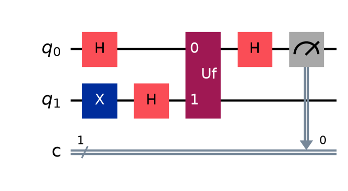
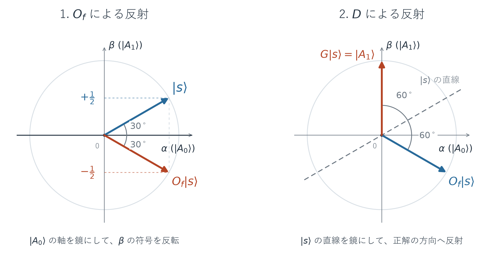
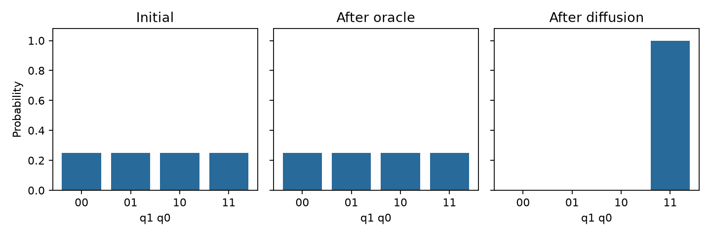
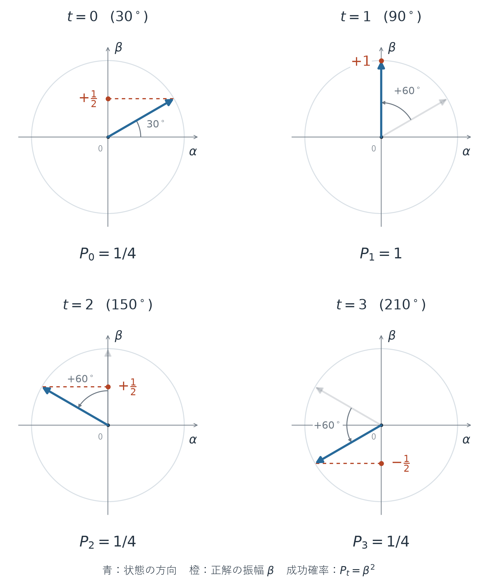
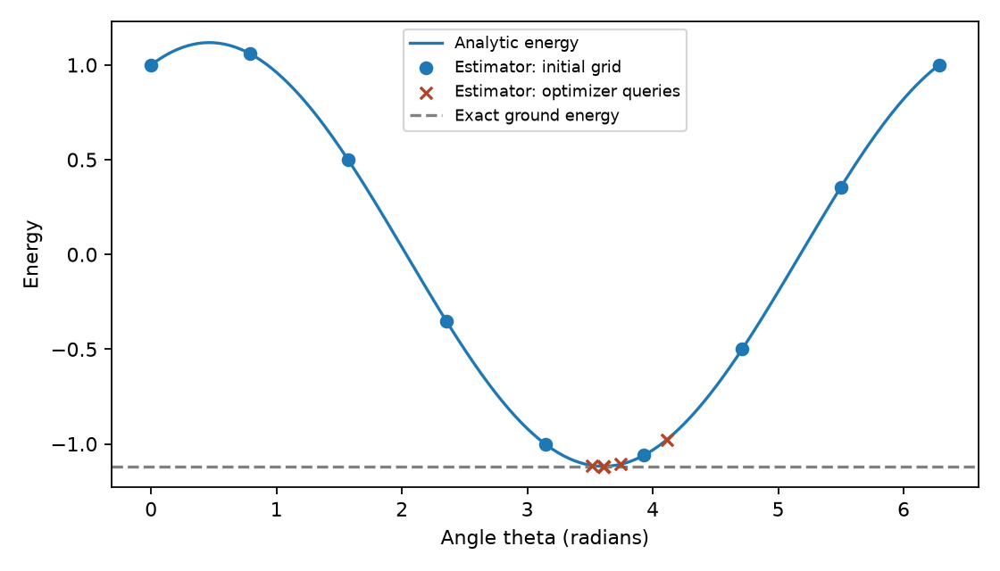

# 補章A. 基本アルゴリズムでつなぐ回路設計と実行

[← OpenQASM 3](08-openqasm3.md) | [入口](README.md) | [次: Objectives対応表 →](coverage.md)

第1〜8章で学んだゲート、測定、パラメータ、Primitivesを、問題を解く手順へつなぎます。**量子アルゴリズム**は、入力の表し方、状態の準備、量子操作、測定、必要な古典処理を組み合わせた計算手順です。回路を実行するだけでなく、出力から何を結論できるかまでを考えます。

ここでは三つの小さな問題を扱います。各節は、問題の定義、途中計算、実行例、条件を変えた確認問題の順に読めます。

| 題材 | 解きたいこと | 既習内容とのつながり |
|---|---|---|
| 位相キックバックとDeutsch | 関数の二つの出力が同じか、異なるかを判定する | 制御ゲート、固有状態、位相、Hによる干渉 |
| 2量子ビットのGrover | 条件を満たす候補を測定で取り出す | 回路の合成、振幅、Sampler、ビット順 |
| 小さなVQE | エネルギーの期待値が低い状態を探す | パラメータ、観測量、Estimator、古典側の最適化 |

この補章は、本編の知識を組み合わせるための教材です。公開Objectivesに新しい試験領域を追加するものでも、個別アルゴリズムの出題頻度を示すものでもありません。第1〜8章の構成はそのまま使います。

コードはQiskit 2.5.2 / NumPy 2.5.3 / SciPy 1.18.1を基準とし、図にはMatplotlibを使います。[検証用の依存一覧](../validation/requirements.txt)で環境をそろえられます。すべてローカルの理想計算です。数式の状態と照合する例は、回路へ測定を加える前の状態ベクトルを使います。

<a id="algorithm-deutsch"></a>
## 位相キックバックとDeutsch: 関数の性質を一つのビットにする

前提は、[位相と干渉](01-quantum-operations.md#phase)、[CXと複数量子ビット](01-quantum-operations.md#multi-entanglement)、[制御ゲートの構築](03-circuit-construction.md#compose-control)です。ここでは、制御ゲートの標的を特定の状態に準備すると、制御側の相対位相に情報が現れることを確かめます。

### 関数の出力を全部知る必要があるか

入力も出力も1ビットの関数$f$を考えます。知りたいのは$f(0)$と$f(1)$そのものではなく、**二つの出力が同じか、異なるか**です。

| f(0) | f(1) | 関数の例 | 分類 | 求める答え |
|---|---|---|---|---|
| 0 | 0 | $f(x)=0$ | 定数関数 | 0 |
| 1 | 1 | $f(x)=1$ | 定数関数 | 0 |
| 0 | 1 | $f(x)=x$ | 均等な関数 | 1 |
| 1 | 0 | $f(x)=1-x$ | 均等な関数 | 1 |

**定数関数**（**constant function**）は、入力によらず同じ値を返します。この1ビットの問題で**均等**（**balanced**）というのは、二つの入力について0と1を一回ずつ返すことです。

求める答えは$f(0)\oplus f(1)$です。$\oplus$は**排他的論理和**（**XOR**）で、同じ二つのビットなら0、異なれば1になります。古典的に一回だけ$f(0)$を調べても、$f(1)$が同じか異なるかは確定しません。両方を問い合わせれば確実に判定できます。

Deutschのアルゴリズムでは、関数を量子ゲートとして一回使い、理想的にはこの答えを確実に得ます。関数がどのようなゲートとして与えられるかが、その前提です。

### 関数を可逆なゲートとして用意する

量子計算で使う**オラクル**（**oracle**）は、調べたい関数の働きを実装した操作です。この例では、**入力用**を$q_0$、**作業用**を$q_1$とします。状態の表記は本編と同じ

$$
|q_1q_0\rangle=|y\rangle_1\otimes|x\rangle_0
$$

です。

さらに、関数を表すゲート$U_f$を、次の作用で定義します。

$$
U_f\bigl(|y\rangle_1\otimes|x\rangle_0\bigr)
=|y\oplus f(x)\rangle_1\otimes|x\rangle_0.
$$

入力$x$を残し、作業ビットへ$f(x)$をXORします。同じ操作をもう一度行えば$y$へ戻るため、これは可逆な操作です。単に$x$を$f(x)$で上書きすると、定数関数では異なる入力が同じ出力になり、ユニタリなゲートにはできません。

具体的には$f(x)=x$なら`cx(0, 1)`です。$x=0$では何もせず、$x=1$では作業ビットを反転するので、上の定義を満たします。他の関数も、恒等操作、X、CXとXの組合せで表せます。

### 標的をマイナス状態にすると、何が変わるか

<!-- 作業用の$q_1$を$|-\rangle=(|0\rangle-|1\rangle)/\sqrt2$へ準備します。

これは$X$（パウリXゲート）の固有状態です。「$|-\rangle$は$X$の固有状態」とは、Xゲートを作用させても、元の状態の定数倍になるという意味です。 -->

オラクル $U_f$ を適用する前に、二つの量子ビットの状態を準備します。初期状態は、$q_0$、$q_1$ ともに $|0\rangle$ です。
作業用の $q_1$ には、まずXゲート、その後にHゲートを適用して、$|-\rangle$ を作ります。

$$
|0\rangle_1
\xrightarrow{X}|1\rangle_1
\xrightarrow{H}|-\rangle_1
=\frac{|0\rangle_1-|1\rangle_1}{\sqrt2}.
$$

入力用の $q_0$ にはHゲートを適用して、$|+\rangle$ を作ります。

$$
|0\rangle_0
\xrightarrow{H}|+\rangle_0
=\frac{|0\rangle_0+|1\rangle_0}{\sqrt2}.
$$

コードでは、この準備が `qc.x(1)` と `qc.h([0, 1])` に相当します。準備後の全体の状態は、本文のビット順 $|q_1q_0\rangle$ で $|-\rangle_1\otimes|+\rangle_0$ です。
次に、準備した $|-\rangle$ に、オラクル内のXゲートが作用すると何が起こるかを調べます。

### Xの固有状態の確認とUの作用

以下の計算は、準備のためにXゲートを追加する手順ではなく、$|-\rangle$ がXの固有状態であることを確認するものです。

Xゲートは $|0\rangle$ と $|1\rangle$ を入れ替えるので、

$$
X|-\rangle
=X\frac{|0\rangle-|1\rangle}{\sqrt2}
=\frac{|1\rangle-|0\rangle}{\sqrt2}
$$

となります。

$|-\rangle$ はXゲートの固有値 $-1$ の固有状態であることが確認できます。

$$
X|-\rangle
=\frac{|1\rangle-|0\rangle}{\sqrt2}
=-|-\rangle
$$

したがって、$U_f$の作用は

$$
U_f\bigl(|-\rangle_1\otimes|x\rangle_0\bigr)
=(-1)^{f(x)}|-\rangle_1\otimes|x\rangle_0
$$

となります。

$f(x)=0$ならそのまま、$f(x)=1$なら負符号が付きます。

<!-- さらに入力$q_0$を$|+\rangle_0=(|0\rangle_0+|1\rangle_0)/\sqrt2$にすると、線形性により -->

ここまで入力を $|x\rangle_0$ として、オラクルの作用を調べました。実際に準備した入力は $|+\rangle_0=(|0\rangle_0+|1\rangle_0)/\sqrt2$ なので、二つの成分それぞれにこの結果を適用します。線形性により、次のようになります。

$$
U_f\bigl(|-\rangle_1\otimes|+\rangle_0\bigr)
=
|-\rangle_1\otimes
\frac{(-1)^{f(0)}|0\rangle_0+(-1)^{f(1)}|1\rangle_0}{\sqrt2}.
$$

作業ビットに共通する状態 $|-\rangle$ をくくり出すことによって、入力ビットの二つの成分に、関数値に応じた符号が付いていることが分かりました。
<!-- 
作業ビットの状態を$|-\rangle$としてくくり出すと、入力ビットの二つの成分に関数値に応じた符号が現れます。
 -->
このように、**標的の固有値**が**制御側の相対位相**へ反映される働きを**位相キックバック**（**phase kickback**）と呼びます。標的を測定して、その結果で制御側へ操作したわけではありません。

第1章の「制御化する前のglobal phaseが、制御の分岐間のrelative phaseになる」という注意が、ここでは情報を取り出す仕組みになります。標的がXの別の固有状態$|+\rangle$なら固有値は$+1$で、同じ符号の付け方はできません。

この仕組みはX固有のものではありません。ユニタリ演算Uの固有状態が$U|u\rangle=e^{i\varphi}|u\rangle$を満たすとき、$q_0$を制御、$q_1$を標的とする制御Uは

$$
C(U)\left[|u\rangle_1\otimes(\alpha|0\rangle_0+\beta|1\rangle_0)\right]
=|u\rangle_1\otimes(\alpha|0\rangle_0+e^{i\varphi}\beta|1\rangle_0)
$$

と作用します。$\alpha$、$\beta$は制御側の正規化した状態の振幅です。**標的がその固有状態であること**が、**同じ$|u\rangle$をくくり出せる理由**です。**一般の標的状態では二つの量子ビットがもつれる場合があり、いつでもこの積の形になるわけではありません。**

次は$f(x)=x$の位相キックバックを確認します。Qiskitの状態ラベル`"-+"`は、$q_1$が$|-\rangle$、$q_0$が$|+\rangle$です。

<!-- example: kickback -->
```python
import numpy as np
from qiskit import QuantumCircuit
from qiskit.quantum_info import Statevector

qc = QuantumCircuit(2)
qc.x(1)
qc.h([0, 1])
before = Statevector(qc)
qc.cx(0, 1)
after = Statevector(qc)
print("before is |-+>:", np.allclose(before.data, Statevector.from_label("-+").data))
print("after is |-->:", np.allclose(after.data, Statevector.from_label("--").data))
print("q0 Z probabilities:", np.round(after.probabilities([0]), 6).tolist())
qc.h(0)
print("q0 after H:", np.round(Statevector(qc).probabilities([0]), 6).tolist())
```

出力:

```text
before is |-+>: True
after is |-->: True
q0 Z probabilities: [0.5, 0.5]
q0 after H: [0.0, 1.0]
```

CXの直後、$q_0$は$|-\rangle$ですが、Z基底で測るだけでは0と1が半分ずつです。最後のHが$|-\rangle$を$|1\rangle$へ変えるため、位相の違いを確定した測定結果として読めます。

### 最後のHで、関数の分類を読み出す

$s_0=(-1)^{f(0)}$、$s_1=(-1)^{f(1)}$と置きます。最後のHが$q_0$へ作用すると、

$$
H\frac{s_0|0\rangle+s_1|1\rangle}{\sqrt2}
=\frac{s_0+s_1}{2}|0\rangle+\frac{s_0-s_1}{2}|1\rangle.
$$

定数関数では$s_0=s_1$なので、$|1\rangle$の振幅が打ち消し合います。均等な関数では$s_0=-s_1$なので、$|0\rangle$の振幅が打ち消し合います。符号を省略せずに書くと、$q_0$の最終状態は

$$
(-1)^{f(0)}|f(0)\oplus f(1)\rangle
$$

です。前の係数は、分離した作業ビットも含めた全体位相です。測定で分かるのはXORであり、$f(0)$と$f(1)$の二つの値を同時に読み出したのではありません。

次の独立したコードで4種類を試します。`values`は検証用オラクルを作る側が持つ真理値表です。判定用回路は、与えられた`oracle`を一回追加する同じ手順を使います。

<!-- example: deutsch -->
```python
import matplotlib.pyplot as plt
from qiskit import QuantumCircuit
from qiskit.primitives import StatevectorSampler

def make_deutsch_oracle(values):
    f0, f1 = values
    oracle = QuantumCircuit(2, name="Uf")
    if f0 != f1:
        oracle.cx(0, 1)
    if f0 == 1:
        oracle.x(1)
    return oracle.to_gate()

def deutsch(oracle):
    qc = QuantumCircuit(2, 1)
    qc.x(1)
    qc.h([0, 1])
    qc.append(oracle, [0, 1])
    qc.h(0)
    qc.measure(0, 0)
    return qc

for values in [(0, 0), (1, 1), (0, 1), (1, 0)]:
    qc = deutsch(make_deutsch_oracle(values))
    counts = StatevectorSampler(seed=7).run([qc], shots=16).result()[0].data.c.get_counts()
    print(f"f(0), f(1) = {values}:", counts)

example = deutsch(make_deutsch_oracle((0, 1)))
fig = example.draw("mpl", fold=-1)
fig.savefig("09-deutsch.png", dpi=160, bbox_inches="tight")
plt.close(fig)
```

出力:

```text
f(0), f(1) = (0, 0): {'0': 16}
f(0), f(1) = (1, 1): {'0': 16}
f(0), f(1) = (0, 1): {'1': 16}
f(0), f(1) = (1, 0): {'1': 16}
```



図の`Uf`は2量子ビットの部品です。作業用$q_1$は測らず、答えを持つ$q_0$だけを$c_0$へ測定します。古典ビットは1個なので、結果の文字列も1桁です。

16shotsは結果を確認するための繰返しです。理想的な一回の計算でも判定でき、各shotにオラクル呼出しが一回あります。「オラクル一回」という比較は、オラクルを与えられた条件での問い合わせ回数についてです。オラクルを構築する費用、ゲート数、実機ノイズ、実行時間まで一回の古典計算より有利だと示したものではありません。

### 条件を変えて確かめる

1. 最初の`qc.x(1)`を取り除き、作業ビットを$|+\rangle$にしました。4種類の関数を区別できますか。
2. 作業ビットは$|-\rangle$のまま、オラクル後の$q_0$のHを取り除きました。Z基底の測定で定数・均等を区別できますか。
3. 均等と判定したら、$f(x)=x$と$f(x)=1-x$のどちらかも分かりましたか。

**解答と理由**:

1. できません。$X|+\rangle=|+\rangle$なので、どの関数でも$q_0$は$|+\rangle$のままです。最後のHの後は0になります。
2. できません。$|+\rangle$も$|-\rangle$もZ基底では0・1を各1/2で与えます。位相を読み出す測定基底が必要です。
3. 分かりません。どちらも最終的に1を与えます。求めたのは二つの関数値のXORです。

公式参照: [Deutschのアルゴリズムと位相キックバック](https://quantum.cloud.ibm.com/learning/en/courses/fundamentals-of-quantum-algorithms/quantum-query-algorithms/deutsch-algorithm)

<a id="algorithm-grover"></a>
## 2量子ビットのGrover: 位相の印を、大きな測定確率へ変える

前提は、[振幅から測定確率を求める方法](01-quantum-operations.md#state-amplitude)、[回路の合成](03-circuit-construction.md#compose-control)、[Samplerの役割](05-sampler.md#sampler-purpose)です。ここでは4候補のうち一つが条件を満たす問題を使い、オラクルだけでは測定確率が変わらない理由と、その後の操作を計算します。

### 条件を判定することと、候補を探すこと

候補は`00`、`01`、`10`、`11`です。ある候補$x$を渡すと、条件を満たすなら$f(x)=1$、そうでなければ$f(x)=0$となる判定手順を使えるとします。目的は、$f(x)=1$となる候補を見つけることです。

この例では、条件を満たす候補を`11`としてオラクルを作り、答えが分かっている小さな問題で計算を検証します。一般の探索では、候補が条件を満たすかを判定する回路を用意できることと、その候補をすでに知っていることは同じではありません。

まず2量子ビットを$|00\rangle$からHで準備し、

$$
|s\rangle=H^{\otimes2}|00\rangle
=\frac{|00\rangle+|01\rangle+|10\rangle+|11\rangle}{2}
$$

とします。全候補の振幅は$1/2$、確率は$1/4$です。ここで測るだけでは、条件を満たす候補を特別に選びやすくなっていません。

### オラクルは、印を付けても確率を変えない

ここでは**位相オラクル**を

$$
O_f|x\rangle=(-1)^{f(x)}|x\rangle
$$

と定義します。Deutschで使った$U_f$は作業ビットへXORする操作でした。今回は、その関数値を符号に反映する部分を直接使います。$U_f$と$|-\rangle$の作業ビットから位相キックバックで実現する方法もありますが、この2量子ビットの例では補助ビットを使わずに実装できます。

`11`だけに負符号を付ける操作はCZです。CZは$|11\rangle$にだけ$-1$を掛ける対角行列なので、オラクルの後は

$$
O_f|s\rangle
=\frac{|00\rangle+|01\rangle+|10\rangle-|11\rangle}{2}.
$$

絶対値の二乗は依然としてすべて$1/4$です。オラクルだけで正解が高確率になるわけではありません。次の操作で、この符号の違いを振幅の大きさの違いへ変えます。

### 平均振幅に関する反転を、成分ごとに計算する

**拡散演算子**（**diffusion operator**）と呼ぶ操作を

$$
D=2|s\rangle\langle s|-I
$$

とします。$I$は4次元の恒等行列です。$|s\rangle\langle s|$は、入力のうち$|s\rangle$方向の成分を取り出す射影です。その方向の成分は$2-1=1$倍、その方向と直交する成分は$0-1=-1$倍になるので、Dは反射を表すユニタリな操作です。

この定義を振幅へ適用すると、何が変わるかが見えます。入力を$|\psi\rangle=\sum_{x=0}^{3}a_x|x\rangle$、四つの振幅の平均を$\bar a=(a_0+a_1+a_2+a_3)/4$とします。$\langle s|\psi\rangle=\sum_x a_x/2$なので、$2|s\rangle\langle s|\psi\rangle$の各成分は$\sum_x a_x/2=2\bar a$です。したがって、Dの後の各振幅は

$$
a_x\longmapsto 2\bar a-a_x
$$

となります。**反転するのは確率の平均ではなく、符号や位相を持つ振幅の平均に対して**です。

オラクル直後の振幅は$(1/2,1/2,1/2,-1/2)$で、平均は$1/4$です。したがって、

$$
\begin{aligned}
\text{条件を満たさない候補}:&\quad 2\times\frac14-\frac12=0,\\
\text{条件を満たす候補}:&\quad 2\times\frac14-\left(-\frac12\right)=1.
\end{aligned}
$$

オラクルOの後にDを適用した結果は$|11\rangle$になります。この順序をまとめた$G=DO$を一回の**Grover反復**と呼びます。行列積では右のOが先です。

<a id="algorithm-grover-geometry"></a>
### 四つの振幅を、平面上の反射と回転で見る

同じ計算を図で追うと、なぜ一回の反復で正解へ到達するのかが見えます。引き続き、正解は`11`の一つだけとします。不正解の3候補を等しく重ね合わせた状態と、正解の状態に、それぞれ名前を付けます。

$$
|A_0\rangle=\frac{|00\rangle+|01\rangle+|10\rangle}{\sqrt3},
\qquad
|A_1\rangle=|11\rangle.
$$

添字の0・1は、条件を満たさない$f(x)=0$の側と、満たす$f(x)=1$の側を表します。$|A_0\rangle$の係数を$1/\sqrt3$にするのは、3候補の確率の合計を$3\times(1/\sqrt3)^2=1$にするためです。二つの状態は共通する候補を含まず、互いに直交するので、長さ1の横軸・縦軸の方向として使えます。

この例では、不正解3候補の振幅は最初から等しく、オラクルも平均振幅に関する反転も、その等しさを保ちます。振幅は実数のままなので、途中の状態を

$$
|\psi\rangle=\alpha|A_0\rangle+\beta|A_1\rangle
=\frac{\alpha}{\sqrt3}(|00\rangle+|01\rangle+|10\rangle)+\beta|11\rangle
$$

と書き、平面上の座標$(\alpha,\beta)$で追えます。**横座標は不正解3候補をまとめた成分であり、各候補の振幅は$\alpha/\sqrt3$です。縦座標$\beta$の二乗が、正解`11`の測定確率になります。** 正規化により$\alpha^2+\beta^2=1$なので、矢印の先端は単位円上にあります。この図は2量子ビットの状態を二つの成分で表すもので、1量子ビットのBloch球ではありません。

初期状態をこの二つの方向で書き直すと、

$$
|s\rangle=\frac{\sqrt3}{2}|A_0\rangle+\frac12|A_1\rangle
=\cos\theta\,|A_0\rangle+\sin\theta\,|A_1\rangle,
\qquad \theta=\frac{\pi}{6}=30^\circ
$$

です。横軸の正の向きから反時計回りに角度を測ると、初期状態の矢印は30度の方向を向きます。



各図では青い矢印が操作前、橙の矢印が操作後です。左図のオラクルOは、不正解側の成分を保ち、正解側だけの符号を変えます。

$$
\alpha|A_0\rangle+\beta|A_1\rangle
\xrightarrow{O}\alpha|A_0\rangle-\beta|A_1\rangle.
$$

座標では$(\alpha,\beta)\mapsto(\alpha,-\beta)$なので、横軸に関する反射です。初期状態の角度は$30^\circ$から$-30^\circ$へ変わります。縦座標の符号だけが変わり、二乗は変わらないことが、オラクルだけでは測定確率が変わらない理由です。

右図のDは、先ほど確認したとおり、$|s\rangle$方向の成分を保ち、それに直交する成分の符号を変えます。そのため、原点と$|s\rangle$を通り、横軸の正の向きとなす角が30度の直線に関する反射になります。角度$-30^\circ$の矢印は、この直線より60度下にあります。反射後は同じだけ上の$90^\circ$へ移り、$|A_1\rangle=|11\rangle$に一致します。

二つを続けると、初期状態からの変化は次のとおりです。

$$
30^\circ\xrightarrow{O}-30^\circ\xrightarrow{D}90^\circ.
$$

初期状態以外でも、この平面内で角度$\varphi$を向く矢印は、Oによって$-\varphi$へ、続くDによって$2\theta-(-\varphi)=\varphi+2\theta$へ移ります。したがって、**一回のGrover反復$G=DO$は、この平面で反時計回りに$2\theta=60^\circ$回す操作**です。四つの成分で計算した「平均振幅に関する反転」を、二つの軸で描き直したのが、この反射と回転です。


### Dをゲートへ分解するときの全体位相

Dは次のようにも書けます。

$$
D=H^{\otimes2}(2|00\rangle\langle00|-I)H^{\otimes2}.
$$

Hで基底を変え、$|00\rangle$だけを$+1$倍、それ以外を$-1$倍してから基底を戻す形です。一方、$X^{\otimes2}CZ X^{\otimes2}$は$|00\rangle$だけに負符号を付けるため、$I-2|00\rangle\langle00|$です。よく使うH→X→CZ→X→Hという回路だけでは、上で定義したDの**マイナス倍**になります。

コードでは全体位相$\pi$を加えて$e^{i\pi}=-1$を掛け、Dそのものの行列へそろえます。これを省いても単独の探索回路の測定確率は変わりませんが、振幅の符号や厳密な行列を比較する場合は区別が必要です。

<!-- example: grover_stages -->
```python
import matplotlib.pyplot as plt
import numpy as np
from qiskit import QuantumCircuit
from qiskit.primitives import StatevectorSampler
from qiskit.quantum_info import Operator, Statevector

oracle = QuantumCircuit(2, name="O11")
oracle.cz(0, 1)
diffuser = QuantumCircuit(2, name="D")
diffuser.h([0, 1])
diffuser.x([0, 1])
diffuser.cz(0, 1)
diffuser.x([0, 1])
diffuser.h([0, 1])
diffuser.global_phase = np.pi

qc = QuantumCircuit(2)
qc.h([0, 1])
initial = Statevector(qc)
qc.compose(oracle, inplace=True)
marked = Statevector(qc)
qc.compose(diffuser, inplace=True)
amplified = Statevector(qc)
s = np.ones(4) / 2
expected_d = 2 * np.outer(s, s) - np.eye(4)
print("same D matrix:", np.allclose(Operator(diffuser).data, expected_d))
for name, state in [("initial", initial), ("oracle", marked), ("diffusion", amplified)]:
    real = np.where(np.abs(state.data.real) < 1e-12, 0.0, state.data.real)
    print(name, "amplitudes:", np.round(real, 6).tolist())

qc.measure_all()
counts = StatevectorSampler(seed=7).run([qc], shots=16).result()[0].data.meas.get_counts()
print("counts:", counts)

fig, axes = plt.subplots(1, 3, figsize=(9, 3), sharey=True)
for ax, title, state in zip(axes, ["Initial", "After oracle", "After diffusion"],
                            [initial, marked, amplified]):
    ax.bar(["00", "01", "10", "11"], state.probabilities(), color="#286a9a")
    ax.set_title(title)
    ax.set_xlabel("q1 q0")
    ax.set_ylim(0, 1.08)
axes[0].set_ylabel("Probability")
fig.tight_layout()
fig.savefig("09-grover-probabilities.png", dpi=160)
plt.close(fig)
```

出力:

```text
same D matrix: True
initial amplitudes: [0.5, 0.5, 0.5, 0.5]
oracle amplitudes: [0.5, 0.5, 0.5, -0.5]
diffusion amplitudes: [0.0, 0.0, 0.0, 1.0]
counts: {'11': 16}
```

表示した振幅はこの例では実数です。表示用の`np.where`は、丸め誤差による負のゼロを0と表示するためのもので、状態そのものは変更しません。



図はshotsから推定した分布ではなく、状態ベクトルから計算した理論確率です。最初の二つは同じ棒の高さですが、状態の振幅は同じではありません。最後の図で初めて、位相の印が測定確率の違いとして現れています。

### 正解の位置と、反復回数を変える

`10`に印を付けるなら、$q_0$を一時的にXで反転すると`11`へ移ります。その状態へCZを適用し、Xで戻すと、元の`10`だけに負符号が付きます。文字列の右端が$q_0$です。

次のコードは4種類の印を同じ規則で作ります。その後、印を`11`に固定して反復回数を変えます。このコードも前の変数へ依存せず実行できます。

<!-- example: grover_variants -->
```python
import numpy as np
from qiskit import QuantumCircuit
from qiskit.quantum_info import Statevector

def phase_oracle(marked):
    if len(marked) != 2 or any(bit not in "01" for bit in marked):
        raise ValueError("marked must be a two-bit string")
    qc = QuantumCircuit(2)
    zeros = [q for q, bit in enumerate(reversed(marked)) if bit == "0"]
    for q in zeros:
        qc.x(q)
    qc.cz(0, 1)
    for q in zeros:
        qc.x(q)
    return qc

def grover(marked, repetitions):
    qc = QuantumCircuit(2)
    qc.h([0, 1])
    for _ in range(repetitions):
        qc.compose(phase_oracle(marked), inplace=True)
        qc.h([0, 1])
        qc.x([0, 1])
        qc.cz(0, 1)
        qc.x([0, 1])
        qc.h([0, 1])
        qc.global_phase += np.pi
    return qc

for marked in ["00", "01", "10", "11"]:
    probabilities = Statevector(grover(marked, 1)).probabilities()
    print("marked:", marked, "P(marked):", f"{probabilities[int(marked, 2)]:.6f}")
for repetitions in range(4):
    probabilities = Statevector(grover("11", repetitions)).probabilities()
    print("repetitions:", repetitions, "P(11):", f"{probabilities[3]:.6f}")
```

出力:

```text
marked: 00 P(marked): 1.000000
marked: 01 P(marked): 1.000000
marked: 10 P(marked): 1.000000
marked: 11 P(marked): 1.000000
repetitions: 0 P(11): 0.250000
repetitions: 1 P(11): 1.000000
repetitions: 2 P(11): 0.250000
repetitions: 3 P(11): 0.250000
```

一回の反復の後の$|11\rangle$へ、もう一度オラクルを適用すると$-|11\rangle$です。振幅の平均が$-1/4$になるので、続くDの結果は$(-1/2,-1/2,-1/2,1/2)$です。正解の確率は再び$1/4$になります。**反復回数を増やせば成功確率が増え続けるわけではありません。**

回転の図でも、反復回数による変化を確認できます。初期角度は$\theta=30^\circ$で、一回ごとに$2\theta=60^\circ$進むため、$t$回の反復後は

$$
G^t|s\rangle
=\cos((2t+1)\theta)|A_0\rangle+\sin((2t+1)\theta)|A_1\rangle,
\qquad \theta=\frac{\pi}{6}
$$

です。したがって、正解の確率は縦座標の二乗、

$$
P_t(11)=\sin^2((2t+1)\theta)
$$

となります。



図は左上、右上、左下、右下の順に読みます。青い矢印がその回数での状態、薄い灰色の矢印が一回前の状態です。橙の破線は矢印の先端から縦軸への投影を示します。縦軸で読む成分は符号を持ち、確率はその二乗です。

| 反復回数$t$ | 横軸からの角度 | 不正解側の成分$\alpha$ | 正解側の成分$\beta$ | 正解の確率$\beta^2$ |
|---|---|---|---|---|
| 0 | $30^\circ$ | $\sqrt3/2$ | $1/2$ | $1/4$ |
| 1 | $90^\circ$ | $0$ | $1$ | $1$ |
| 2 | $150^\circ$ | $-\sqrt3/2$ | $1/2$ | $1/4$ |
| 3 | $210^\circ$ | $-\sqrt3/2$ | $-1/2$ | $1/4$ |

一回で正解の方向へ到達しても、Gは停止せず、さらに同じ角度だけ回します。二回後にはその方向を通り過ぎ、縦座標は$1/2$に戻ります。横座標$-\sqrt3/2$を$\sqrt3$で割ると、不正解の各候補の振幅は$-1/2$です。これは先ほど求めた$(-1/2,-1/2,-1/2,1/2)$と一致します。

三回後は$G^3|s\rangle=-|s\rangle$となり、矢印は初期状態と逆向きです。全成分に共通の負符号は全体位相なので、初期状態と同じ物理的な状態を表します。二回後も計算基底での測定確率は初期状態と同じですが、不正解側と正解側の相対的な符号は異なります。**計算基底での測定確率が同じでも、全体位相だけが違う場合と、相対位相が違う場合を区別します。**


反復は、一つのshotの中で同じ状態へ続けて作用する演算です。shotsを増やすことは、状態を準備するところから同じ回路を繰り返して統計を集めることです。二回反復した回路を何shots測っても、その理論上の成功確率$1/4$自体は変わりません。

一回で確実になるのは、この4候補・正解1個・理想計算という条件によります。一般のGrover探索は候補数と正解数に応じて反復回数を選びます。正解1個の非構造探索でよく述べられる$O(\sqrt N)$は、候補数Nに対するオラクル呼出し回数の増え方です。オラクルの実装費用や入出力も含めた任意の探索処理の実行時間を、この小さな例から保証することはできません。

### 条件を変えて確かめる

1. `10`を正解とする位相オラクルでは、CZの前後にどの量子ビットへXを置きますか。
2. オラクルだけを適用したところで測定すると、正解の確率はいくつですか。
3. 二回反復した回路でshotsを100倍にすれば、一回反復した回路と同じ成功確率になりますか。
4. diffuserの`global_phase`を省いた場合、先ほどのDと行列は同じですか。一回反復後の測定確率は変わりますか。

**解答と理由**:

1. $q_0$です。`10`の右端の0を反転し、`11`へ移して符号を付け、元へ戻します。
2. $1/4$です。位相反転は振幅の絶対値を変えません。
3. なりません。shotsは統計的な揺らぎを小さくするための繰返しです。回路内の反復が作った理論確率は$1/4$のままです。
4. 行列は$-D$になります。一回反復後は$-|11\rangle$となり、全体位相だけの違いなので測定確率は同じです。

公式参照: [Groverのアルゴリズム](https://quantum.cloud.ibm.com/learning/en/modules/computer-science/grovers)

<a id="algorithm-vqe"></a>
## 小さなVQE: 期待値を使って、エネルギーの低い状態を探す

前提は、[固有値と期待値](01-quantum-operations.md#expectation)、[パラメータ付き回路](03-circuit-construction.md#parameters)、[Estimatorの入力と出力](06-estimator.md#estimator-purpose)です。ここでは、同じ回路の角度を変え、期待値を比べて次の角度を選びます。

### 最小化する量を決める

系のエネルギーを表す観測量を**ハミルトニアン**（**Hamiltonian**）と呼びます。エルミート演算子なので、固有値は実数です。その最小固有値を**基底エネルギー**、対応する状態を**基底状態**と呼びます。この節ではハミルトニアンを$\mathcal H$と書き、HadamardゲートのHと区別します。

**VQE**（**Variational Quantum Eigensolver**）は、パラメータを持つ回路で候補状態を準備し、エネルギーの期待値が小さくなるようにパラメータを調整する方法です。日本語では変分量子固有値ソルバーなどと呼ばれます。量子側が候補状態の期待値を評価し、古典側が次に評価するパラメータを選びます。

本章のモデルは、一つの量子ビットについて

$$
\mathcal H=Z+\frac12 X
=\begin{pmatrix}1&1/2\\1/2&-1\end{pmatrix}
$$

とします。化学分子そのものを模した例ではなく、手計算と照合できるモデルです。エネルギーの単位はこの行列で定めた任意の単位として扱います。

状態$|\psi\rangle$のエネルギーの期待値は

$$
E=\langle\psi|\mathcal H|\psi\rangle
=\langle Z\rangle+\frac12\langle X\rangle
$$

です。Zだけの測定記録では、Xの項を評価したことにはなりません。Estimatorへ渡す観測量が、どの量を小さくしたいかを定めます。

### 期待値を小さくすると、なぜ基底状態へ近づけるのか

ハミルトニアンの正規直交した固有状態を$|E_j\rangle$、固有値を$E_j$とし、最小値を$E_0$とします。正規化した候補状態を

$$
|\psi\rangle=\sum_j c_j|E_j\rangle,\qquad \sum_j|c_j|^2=1
$$

と展開すると、$\mathcal H|E_j\rangle=E_j|E_j\rangle$と固有状態同士の直交性から

$$
E=\langle\psi|\mathcal H|\psi\rangle
=\sum_j |c_j|^2 E_j\geq E_0
$$

となります。期待値は固有値の重み付き平均なので、最小の固有値より下にはなりません。これが、この方法で使う**変分原理**の内容です。

期待値を下げることは、高いエネルギーの成分を減らす方向に対応します。ただし、有限の計算で必ず基底状態が見つかるわけではありません。候補回路が基底状態を作れるか、最適化が適切な場所へ到達するかが必要です。また、エネルギーの誤差だけから状態の近さを判断するには、固有値の間隔や縮退も考慮します。

### 候補状態を作る回路と、角度の意味

候補状態を表す回路の形を**アンザッツ**（**ansatz**）と呼びます。ここでは「どの状態を試せるかを決める回路」と理解します。もっとも小さな例として、

$$
|\psi(\theta)\rangle=R_y(\theta)|0\rangle
=\cos\frac\theta2|0\rangle+\sin\frac\theta2|1\rangle
$$

を使います。角度$\theta$を変えると、二つの基底状態の振幅が変わります。この状態について、

$$
\begin{aligned}
\langle Z\rangle_\theta
&=\cos^2\frac\theta2-\sin^2\frac\theta2=\cos\theta,\\
\langle X\rangle_\theta
&=2\cos\frac\theta2\sin\frac\theta2=\sin\theta.
\end{aligned}
$$

したがって最小化したい関数は

$$
E(\theta)=\cos\theta+\frac12\sin\theta
$$

です。$\theta=0$では1、$\theta=\pi$では$-1$です。しかし、$|1\rangle$を作るだけが最良とは限りません。Xの期待値も含めて比較する必要があります。

### まず複数の角度を一つのPUBで評価する

角度を0から$2\pi$まで9点選びます。一つのParameterへ9通りの値を渡すため、配列はshape `(9, 1)`です。観測量は$\mathcal H$一つなので、返る期待値はshape `(9,)`となります。[第6章のbroadcasting](06-estimator.md#estimator-broadcasting)を、エネルギーの比較へ使っています。

<!-- example: vqe_grid -->
```python
import numpy as np
from qiskit import QuantumCircuit
from qiskit.circuit import Parameter
from qiskit.primitives import StatevectorEstimator
from qiskit.quantum_info import SparsePauliOp

theta = Parameter("theta")
ansatz = QuantumCircuit(1)
ansatz.ry(theta, 0)
hamiltonian = SparsePauliOp.from_list([("Z", 1.0), ("X", 0.5)])
angles = np.linspace(0, 2 * np.pi, 9)
values = angles.reshape(-1, 1)
estimator = StatevectorEstimator()
energies = estimator.run([(ansatz, hamiltonian, values)], precision=0.0).result()[0].data.evs
best = int(np.argmin(energies))
print("input shape:", values.shape)
print("energy shape:", energies.shape)
print("energies:", np.round(energies, 6).tolist())
print("best grid angle:", f"{angles[best]:.6f}")
print("best grid energy:", f"{energies[best]:.6f}")
```

出力:

```text
input shape: (9, 1)
energy shape: (9,)
energies: [1.0, 1.06066, 0.5, -0.353553, -1.0, -1.06066, -0.5, 0.353553, 1.0]
best grid angle: 3.926991
best grid energy: -1.060660
```

`energies[j]`が`angles[j]`の評価です。`np.argmin`は値が最小の位置を返します。ここでは$5\pi/4$の点が最も低い値ですが、調べた9点の中での最小であり、すべての角度についての最小を得たわけではありません。0と$2\pi$の回路が作る状態は全体位相が異なりますが、期待値は同じです。

測定を含まないこの回路と`precision=0.0`の`StatevectorEstimator`では、状態ベクトルから期待値を計算します。有限shotsの実機結果を使った最適化ではありません。

### 古典側が次の角度を選び、Estimatorを繰り返し呼ぶ

9点の評価で低かった$5\pi/4$の左右、$\pi$から$3\pi/2$の区間をさらに調べます。このモデルでは、この区間内のエネルギーが一度下がってから上がることを数式でも確認できます。そこで、区間内の一変数関数を最小化するSciPyの`minimize_scalar`を使います。

`method="bounded"`は有限区間の中で候補を選びます。目的関数`energy(angle)`へ角度を渡すと、関数がEstimatorを呼び出してエネルギーを返します。その値を使って古典側が次の候補を選び、停止条件を満たすまで繰り返します。この方法を使っただけで、任意の多峰性の関数の大域的最小値が保証されるわけではありません。

次のコードは粗い9点の評価も含め、独立に実行できます。`xatol`は角度の最適化を止める許容誤差で、Estimatorの`precision`とは別の設定です。

<!-- example: vqe_optimize -->
```python
import matplotlib.pyplot as plt
import numpy as np
from scipy.optimize import minimize_scalar
from qiskit import QuantumCircuit
from qiskit.circuit import Parameter
from qiskit.primitives import StatevectorEstimator
from qiskit.quantum_info import SparsePauliOp

theta = Parameter("theta")
ansatz = QuantumCircuit(1)
ansatz.ry(theta, 0)
hamiltonian = SparsePauliOp.from_list([("Z", 1.0), ("X", 0.5)])
estimator = StatevectorEstimator()
angles = np.linspace(0, 2 * np.pi, 9)
grid = estimator.run([(ansatz, hamiltonian, angles.reshape(-1, 1))],
                     precision=0.0).result()[0].data.evs
best = int(np.argmin(grid))
left, right = angles[best - 1], angles[best + 1]
evaluations = []

def energy(angle):
    pub = (ansatz, hamiltonian, [float(angle)])
    value = float(estimator.run([pub], precision=0.0).result()[0].data.evs)
    evaluations.append((float(angle), value))
    return value

optimized = minimize_scalar(energy, bounds=(left, right), method="bounded",
                            options={"xatol": 1e-8})
exact = float(np.linalg.eigvalsh(hamiltonian.to_matrix())[0])
print("optimizer success:", bool(optimized.success))
print("optimized angle:", f"{optimized.x:.6f}")
print("optimized energy:", f"{optimized.fun:.6f}")
print("exact eigenvalue:", f"{exact:.6f}")
print("absolute energy error:", f"{abs(optimized.fun - exact):.6f}")

curve = np.linspace(0, 2 * np.pi, 301)
trace = np.array(evaluations)
fig, ax = plt.subplots(figsize=(7, 4))
ax.plot(curve, np.cos(curve) + 0.5 * np.sin(curve), label="Analytic energy")
ax.scatter(angles, grid, label="Estimator: initial grid", zorder=3)
ax.scatter(trace[:, 0], trace[:, 1], marker="x", color="#b44425",
           label="Estimator: optimizer queries", zorder=4)
ax.axhline(exact, color="gray", linestyle="--", label="Exact ground energy")
ax.set_xlabel("Angle theta (radians)")
ax.set_ylabel("Energy")
ax.legend(fontsize=8)
fig.tight_layout()
fig.savefig("09-vqe-energy.png", dpi=160)
plt.close(fig)
```

出力:

```text
optimizer success: True
optimized angle: 3.605240
optimized energy: -1.118034
exact eigenvalue: -1.118034
absolute energy error: 0.000000
```



曲線は手計算の$E(\theta)$、丸印は初期の9点、交差印は最適化中にEstimatorへ問い合わせた点です。横軸は角度であり、反復番号ではありません。最適化の候補点は必ずしも評価順にエネルギーが下がるとは限らず、低い場所を絞るために周辺の点も評価します。

`optimized.x`が選ばれた角度、`optimized.fun`がその期待値です。`optimized.success`は最適化処理が停止条件を満たしたことを表し、基底状態を見つけたことの数学的証明ではありません。`eigvalsh`で行列を対角化した結果は、この小さな例の答え合わせにだけ使い、最適化の入力にはしていません。

手計算でも答えを確認できます。$\phi$を$\cos\phi=2/\sqrt5$、$\sin\phi=1/\sqrt5$となる角度、すなわち$\phi=\arctan(1/2)$とすると、

$$
E(\theta)=\frac{\sqrt5}{2}\cos(\theta-\phi).
$$

したがって$\theta=\pi+\phi$で最小値$-\sqrt5/2$を取ります。また、行列の固有値は

$$
\det(\mathcal H-\lambda I)
=(1-\lambda)(-1-\lambda)-\frac14
=\lambda^2-\frac54=0
$$

より$\lambda=\pm\sqrt5/2$です。候補回路で達成した期待値が最小固有値と一致するので、このモデルではansatzが基底状態を表せていることまで確認できます。表示した誤差0は小数点以下6桁で丸めた数値です。

### 得たのは、毎回同じビットを返す回路か

最小エネルギーの状態をZ基底で測っても、必ず0または必ず1になるとは限りません。この例の最適角度では、

$$
\langle Z\rangle=-\frac{2}{\sqrt5},\qquad
\langle X\rangle=-\frac{1}{\sqrt5}.
$$

Z基底での確率は

$$
P(0)=\frac{1+\langle Z\rangle}{2}\approx0.052786,
\qquad P(1)\approx0.947214
$$

です。1が出やすいというだけで、Groverの一回反復の例のように答えのビット列を確実に得たのではありません。基底状態で確定するのは$\mathcal H$の固有値であり、Zの測定結果とは別です。

次は最適角度を解析式から再現して、Z・Xそれぞれの期待値と、有限shotsで推定したエネルギーを比べます。Xを測る回路には、測定前にHを入れます。最適化そのものは、前のコードの理想的なEstimatorで行ったものです。

<!-- example: vqe_readout -->
```python
import numpy as np
from qiskit import QuantumCircuit
from qiskit.primitives import StatevectorSampler
from qiskit.quantum_info import Statevector

theta_star = np.pi + np.arctan(0.5)
qc = QuantumCircuit(1)
qc.ry(theta_star, 0)
state = Statevector(qc)
print("Z probabilities:", np.round(state.probabilities(), 6).tolist())
print("exact Z:", f"{np.cos(theta_star):.6f}")
print("exact X:", f"{np.sin(theta_star):.6f}")

z_circuit = qc.copy()
z_circuit.measure_all()
x_circuit = qc.copy()
x_circuit.h(0)
x_circuit.measure_all()
results = StatevectorSampler(seed=7).run([z_circuit, x_circuit], shots=512).result()
means = []
for label, result in zip(["Z", "X"], results):
    counts = result.data.meas.get_counts()
    mean = (counts.get("0", 0) - counts.get("1", 0)) / sum(counts.values())
    means.append(mean)
    print(label, "sample mean:", f"{mean:.6f}")
print("sample energy:", f"{means[0] + 0.5 * means[1]:.6f}")
```

出力:

```text
Z probabilities: [0.052786, 0.947214]
exact Z: -0.894427
exact X: -0.447214
Z sample mean: -0.898438
X sample mean: -0.480469
sample energy: -1.138672
```

各測定のビット0を$+1$、1を$-1$へ対応させて平均し、最後に係数で重み付けしています。二つの回路は同じ状態を別々に準備して測る実験であり、一つの量子ビットから同時にXとZの値を読み出してはいません。

今回はseedを固定した標本から、約$-1.138672$という推定値を得ました。真の基底エネルギー約$-1.118034$より低い値ですが、さらに低いエネルギーの状態を見つけたことにはなりません。

有限shotsの推定値は揺らぎます。変分原理の下限は、正規化した状態の真の期待値に関する性質です。測定から推定した数値が偶然に基底エネルギーより低く出ることまで禁じるものではありません。誤差軽減を含む推定では、その処理による不確かさも考慮します。[第6章のprecision](06-estimator.md#estimator-options)と[第7章の結果比較](07-results-analysis.md#compare-results)へつながる点です。

### ansatzと実行方法が、解ける範囲を決める

同じハミルトニアンに対して、候補回路を$R_z(\theta)|0\rangle$に変えてみます。

$$
R_z(\theta)|0\rangle=e^{-i\theta/2}|0\rangle.
$$

変わるのは全体位相だけなので、$\langle Z\rangle=1$、$\langle X\rangle=0$、$E=1$のままです。角度をいくら細かく探しても、このansatzでは基底状態へ到達できません。最適化手法やshotsを変更しても、回路で表せない状態が表せるようになるわけではありません。

実際の多量子ビットのVQEでは、ハミルトニアンの項数、ansatzの表現力と深さ、測定の精度、最適化の進み方が計算量へ影響します。この1量子ビットの例は古典計算でも簡単に解け、量子による高速化を実証するものではありません。役割の分担を確かめるための例です。

QPUへ移す場合は、[第4章](04-transpile-execution.md#isa-layout)のように回路を実行先へ変換し、観測量にもlayoutを適用します。前の結果で次の角度を選ぶ処理には、利用条件が合えば[Session](04-transpile-execution.md#execution-modes)を使えます。ただし、SessionはVQEの数学的な必須条件ではありません。独立した角度をまとめるPUBと、結果に依存して次を選ぶ最適化の呼出しも区別します。

### 条件を変えて確かめる

1. ハミルトニアンを$\mathcal H=Z$だけにした場合、$R_y(\theta)|0\rangle$の最適角度と最小エネルギーはどうなりますか。
2. 元の$Z+X/2$の例で、ansatzを$R_z(\theta)|0\rangle$へ変え、shotsだけを増やしました。基底状態へ近づけますか。
3. 元の最適状態のZ測定で1が多く出ました。Zだけの平均を、そのままエネルギーと呼べますか。
4. 有限shotsから求めたエネルギーが、わずかに$-\sqrt5/2$を下回りました。変分原理が破れたと結論できますか。

**解答と理由**:

1. $E(\theta)=\cos\theta$なので、$\theta=\pi$で$-1$です。$2\pi$の整数倍を加えた角度も同じ期待値になります。
2. 近づけません。全体位相しか変わらず、候補状態の真のエネルギーは1のままです。
3. 呼べません。$\langle Z\rangle+\langle X\rangle/2$が必要です。最適状態でもZの平均は約$-0.894427$、エネルギーは約$-1.118034$と異なります。
4. 結論できません。有限shotsからの推定値と真の期待値を区別し、統計的な不確かさや測定・処理の条件を調べます。

公式参照: [変分法の目的関数](https://quantum.cloud.ibm.com/learning/en/courses/variational-algorithm-design/cost-functions)、[StatevectorEstimator](https://quantum.cloud.ibm.com/docs/en/api/qiskit/qiskit.primitives.StatevectorEstimator)、[SciPyの一変数最小化](https://docs.scipy.org/doc/scipy/reference/generated/scipy.optimize.minimize_scalar.html)

<a id="algorithm-connections"></a>
## 三つの例から、回路を読む手順へ戻る

| 確認すること | Deutsch | Grover | VQE |
|---|---|---|---|
| 問題の入力 | 関数を実装したオラクル | 条件に印を付けるオラクル | ハミルトニアンと候補回路 |
| 状態を準備する目的 | 関数値を相対位相へ反映する | 候補の重ね合わせを作る | パラメータごとの候補状態を作る |
| 量子操作で変えるもの | 位相をHで読み出せる形へ変える | 反射を組み合わせて振幅を変える | 角度によって期待値を変える |
| 結果から読むもの | 関数値のXOR | 条件を満たす候補 | エネルギーの期待値 |
| 繰返しの意味 | shotsごとに同じ判定を行う | 回路内の反復とshotsは別 | 古典側が角度を更新して評価を繰り返す |

回路を読んだら、初期状態、操作の順序、測定の基底と保存先、結果をどう問題の答えへ対応させるかを確認します。途中で位相が変わっても、そこで直ちに測定確率が変わるとは限りません。また、Estimatorが返す期待値や最適化の結果を、一回の測定ビットと読み替えないことも共通しています。

次の発展候補は、位相と制御ゲートをさらに組み合わせるQFT・位相推定です。Shor全体やQAOAの詳説は、ここでの3題を土台にする発展学習として位置付けます。本章の確認問題を、元のコードの数値だけを覚えずに説明できるかを確かめてから進みます。

[← OpenQASM 3](08-openqasm3.md) | [入口](README.md) | [次: Objectives対応表 →](coverage.md)
