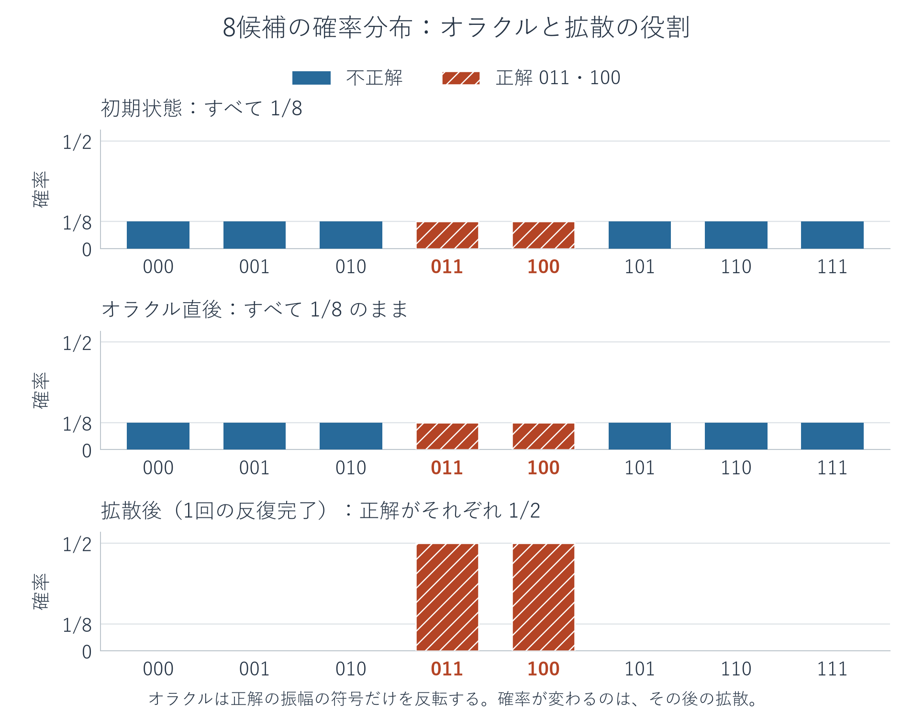
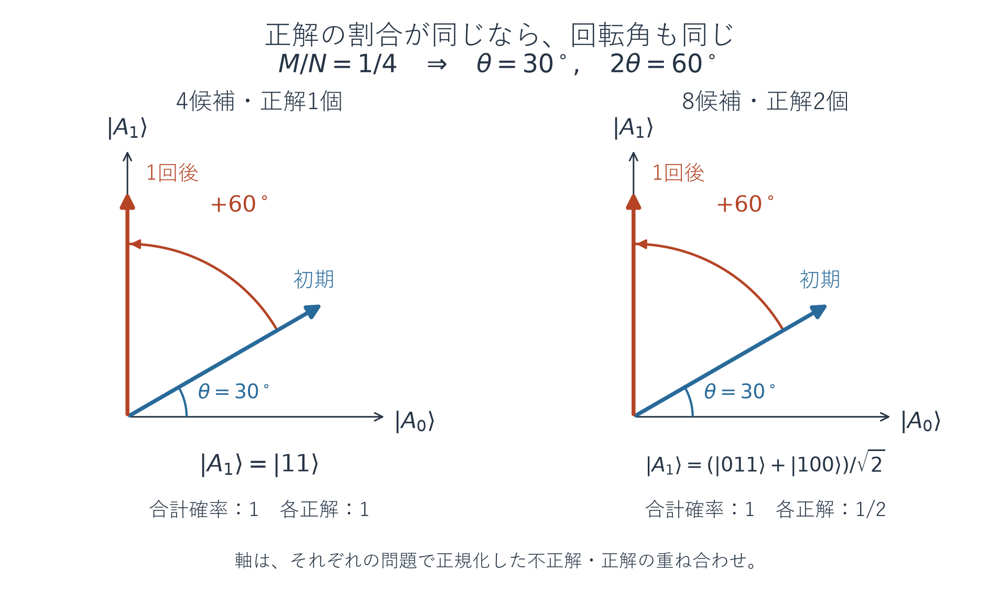

# 発展編（Advanced）: 複数の正解を探すGrover

[← 補章AのGrover](09-algorithm-worked-examples.md#algorithm-grover) | [入口](README.md)

補章Aでは、4候補のうち一つだけが条件を満たす問題を扱いました。この発展編では、**8候補のうち二つが条件を満たす問題**へ進みます。正解が複数あるとき、何を増幅し、一回の測定から何を得るのかを、手計算・図・Qiskitの実装で確かめます。

前提は、補章Aの[位相オラクルと拡散演算子](09-algorithm-worked-examples.md#algorithm-grover)、[二つの反射による回転](09-algorithm-worked-examples.md#algorithm-grover-geometry)、第5章の[Sampler](05-sampler.md#sampler-purpose)です。この発展編は、基礎の例を理解した後に、候補数や正解数を変えて試したい人向けの任意の読み物です。

読み終えると、複数の候補に印を付ける回路を作り、正解全体の確率と各正解の確率を区別し、正解数が既知の場合の反復回数を選べます。正解数が不明な探索については、最後に次の学習課題として位置付けます。

コードの基準はQiskit 2.5.2 / NumPy 2.5.3です。図はMatplotlib 3.11.2で作成しています。[本書の依存一覧](../validation/requirements.txt)と[この発展編の検証記録](../validation/grover-advanced-2026-09-18.md)を参照できます。掲載コードは上から順に実行し、後続の例は最初に定義した関数を使います。計算はすべてローカルの理想計算です。

<a id="advanced-grover-problem"></a>
## 正解が二つあるとき、何を答えとするか

3量子ビットの計算基底は、`000`から`111`までの8通りです。ビット列は$|q_2q_1q_0\rangle$の順に書きます。ここでは条件を

$$
f(x)=
\begin{cases}
1 & x\in\{011,100\},\\
0 & \text{それ以外}
\end{cases}
$$

と定めます。目的は、条件を満たす候補を**一つ見つけること**です。`011`と`100`のどちらが出ても成功です。一回の測定で二つの文字列を同時に得るわけではありません。

以後、候補数を$N$、正解数を$M$とします。この例では$N=8$、$M=2$です。初期状態には、すべての量子ビットへHを適用して作る一様な重ね合わせを使います。

$$
|s\rangle=H^{\otimes3}|000\rangle
=\frac{1}{\sqrt8}\sum_{x=0}^{7}|x\rangle.
$$

各候補の確率は$1/8$ですが、正解は二つあるので、正解のどちらかを得る確率は$2/8=1/4$です。

| 確認する量 | 補章Aの例 | この発展編 |
|---|---|---|
| 量子ビット数 | 2 | 3 |
| 候補数$N$ | 4 | 8 |
| 正解数$M$ | 1 | 2 |
| 初期状態で各正解を得る確率 | $1/4$ | $1/8$ |
| 初期状態で正解のどれかを得る確率$M/N$ | $1/4$ | $1/4$ |

候補数も正解数も増えましたが、**正解の割合$M/N$は同じ**です。この割合が、後で見る回転角を決めます。

この例では、動作を検証するために正解の一覧を用意します。一般の探索で与えられるのは、候補が条件を満たすかを判定する手順です。「候補を渡せば正否を判定できること」「正解の個数を知っていること」「正解そのものを知っていること」は、それぞれ別です。

<a id="advanced-grover-amplitudes"></a>
## 八つの振幅を計算する

位相オラクルは、補章Aと同じ定義です。

$$
O_f|x\rangle=(-1)^{f(x)}|x\rangle.
$$

今回は、`011`と`100`の二つの成分に負符号を付けます。

$$
O_f|s\rangle
=\frac{|000\rangle+|001\rangle+|010\rangle-|011\rangle-|100\rangle+|101\rangle+|110\rangle+|111\rangle}{\sqrt8}.
$$

ここで測定しても、各候補の確率は$1/8$のままです。オラクルが変えるのは振幅の符号であり、絶対値ではありません。

続いて、拡散演算子を

$$
D=2|s\rangle\langle s|-I
$$

とします。今回は$I$が8次元の恒等行列です。平均振幅に関する反転$a_x\mapsto2\bar a-a_x$は、候補が8個でも同じです。実際、$\langle s|\psi\rangle=\sum_x a_x/\sqrt8$なので、$2|s\rangle\langle s|\psi\rangle$の各成分は$2\sum_x a_x/8=2\bar a$になります。

$c=1/\sqrt8$と置くと、オラクル直後は6個の振幅が$c$、2個が$-c$です。平均は

$$
\bar a=\frac{6c-2c}{8}=\frac c2.
$$

したがって、Dの後の振幅は次のようになります。

$$
\begin{aligned}
\text{不正解の各候補}:&\quad 2\bar a-c=c-c=0,\\
\text{正解の各候補}:&\quad 2\bar a-(-c)=c+c=\frac{1}{\sqrt2}.
\end{aligned}
$$

一回のGrover反復$G=DO_f$の後は、

$$
G|s\rangle=\frac{|011\rangle+|100\rangle}{\sqrt2}
$$

となります。各正解の確率は$1/2$、正解全体の確率は$1/2+1/2=1$です。



図は状態ベクトルから計算した理論確率です。橙の棒が正解候補を表します。初期状態とオラクル直後の棒の高さは同じでも、振幅の符号は異なります。また、各正解の棒が高さ1になるのではありません。二つの棒を合わせて成功確率1になります。

<a id="advanced-grover-geometry"></a>
## 回転の縦軸が、正解二つの重ね合わせになる

補章Aの回転の図では、正解方向は一つの基底状態$|11\rangle$でした。今回は、不正解側と正解側の状態を次のようにまとめます。

$$
\begin{aligned}
|A_0\rangle&=\frac{|000\rangle+|001\rangle+|010\rangle+|101\rangle+|110\rangle+|111\rangle}{\sqrt6},\\
|A_1\rangle&=\frac{|011\rangle+|100\rangle}{\sqrt2}.
\end{aligned}
$$

それぞれ長さ1で、共通する候補を含まないため、互いに直交します。横軸を$|A_0\rangle$方向、縦軸を$|A_1\rangle$方向に取れます。

一様な初期状態では正解同士の振幅が等しく、不正解同士の振幅も等しくなっています。オラクルと拡散演算子は、その等しさを保ちます。そのため、途中の状態を

$$
|\psi\rangle=\alpha|A_0\rangle+\beta|A_1\rangle
$$

と書けます。この例では$\alpha,\beta$は実数なので、座標$(\alpha,\beta)$を単位円上の矢印として描けます。これは3量子ビットの状態空間のうち、この探索で状態が動く二次元の平面で、1量子ビットのBloch球ではありません。

各不正解の振幅は$\alpha/\sqrt6$、各正解の振幅は$\beta/\sqrt2$です。したがって、

$$
P(011)=P(100)=\frac{\beta^2}{2},
\qquad
P(\text{正解のどちらか})=2\times\frac{\beta^2}{2}=\beta^2.
$$

**図の縦座標の二乗は、正解全体の確率です。各正解の確率を読むには、さらに正解数で割ります。** この対応は、一様な初期状態と、ここで使う標準的なオラクル・拡散演算子によって、正解同士の振幅が等しい場合のものです。

初期状態は、

$$
|s\rangle=\sqrt{\frac68}|A_0\rangle+\sqrt{\frac28}|A_1\rangle
=\frac{\sqrt3}{2}|A_0\rangle+\frac12|A_1\rangle
$$

です。座標は補章Aの例と同じで、初期角度は$30^\circ$です。オラクルは横軸に関する反射、Dは初期状態の方向の直線に関する反射なので、合成したGは反時計回りに$60^\circ$回します。一回で$90^\circ$、すなわち正解側の軸へ到達します。



左右の図は、それぞれの問題に対して定義した二つの軸で描いています。座標と回転角は同じですが、右図の正解側の軸は二つの候補を含みます。**一回で正解側へ到達することと、一つの決まった文字列が必ず出ることは同じではありません。**

<a id="advanced-grover-oracle"></a>
## 複数の候補に印を付ける回路を作る

3量子ビットでは、全ビットが1の`111`だけに負符号を付ける操作を**CCZ**と呼びます。CCXの標的となる量子ビットに、そのCCXの前後でHを適用すると、$HXH=Z$によりCCZになります。時間順ではH→CCX→Hです。

一般の$n$量子ビットでは、同じ考え方でH→多重制御X→Hを使えます。Qiskitの`mcx(controls, target)`は、指定した制御量子ビットがすべて1のときに標的へXを適用します。

`111`以外に印を付けるには、正解文字列の0の位置へXを置き、一時的に全ビット1へ移してから位相を反転し、Xで戻します。

| 正解文字列 | 0の位置 | 位相反転の前後に置くX |
|---|---|---|
| `011` | 左端の$q_2$ | $q_2$ |
| `100` | 中央の$q_1$と右端の$q_0$ | $q_1,q_0$ |

この二つの操作を続けると、`011`と`100`にそれぞれ一回ずつ負符号が付きます。他の候補は変わりません。同じ候補を二回含めると$(-1)^2=1$で印が消えてしまうため、コードでは重複した文字列をエラーにします。

拡散演算子も$n$量子ビットへ広げます。$|0^n\rangle$だけに負符号を付ける位相オラクルを$O_0=I-2|0^n\rangle\langle0^n|$とすると、

$$
D=H^{\otimes n}(2|0^n\rangle\langle0^n|-I)H^{\otimes n}
=-H^{\otimes n}O_0H^{\otimes n}.
$$

したがって、H→$O_0$→Hという回路に全体位相$\pi$を加えれば、上で定義したDに符号まで一致します。ここでの$O_0$は既知の全ゼロ状態に対する反射を作る部品で、問題の判定関数$f$への追加の問い合わせではありません。

次のコードは、ここから単独で実行できます。`phase_oracle`が印を付ける回路を作り、`grover_circuit`は渡されたオラクルを使って探索回路を組み立てます。探索回路を作る関数へは、正解の文字列自体を渡していません。

<!-- example: advanced_core -->
```python
import numpy as np
from qiskit import QuantumCircuit
from qiskit.quantum_info import Operator, Statevector


def phase_oracle(marked_states):
    marked_states = list(marked_states)
    if not marked_states:
        raise ValueError("at least one marked state is required")
    n = len(marked_states[0])
    if n < 1 or any(len(bits) != n or set(bits) - {"0", "1"}
                    for bits in marked_states):
        raise ValueError("use binary strings of the same positive length")
    if len(set(marked_states)) != len(marked_states):
        raise ValueError("marked states must be distinct")
    oracle = QuantumCircuit(n, name="Of")
    for bits in marked_states:
        zeros = [q for q, bit in enumerate(reversed(bits)) if bit == "0"]
        for q in zeros:
            oracle.x(q)
        if n == 1:
            oracle.z(0)
        else:
            oracle.h(n - 1)
            oracle.mcx(list(range(n - 1)), n - 1)
            oracle.h(n - 1)
        for q in zeros:
            oracle.x(q)
    return oracle


def diffuser(n):
    qc = QuantumCircuit(n, name="D")
    qc.h(range(n))
    qc.compose(phase_oracle(["0" * n]), inplace=True)
    qc.h(range(n))
    qc.global_phase += np.pi
    return qc


def grover_circuit(oracle, repetitions):
    if repetitions < 0 or int(repetitions) != repetitions:
        raise ValueError("repetitions must be a nonnegative integer")
    n = oracle.num_qubits
    qc = QuantumCircuit(n)
    qc.h(range(n))
    d = diffuser(n)
    for _ in range(int(repetitions)):
        qc.compose(oracle, inplace=True)
        qc.compose(d, inplace=True)
    return qc


marked_states = ["011", "100"]
oracle = phase_oracle(marked_states)
initial = Statevector(grover_circuit(oracle, 0))
marked = initial.evolve(oracle)
qc = grover_circuit(oracle, 1)
amplified = Statevector(qc)
s = np.ones(8) / np.sqrt(8)
expected_d = 2 * np.outer(s, s) - np.eye(8)
print("same D matrix:", np.allclose(Operator(diffuser(3)).data, expected_d))
print("oracle diagonal:", np.rint(np.diag(Operator(oracle).data).real).astype(int).tolist())
for name, state in [("initial", initial), ("oracle", marked), ("diffusion", amplified)]:
    real = np.where(np.abs(state.data.real) < 1e-12, 0.0, state.data.real)
    print(name, "amplitudes:", np.round(real, 6).tolist())
print("probabilities:", np.round(amplified.probabilities(), 6).tolist())
```

出力:

```text
same D matrix: True
oracle diagonal: [1, 1, 1, -1, -1, 1, 1, 1]
initial amplitudes: [0.353553, 0.353553, 0.353553, 0.353553, 0.353553, 0.353553, 0.353553, 0.353553]
oracle amplitudes: [0.353553, 0.353553, 0.353553, -0.353553, -0.353553, 0.353553, 0.353553, 0.353553]
diffusion amplitudes: [0.0, 0.0, 0.0, 0.707107, 0.707107, 0.0, 0.0, 0.0]
probabilities: [0.0, 0.0, 0.0, 0.5, 0.5, 0.0, 0.0, 0.0]
```

状態ベクトルの配列は`000`, `001`, `010`, `011`, `100`, `101`, `110`, `111`の順です。`oracle diagonal`の二つの`-1`が印の位置を表し、`diffusion amplitudes`ではその二つだけが$1/\sqrt2\approx0.707107$になっています。`np.where`は丸め誤差による負のゼロを表示上0にするための処理です。

`same D matrix`では、回路から得た行列を$2|s\rangle\langle s|-I$と照合しています。全体位相を省いた回路でも探索の測定確率は同じですが、ここでは途中の振幅の符号も手計算と比較できるようにしています。

<a id="advanced-grover-sampling"></a>
## Samplerで得るのは、毎回どちらか一つの正解

次は、直前のコードの`qc`と`marked_states`を使う続きです。`measure_all()`によって、三つの量子ビットを古典ビットへ測定します。

<!-- example: advanced_sampling -->
```python
from qiskit.primitives import StatevectorSampler

measured = qc.copy()
measured.measure_all()
shots = 512
result = StatevectorSampler(seed=7).run([measured], shots=shots).result()[0]
counts = dict(sorted(result.data.meas.get_counts().items()))
hits = sum(counts.get(bits, 0) for bits in marked_states)
print("counts:", counts)
print("success frequency:", f"{hits / shots:.6f}")
print("P(011) estimate:", f"{counts.get('011', 0) / shots:.6f}")
print("P(100) estimate:", f"{counts.get('100', 0) / shots:.6f}")
```

出力:

```text
counts: {'011': 241, '100': 271}
success frequency: 1.000000
P(011) estimate: 0.470703
P(100) estimate: 0.529297
```

この出力では、512回の測定がすべて正解のどちらかでした。しかし、`011`と`100`の回数は同数ではありません。理論上の各確率が$1/2$でも、有限shotsの回数には揺らぎがあります。`seed=7`は、この実行例を再現しやすくするための設定です。

一回の測定で得る文字列は一つです。shotsを増やせば分布を調べられますが、「正解のどれかを見つける探索」と「すべての正解を列挙する処理」は異なります。後者では、何種類の正解を見つけたか、まだ見つけていない正解があるかを別に考える必要があります。

<a id="advanced-grover-iterations"></a>
## 候補数と正解数から反復回数を選ぶ

ここまでは、$M/N=1/4$という条件により一回で成功しました。一般の$N=2^n$候補、$M$個の正解でも、$0<M<N$なら、不正解と正解をそれぞれ正規化した一様な重ね合わせ$|A_0\rangle,|A_1\rangle$で表せます。

$$
|s\rangle=\sqrt{\frac{N-M}{N}}|A_0\rangle+\sqrt{\frac{M}{N}}|A_1\rangle
=\cos\theta\,|A_0\rangle+\sin\theta\,|A_1\rangle,
\qquad
\theta=\arcsin\sqrt{\frac{M}{N}}.
$$

$\arcsin$は、指定された値を正弦に持つ角度を求める関数です。ここでは$0<\theta<\pi/2$となります。Grover反復を一回適用するたびに$2\theta$回転するため、$t$回後は

$$
G^t|s\rangle
=\cos((2t+1)\theta)|A_0\rangle+\sin((2t+1)\theta)|A_1\rangle.
$$

正解全体の確率と、特定の正解$x$を得る確率は、

$$
P_t(\text{正解})=\sin^2((2t+1)\theta),
\qquad
P_t(x)=\frac{\sin^2((2t+1)\theta)}{M}\quad(f(x)=1)
$$

です。ここでも、正解同士の振幅が等しいという前提を使っています。

最初に正解側の軸へ近づくのは、$(2t+1)\theta$が$\pi/2$に近いときです。回数を実数として解くと$t_*=\pi/(4\theta)-1/2$ですが、実際の回数は整数にします。その近くを選ぶ規則として

$$
t=\left\lfloor\frac{\pi}{4\theta}\right\rfloor
$$

を使えます。$\lfloor a\rfloor$は$a$を超えない最大の整数です。この式は最初の成功確率の山に近い回数を選ぶもので、どの条件でも成功確率1になることや、際限なく反復した中での最大値を保証するものではありません。

正解が半分の$M=N/2$では、0回と1回が同じ成功確率になります。上の切り捨ての式は厳密には1回を選びますが、次のコードでは少ない0回を選びます。半分より多い場合も、最初の山に近い整数回数は0回です。

境界のケースも区別します。$M=N$ならすべての候補が正解なので、反復0回で成功します。$M=0$なら見つけるべき正解が存在せず、上の反復回数の式は使えません。次の関数は、既知の整数$M$が$1\leq M\leq N$の場合を扱います。

次のコードも、最初のコードで定義した関数を使う続きです。複数の問題で回路の確率と式を比べ、その後に8候補・正解2個の反復回数を変えます。

<!-- example: advanced_general -->
```python
import math


def repetitions_for_known_count(n, solution_count):
    if n < 1 or int(n) != n:
        raise ValueError("n must be a positive integer")
    N = 2 ** int(n)
    if int(solution_count) != solution_count or not 1 <= solution_count <= N:
        raise ValueError("solution_count must be an integer from 1 to 2**n")
    if 2 * solution_count >= N:
        return 0
    theta = math.asin(math.sqrt(solution_count / N))
    return math.floor(math.pi / (4 * theta))


cases = [
    ["11"],
    ["011", "100"],
    ["111"],
    ["000", "001", "010", "011"],
    ["0000011", "0100101", "1010010", "1111001"],
]
for solutions in cases:
    n = len(solutions[0])
    N, M = 2**n, len(solutions)
    t = repetitions_for_known_count(n, M)
    state = Statevector(grover_circuit(phase_oracle(solutions), t))
    success = sum(state.probabilities()[int(bits, 2)] for bits in solutions)
    theta = math.asin(math.sqrt(M / N))
    theory = math.sin((2*t + 1)*theta)**2
    print(f"N={N:3d}, M={M}, t={t}, P={success:.6f}, formula={theory:.6f}")

for t in range(4):
    state = Statevector(grover_circuit(phase_oracle(["011", "100"]), t))
    good = state.probabilities()[3] + state.probabilities()[4]
    print(f"N=8, M=2, t={t}, P(good)={good:.6f}, P(011)={state.probabilities()[3]:.6f}")
```

出力:

```text
N=  4, M=1, t=1, P=1.000000, formula=1.000000
N=  8, M=2, t=1, P=1.000000, formula=1.000000
N=  8, M=1, t=2, P=0.945312, formula=0.945312
N=  8, M=4, t=0, P=0.500000, formula=0.500000
N=128, M=4, t=4, P=0.999182, formula=0.999182
N=8, M=2, t=0, P(good)=0.250000, P(011)=0.125000
N=8, M=2, t=1, P(good)=1.000000, P(011)=0.500000
N=8, M=2, t=2, P(good)=0.250000, P(011)=0.125000
N=8, M=2, t=3, P(good)=0.250000, P(011)=0.125000
```

$N=8,M=1$では2回の反復を選びますが、成功確率は約94.53％です。$N=128,M=4$では4回で約99.918％になります。いずれも、選んだ回数とその結果を、候補数だけから決めていない点を確認してください。

$N=8,M=4$では初期角度が$45^\circ$で、反復ごとに$90^\circ$回転します。正解全体の確率は常に$1/2$なので、コードの規則は0回を選んでいます。この比率では、通常のGrover反復を増やしても確率は上がりません。

最後の4行では、正解全体の確率が$1/4,1,1/4,1/4$、`011`一つの確率がその半分になっています。補章Aで見た「反復を増やすと正解方向を通り過ぎる」という現象は、複数正解でも同じです。

正解が十分少ない場合、$\theta\approx\sqrt{M/N}$なので、必要なオラクル呼出し回数は$O(\sqrt{N/M})$になります。この比較は、判定オラクルが与えられた場合の問い合わせ数についてです。このコードのように正解を列挙してオラクルを作る費用や、その内部ゲート数、実機での誤差まで含めた高速化を示したものではありません。

<a id="advanced-grover-library"></a>
## Qiskitの部品でも同じ反復を組み立てる

反射の意味を確認した後は、Qiskitの`grover_operator`へ位相オラクルを渡して、一回のGrover反復を作ることもできます。初期状態を一様な重ね合わせへ準備するHは、探索回路の先頭へ別に置きます。

次は、最初のコードで定義した関数・変数を使い、手作りの反復とライブラリの反復を比較する例です。

<!-- example: advanced_library -->
```python
from qiskit.circuit.library import grover_operator

oracle = phase_oracle(["011", "100"])
g = grover_operator(oracle)
manual_g = QuantumCircuit(3)
manual_g.compose(oracle, inplace=True)
manual_g.compose(diffuser(3), inplace=True)
print("same Grover matrix:", np.allclose(Operator(g).data, Operator(manual_g).data))
library_qc = QuantumCircuit(3)
library_qc.h(range(3))
library_qc.compose(g, inplace=True)
print("same final state:", np.allclose(Statevector(library_qc).data, amplified.data))
```

出力:

```text
same Grover matrix: True
same final state: True
```

本書の基準版では、行列と最終状態が全体位相も含めて一致します。`grover_operator`へ渡すのは位相オラクルであり、単に古典的なPythonの判定関数を渡すだけで、その内部処理が量子回路になるわけではありません。

<a id="advanced-grover-next"></a>
## 正解数が不明な場合へ進むには

ここまでの反復回数の選択には、正解数$M$が必要でした。$M$が不明でも、候補を判定できるオラクルを用意することは可能です。

その場合は、Python側で反復回数を選び、量子回路を実行し、測定で得た候補$x$を$f(x)$で検証する処理を組み合わせます。反復回数をランダムに選び、その選択範囲を段階的に変える方法などがあります。回路内で状態を回転させる反復と、状態を準備し直して候補を得る再試行は、別の繰返しです。

成功確率や問い合わせ数を保証するには、回数の選び方と停止条件を定める必要があります。何回か不正解が出たというだけで、正解が存在しないと確定することはできません。正解数不明の探索手順の実装・保証は、この発展編の次の課題です。

<a id="advanced-grover-exercises"></a>
## 条件を変えて確かめる

1. 8候補・正解2個の一回反復後に、`011`の確率は1になりますか。それとも$1/2$ですか。
2. 正解を`001`と`110`へ変えました。反復回数と正解全体の理論確率は変わりますか。それぞれ、位相反転の前後にどの量子ビットへXを置きますか。
3. `marked_states`へ同じ文字列を二回入れて、それぞれに位相反転を適用すると何が起こりますか。
4. 8候補のうち4個が正解の場合、反復を2回、3回と増やすと正解全体の確率は1へ近づきますか。
5. 二つの正解を区別して測定した回数が241回と271回でした。理想的な各確率が$1/2$という計算と矛盾しますか。
6. 正解数が不明な問題で、数回試して正解が出ませんでした。何が分かり、何はまだ分かりませんか。

**解答と理由**:

1. $1/2$です。最終状態は$(|011\rangle+|100\rangle)/\sqrt2$なので、各正解の振幅の絶対値の二乗は$1/2$です。正解全体の確率が1になります。
2. $N=8,M=2$は同じなので、一回で正解全体の理論確率は1です。`001`は$q_2,q_1$、`110`は$q_0$へXを置きます。各正解の確率は$1/2$です。
3. $(-1)^2=1$となり、その候補の印が消えます。正解数の数え方と回路の作用が食い違うため、このコードは重複を受け付けません。
4. 近づきません。$\theta=\pi/4$なので、$\sin^2((2t+1)\pi/4)=1/2$がすべての整数$t$で成り立ちます。
5. 矛盾しません。$1/2$は各試行の理論確率であり、有限回の観測が必ず同数になるという意味ではありません。
6. 試した回路とその測定では、まだ正解候補を得ていないと分かります。正解が存在しないことは、その事実だけでは分かりません。用いた回数の選び方と、失敗確率・停止条件の保証を確認します。

公式参照: [複数の正解を持つGroverの実装](https://quantum.cloud.ibm.com/docs/en/tutorials/grovers-algorithm)、[grover_operator](https://quantum.cloud.ibm.com/docs/en/api/qiskit/qiskit.circuit.library.grover_operator)、[反復回数の選択](https://quantum.cloud.ibm.com/learning/en/courses/fundamentals-of-quantum-algorithms/grover-algorithm/number-of-iterations)。参照資料とコードの照合範囲は[検証記録](../validation/grover-advanced-2026-09-18.md)にまとめています。

[← 補章AのGrover](09-algorithm-worked-examples.md#algorithm-grover) | [入口](README.md)
