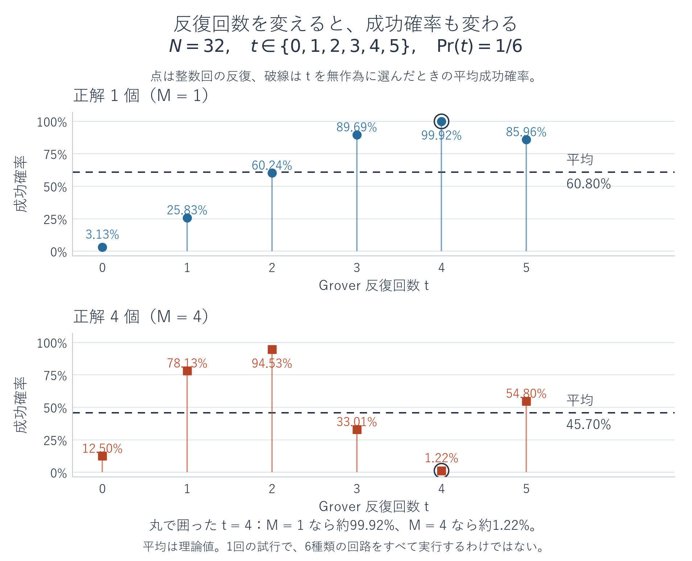
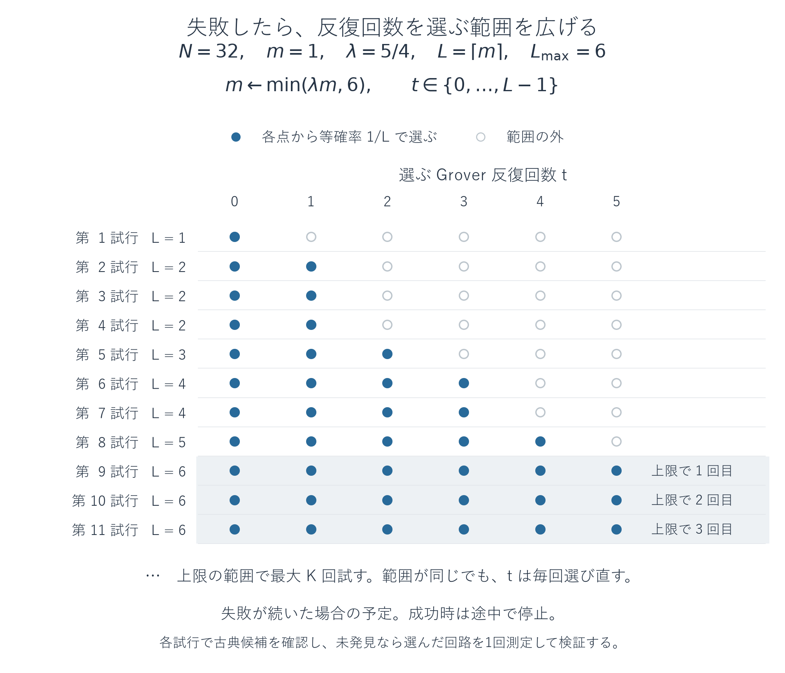

# 発展編（Advanced）: 正解数が不明なGrover探索

[← 複数の正解を探すGrover](10-grover-advanced.md) | [入口](README.md)

前の発展編では、候補数$N$と正解数$M$からGrover反復の回数を選びました。今回は、**候補が正解かどうかは調べられるが、正解が何個あるかは分からない**場合へ進みます。正解が存在しない可能性も含めます。

読み終えると、反復回数をランダムに選ぶ理由を説明し、測定結果の検証と再試行を組み合わせた探索をQiskitで実装できます。さらに、短い回路から始めて選択範囲を広げる方法と、未発見で打ち切った結果の読み方を理解します。

前提は、[複数正解の回転の図](10-grover-advanced.md#advanced-grover-geometry)、[正解数が既知の場合の反復回数](10-grover-advanced.md#advanced-grover-iterations)、第5章の[Sampler](05-sampler.md#sampler-purpose)です。コードの基準はQiskit 2.5.2 / NumPy 2.5.3、図はMatplotlib 3.11.2です。[依存一覧](../validation/requirements.txt)と[検証記録](../validation/grover-unknown-2026-09-18.md)を参照できます。掲載例はローカルの理想計算で、後続のコードはどの例の続きかを明示します。

<a id="unknown-grover-input"></a>
## 分からないのは正解の個数であり、判定の手順ではない

候補は$n$量子ビットで表す$N=2^n$通りの文字列です。候補$x$を一つ渡すと、判定関数$f(x)$は条件を満たす場合に1、それ以外に0を返すとします。量子回路には、この判定を位相へ反映するオラクル

$$
O_f|x\rangle=(-1)^{f(x)}|x\rangle
$$

が与えられるとします。一方、正解数$M$は探索手順へ渡しません。目的は$f(x)=1$となる候補を一つ返すことです。

例えば、整数$0\leq x<8$について、$x^2$を8で割った余りが4かどうかを調べる問題を使えます。候補$x$が得られれば、Pythonでは`(x * x) % 8 == 4`と判定できます。説明と検証のために調べると、正解は2と6、ビット列では`010`と`110`です。**教材の作成者が答えを確認できることと、探索手順がその個数を入力として使うことは別です。**

探索には、同じ条件を表す位相オラクルと、測定した候補を確認する古典的な判定関数を用意します。位相オラクルだけを一つの基底状態に適用しても、その全体符号を直接読み出して正否を判定できるわけではありません。ここでは、候補の正否を別途評価できるという入力条件を置きます。

今回の小さな実装では、全候補を調べて教材用のオラクルを作ります。この準備にはすでに$N$回の判定が必要なので、実用的な探索の高速化を示す作り方ではありません。探索部分はオラクルと候補の検証だけを使い、正解の一覧や個数を参照しない構造にします。

<a id="unknown-grover-oscillation"></a>
## いつも同じ回数だけ回すと、正解方向を通り過ぎる

$0<M<N$の場合、前の発展編で得た成功確率は

$$
P_t=\sin^2((2t+1)\theta),
\qquad
\theta=\arcsin\sqrt{\frac MN}
$$

でした。$t$は、一つの回路内で繰り返すGrover反復の回数です。$M$が不明でもこの式は成り立ちますが、探索手順は$\theta$を計算できないので、成功確率が高い$t$をこの式から選べません。

具体例として$N=32$を考えます。正解が1個だと仮定して$t=4$を選ぶと、実際に$M=1$なら成功確率は約99.92％です。しかし、本当は$M=4$だった場合、同じ$t=4$では約1.22％になります。正解が増えると一反復の回転角も増えるため、同じ回数では正解方向を通り過ぎます。

次のコードは、この違いを理論式で確認する独立した例です。ここで$M$を指定するのは、探索を行うためでなく、その振る舞いを比較するためです。

<!-- example: unknown_probability -->
```python
from math import asin, ceil, sin, sqrt

N = 32
L = ceil(sqrt(N))
print("N:", N, "L:", L, "choices:", list(range(L)))
for M in (1, 4):
    theta = asin(sqrt(M / N))
    probabilities = [sin((2*t + 1)*theta)**2 for t in range(L)]
    print(f"M={M}, P(t=4)={probabilities[4]:.6f}, average={sum(probabilities)/L:.6f}")
    print("P(t=0..5):", [round(p, 6) for p in probabilities])
```

出力:

```text
N: 32 L: 6 choices: [0, 1, 2, 3, 4, 5]
M=1, P(t=4)=0.999182, average=0.607955
P(t=0..5): [0.03125, 0.258301, 0.602425, 0.896937, 0.999182, 0.859637]
M=4, P(t=4)=0.012207, average=0.456970
P(t=0..5): [0.125, 0.78125, 0.945312, 0.330078, 0.012207, 0.547974]
```



図の点は整数回の反復に対応します。横軸のどこを選ぶと成功しやすいかは、正解数によって異なります。ランダム化は、回転を途中で観察して調節する操作ではありません。**一回路を実行する前に、古典側で整数$t$を選ぶ操作**です。

<a id="unknown-grover-fixed"></a>
## 方法1: 一定の範囲から回数をランダムに選ぶ

まずは、候補数だけで決められる範囲を使います。$\lceil a\rceil$を$a$以上の最小の整数とし、

$$
L=\lceil\sqrt N\rceil,
\qquad t\in\{0,1,\ldots,L-1\}
$$

から$t$を等確率で一つ選びます。選択肢は$L$個です。$t=0$も含めるため、増幅せずに一様な初期状態を測定する場合もあります。

一回の**試行**を、次の手順と定めます。

1. 古典側で$t$をランダムに選ぶ。
2. 量子状態を新しく$|s\rangle=H^{\otimes n}|0^n\rangle$へ準備する。
3. $G=DO_f$を$t$回適用し、一回測定して候補$x$を得る。
4. 古典側で$f(x)$を評価する。1なら$x$を返し、0なら次の試行へ進む。

毎回、状態の準備からやり直します。測定後の状態へさらにGを適用し続ける方法ではありません。また、一つの回路を固定してshotsだけを増やしても、$t$が悪かった場合の一測定あたりの低い成功確率は変わりません。成功確率が0より大きければ、測定を増やすことで少なくとも一回成功する確率は上がりますが、ここでは回数$t$も選び直します。

$N=8,M=2$なら$L=3$です。$t=0,1,2$の成功確率は順に$1/4,1,1/4$なので、一試行を平均すると

$$
\frac13\left(\frac14+1+\frac14\right)=\frac12
$$

で成功します。正解数を知っていれば$t=1$で確実に成功できましたが、今回は個数を使わずに試行を構成しています。

<a id="unknown-grover-bound"></a>
## 平均成功確率と、打ち切るまでの回数を結ぶ

ランダムな$t$を含めた一試行の成功確率を$\overline P_L$と書きます。$0<M<N$なら、

$$
\overline P_L
=\frac1L\sum_{t=0}^{L-1}\sin^2((2t+1)\theta)
=\frac12-\frac{\sin(4L\theta)}{4L\sin(2\theta)}.
$$

この等式は、$\sin^2 a=(1-\cos2a)/2$を使うと導けます。さらに

$$
2\sin(2\theta)\cos((4t+2)\theta)
=\sin((4t+4)\theta)-\sin(4t\theta)
$$

を$t=0$から$L-1$まで足すと、右辺の途中の項が打ち消し合い、$\sin(4L\theta)$だけが残ります。これを代入したのが上の平均の式です。

分子の正弦は1以下なので、$L\sin(2\theta)\geq1$なら

$$
\overline P_L\geq\frac12-\frac{1}{4L\sin(2\theta)}\geq\frac14
$$

となります。今回の$L=\lceil\sqrt N\rceil$がこの条件を満たすことも確認できます。整数$1\leq M\leq N-1$では$M(N-M)\geq N-1$なので、$N\geq2$に対して

$$
L\sin(2\theta)
=L\frac{2\sqrt{M(N-M)}}{N}
\geq2\sqrt{1-\frac1N}
\geq\sqrt2>1.
$$

したがって、**正解が少なくとも一つあれば、一試行の成功確率は少なくとも$1/4$**です。これは各$t$の成功確率の保証ではなく、回数をランダムに選ぶ操作も含む平均の保証です。$M=N$ならどの候補も正解なので成功確率は1です。$M=0$なら、成功する候補はありません。

毎回独立に乱数と測定をやり直せば、正解があるのに$K$回続けて未発見となる確率は

$$
\Pr(\text{未発見}\mid M\geq1)\leq\left(\frac34\right)^K
$$

以下です。許容する見逃し確率を$0<\varepsilon<1$として、

$$
K=\left\lceil\frac{\log\varepsilon}{\log(3/4)}\right\rceil
$$

とすれば、この上限を$\varepsilon$以下にできます。例えば$\varepsilon=0.05$なら$K=11$で、$(3/4)^{11}\approx0.042235$です。$\log$の底は分子と分母で同じなら結果は変わりません。

位相オラクルは一試行につき$t$回、候補の検証は1回です。これらをそれぞれ一問い合わせとして数えるモデルでは、$t+1\leq L$なので、全体は最大$KL$回です。固定した$\varepsilon$なら$O(\sqrt N)$、誤差の指定も含めると$O(\sqrt N(1+\log(1/\varepsilon)))$です。実際のゲート数、オラクルを作る費用、シミュレータの計算時間とは区別します。

<a id="unknown-grover-code"></a>
## Qiskitで、候補の検証まで含めて実行する

次のコードは単独で実行できます。`oracle_from_predicate`は教材用の準備処理です。正解候補の0の位置へXを置き、多重制御Zで符号を反転してXで戻します。この部分の考え方は[複数の候補に印を付ける回路](10-grover-advanced.md#advanced-grover-oracle)と同じです。正解がなければ恒等回路になります。

`one_trial`は、毎回新しい回路に一様な状態を準備し、指定された`t`回だけ反復し、`StatevectorSampler`の`shots=1`で一つの候補を得ます。`find_fixed`は個数$M$を受け取らず、回数の選択、検証、打ち切りを担当します。この実装は、補助量子ビットや測定を含まず、探索対象の$n\geq1$量子ビットだけに作用する位相オラクルを前提とします。測定文字列は$|q_{n-1}\cdots q_0\rangle$の順で、`int(bits, 2)`により判定関数へ渡す整数へ戻します。

<!-- example: unknown_fixed -->
```python
from math import ceil, log, sqrt
from random import Random

from qiskit import QuantumCircuit
from qiskit.circuit.library import grover_operator
from qiskit.primitives import StatevectorSampler


def oracle_from_predicate(n, is_good):
    """Small teaching example: enumerate candidates to build a phase oracle."""
    if not isinstance(n, int) or n < 1:
        raise ValueError("n must be a positive integer")
    oracle = QuantumCircuit(n, name="O_f")
    for x in range(2**n):
        if not is_good(x):
            continue
        zeros = [q for q in range(n) if ((x >> q) & 1) == 0]
        if zeros:
            oracle.x(zeros)
        if n == 1:
            oracle.z(0)
        else:
            oracle.h(n - 1)
            oracle.mcx(list(range(n - 1)), n - 1)
            oracle.h(n - 1)
        if zeros:
            oracle.x(zeros)
    return oracle


def failure_budget(epsilon):
    if not 0 < epsilon < 1:
        raise ValueError("epsilon must be between 0 and 1")
    return ceil(log(epsilon) / log(0.75))


def one_trial(oracle, t, seed):
    """Prepare a new uniform state, rotate t times, and measure one candidate."""
    if not isinstance(t, int) or t < 0:
        raise ValueError("t must be a nonnegative integer")
    n = oracle.num_qubits
    if n < 1:
        raise ValueError("at least one qubit is required")
    circuit = QuantumCircuit(n)
    circuit.h(range(n))
    step = grover_operator(oracle)
    for _ in range(t):
        circuit.compose(step, inplace=True)
    circuit.measure_all()
    sampler = StatevectorSampler(seed=seed)
    counts = sampler.run([circuit], shots=1).result()[0].data.meas.get_counts()
    return int(next(iter(counts)), 2)


def search_result(candidate, trace, phase_queries, predicate_queries):
    return dict(status="not_found" if candidate is None else "found",
                candidate=candidate, rounds=trace[-1][0], trace=trace,
                phase_queries=phase_queries, predicate_queries=predicate_queries)


def find_fixed(oracle, is_good, epsilon=0.05, seed=7):
    n = oracle.num_qubits
    limit = ceil(sqrt(2**n))
    max_rounds = failure_budget(epsilon)
    rng = Random(seed)
    phase_queries = 0
    trace = []
    for r in range(1, max_rounds + 1):
        t = rng.randrange(limit)
        x = one_trial(oracle, t, rng.randrange(2**32))
        phase_queries += t
        good = bool(is_good(x))
        trace.append((r, "grover", t, f"{x:0{n}b}", good))
        if good:
            return search_result(x, trace, phase_queries, r)
    return search_result(None, trace, phase_queries, max_rounds)


is_good = lambda x: x * x % 8 == 4
oracle = oracle_from_predicate(3, is_good)
answer = find_fixed(oracle, is_good, epsilon=0.05, seed=7)
print("L:", ceil(sqrt(2**3)), "max_rounds:", failure_budget(0.05))
print("round method t candidate verified")
for row in answer["trace"]:
    print(*row)
print("status:", answer["status"], "candidate:", answer["candidate"])
print("phase queries:", answer["phase_queries"])
print("predicate queries:", answer["predicate_queries"])
```

出力:

```text
L: 3 max_rounds: 11
round method t candidate verified
1 grover 1 110 True
status: found candidate: 6
phase queries: 1
predicate queries: 1
```

この実行では最初に`t=1`が選ばれ、`110`、すなわち整数6が得られました。判定結果が`True`なので、その時点で終了しています。`max_rounds=11`は必ず11回実行するという意味ではなく、未発見が続いた場合の上限です。

`phase_queries`は実行したGrover反復回数の合計、`predicate_queries`は測定した候補を確認した回数です。教材用オラクルを最初に作るときの全候補の判定は、この二つのカウンターに含みません。

乱数の種`seed`は例を再現するために指定しています。一方、一試行ごとに同じ種でSamplerを初期化し直してしまうと、同じ回路から同じ結果を繰り返すことがあります。このコードは探索全体の乱数列を進め、測定用の種も各試行で新しく生成します。成功確率の保証は、理想的な独立な乱数・測定を前提とし、一つの固定した種に対する保証ではありません。

<a id="unknown-grover-growing"></a>
## 方法2: 短い回路から始めて、選ぶ範囲を広げる

方法1は最初から$\sqrt N$程度の範囲を使います。しかし正解が多い場合は、少ない反復で十分な可能性があります。そこで、選択範囲を小さく始め、未発見なら徐々に広げます。

範囲の大きさを調整する実数$m$を1から始め、増加率を$\lambda=5/4$とします。一回の試行では$L=\lceil m\rceil$として$t\in\{0,\ldots,L-1\}$を一様に選びます。未発見なら

$$
m\leftarrow\min\left(\frac54m,L_{\max}\right),
\qquad L_{\max}=\lceil\sqrt N\rceil
$$

とします。$m$は実数のまま保持し、選択肢の個数$L$を作るときに切り上げます。毎回$m$自体を整数に丸める更新とは区別します。

さらに、この方法では各試行の最初に、古典側で一様に候補を一つ選んで判定します。正解ならそこで終了し、不正解なら上述の量子回路を実行します。正解が半数より多い場合、この短い確認だけでも半分を超える確率で成功します。これにより、正解が多いのに深い回路まで待つことを避けられます。



図は$N=32$で失敗が続いた場合の予定です。各行の点から$t$を等確率で一つ選びます。実際には正解を見つけた時点で停止するため、全行を実行するとは限りません。$L$が同じ行でも、新しく回数と候補を選び直します。

上限$L_{\max}$に達したら、方法1と同じ成功確率の下限が使えます。そこで、**上限の範囲で行う量子試行が$K$回に達するまで**を打ち切り条件にします。上限へ達する前の試行は、この$K$回には含めません。それ以前や古典候補の判定で成功することもあるため、正解があるのに最後まで未発見となる確率は、やはり$(3/4)^K\leq\varepsilon$です。

次は、直前のコードで定義した関数と`oracle`、`is_good`を使う続きです。

<!-- example: unknown_growing -->
```python
def find_growing(oracle, is_good, epsilon=0.05, seed=7, growth=1.25):
    if not 1 < growth < 4 / 3:
        raise ValueError("growth must be between 1 and 4/3")
    n = oracle.num_qubits
    size = 2**n
    cap = ceil(sqrt(size))
    max_cap_trials = failure_budget(epsilon)
    rng = Random(seed)
    m, cap_trials, r = 1.0, 0, 0
    phase_queries = predicate_queries = 0
    trace = []
    while cap_trials < max_cap_trials:
        r += 1
        x = rng.randrange(size)
        predicate_queries += 1
        good = bool(is_good(x))
        trace.append((r, "uniform", "-", f"{x:0{n}b}", good))
        if good:
            return search_result(x, trace, phase_queries, predicate_queries)

        limit = ceil(m)
        if limit == cap:
            cap_trials += 1
        t = rng.randrange(limit)
        x = one_trial(oracle, t, rng.randrange(2**32))
        phase_queries += t
        predicate_queries += 1
        good = bool(is_good(x))
        trace.append((r, "grover", t, f"{x:0{n}b}", good))
        if good:
            return search_result(x, trace, phase_queries, predicate_queries)
        m = min(growth * m, cap)
    return search_result(None, trace, phase_queries, predicate_queries)


is_good = lambda x: x * x % 8 == 4
oracle = oracle_from_predicate(3, is_good)
answer = find_growing(oracle, is_good, epsilon=0.05, seed=6)
print("round method t candidate verified")
for row in answer["trace"]:
    print(*row)
print("status:", answer["status"], "candidate:", answer["candidate"])
print("phase queries:", answer["phase_queries"])
print("predicate queries:", answer["predicate_queries"])
```

出力:

```text
round method t candidate verified
1 uniform - 001 False
1 grover 0 000 False
2 uniform - 000 False
2 grover 0 100 False
3 uniform - 101 False
3 grover 1 010 True
status: found candidate: 2
phase queries: 1
predicate queries: 6
```

`uniform`の行は古典側で直接選んだ候補、`grover`の行は量子回路から得た候補です。この実行では2回の試行が不成功となり、3回目に`t=1`の回路から`010`、すなわち整数2が得られました。反復0回の回路でも一つの候補が得られ、検証の対象になります。

古典候補の検証も`predicate_queries`に含めます。そのため方法1とは、一試行あたりの検証回数が異なります。出力は一つの乱数列での経過であり、この一例だけで平均の問い合わせ数や優劣が分かるわけではありません。

<a id="unknown-grover-cost"></a>
## 増加率を控えめにする理由と、期待問い合わせ数

この範囲拡大は、Boyer・Brassard・Høyer・Tappによる未知正解数の探索、通称**BBHT**の考え方に基づきます。ここでは0回を含む選択範囲、半数より多い正解への古典的な確認、有限の打ち切り条件まで具体化しました。

$1\leq M\leq N/2$の場合、

$$
m_* = \frac{1}{\sin(2\theta)}
=\frac{N}{2\sqrt{M(N-M)}}
\leq\sqrt{\frac{N}{2M}}
$$

を超える大きさの範囲へ到達すれば、量子試行だけでも成功確率は少なくとも$1/4$です。この$m_*$は解析に使う値であり、探索のコードで計算する値ではありません。

一試行で使う問い合わせは、選ばれた$t$回の位相オラクルと、最大2回の候補検証です。$t$の平均は$(\lceil m\rceil-1)/2$なので、一試行の平均費用は高々$(\lceil m\rceil-1)/2+2<m/2+2=O(m)$です。古典候補が正解なら、その時点で停止するのでさらに少なくなります。

到達前の範囲は$1,\lambda,\lambda^2,\ldots$と増えるので、それまでの費用の合計は最後の範囲の大きさと同じ程度、$O(m_*)$です。到達後は、次の試行まで失敗し続ける確率が一段につき高々$3/4$になります。一方、一試行の平均費用の上界は$\lambda$程度ずつ増えます。したがって、期待費用を足す級数の比を

$$
\frac34\lambda<1
$$

に抑える必要があります。$\lambda=5/4$なら比は$15/16<1$です。単純に倍にすると比は$3/2$になり、この期待費用の評価は成り立ちません。倍増しただけで個々の回路が無効になる、という意味ではありません。

$M>N/2$なら各試行の古典候補だけで成功確率が$1/2$を超えます。費用の増加を含めても比は$\lambda/2=5/8<1$となり、期待費用は$O(1)$です。これらを合わせると、正解がある場合、成功するまで続ける方式の期待問い合わせ数は

$$
O\left(\sqrt{\frac NM}\right)
$$

になります。「期待」は乱数と測定の結果に関する平均であり、どの実行も同じ回数で成功するという意味ではありません。有限で打ち切る掲載コードの期待費用は、この成功まで続ける方式以下で、その代わり見逃し確率$\varepsilon$を許容します。$M=0$でも停止する掲載コードの最悪時の費用は、上限到達前を含めて$O(\sqrt N(1+\log(1/\varepsilon)))$です。

<a id="unknown-grover-not-found"></a>
## 「未発見」と「正解が存在しない」を区別する

`found`は、返された候補が実際に$f(x)=1$と確認できたことを表します。正確な判定関数を使う限り、不正解を正解として返すことはありません。

`not_found`は、決めた範囲の試行で正解が見つからなかったことを表します。$M=0$なら必ずこの結果になりますが、$M\geq1$でも小さな確率で同じ結果になります。したがって、正解の不存在を確定する証明にはなりません。

特に、

$$
\Pr(\text{未発見}\mid M\geq1)\leq\varepsilon
$$

と、「未発見だった場合に正解が存在する確率が$\varepsilon$以下」は別の主張です。後者を述べるには、問題に正解がある事前の確率など、追加の情報が必要です。ここで示しているのは、正解のある問題に対する見逃しの上限です。

次は、これまでのコードの続きとして判定条件を変える例です。半数の候補が正解、全部が正解、正解なしの場合を同じ探索関数へ渡します。

<!-- example: unknown_cases -->
```python
cases = [
    ("two", lambda x: x * x % 8 == 4),
    ("half", lambda x: x * x % 8 == 1),
    ("all", lambda x: True),
    ("none", lambda x: False),
]
print("method case status candidate rounds phase predicate")
for method, search in [("fixed", find_fixed), ("growing", find_growing)]:
    for name, check in cases:
        oracle = oracle_from_predicate(3, check)
        answer = search(oracle, check, epsilon=0.05, seed=7)
        candidate = answer["candidate"]
        bits = "---" if candidate is None else f"{candidate:03b}"
        print(method, name, answer["status"], bits, answer["rounds"],
              answer["phase_queries"], answer["predicate_queries"])
```

出力:

```text
method case status candidate rounds phase predicate
fixed two found 110 1 1 1
fixed half found 011 5 4 5
fixed all found 100 1 1 1
fixed none not_found --- 11 7 11
growing two found 110 1 0 2
growing half found 101 1 0 1
growing all found 101 1 0 1
growing none not_found --- 15 12 30
```

`two`は2と6、`half`は四つの奇数が正解です。`all`では最初に検証した候補が必ず正解となります。`none`ではどの候補も正解にならず、固定法は11回、拡大法は15回の試行で打ち切られました。拡大法では$L=3$へ到達する前の4回に加え、上限で11回の量子試行を行っています。どちらも`not_found`であり、不正解の候補を返してはいません。

回路側のオラクルと候補を確認する関数は、同じ条件を表す必要があります。上の成功確率と計算量の議論は、正確なオラクル、正確な検証、一様な初期状態、独立な試行を前提とします。実機ノイズを含む回路に、そのまま同じ数値の保証が付くわけではありません。

<a id="unknown-grover-comparison"></a>
## 三つの方法を使い分ける

| 方法 | 反復回数を選ぶための情報 | 問い合わせ数の読み方 |
|---|---|---|
| 正解数が既知 | $N,M$から最初の成功確率の山に近い整数を選ぶ | 正解が少ないとき一試行$O(\sqrt{N/M})$。成功確率は選んだ回数に依存 |
| 固定範囲でランダム化 | $N$だけで$L=\lceil\sqrt N\rceil$を決める | 見逃し上限$\varepsilon$まで最大$O(\sqrt N(1+\log(1/\varepsilon)))$ |
| 範囲を徐々に拡大 | $N$とそれまでに正解を得たかどうか | 正解がある場合の期待費用$O(\sqrt{N/M})$。有限の打ち切りでは未発見を返す可能性あり |

未知の正解数を先に推定してから探索する方法もありますが、この原稿の二つの方法は$M$の推定を行いません。測定結果が外れたことから、直ちに「正解は何個」と推論することもありません。

実装時は、判定条件と位相オラクルをそろえ、回路内の反復回数$t$と再試行回数を分け、検証済みの候補だけを返します。有限で止める場合は、未発見の意味と許容する見逃し確率を結果に添えます。

<a id="unknown-grover-exercises"></a>
## 条件を変えて確かめる

1. $M$を知らないことは、候補が正解かどうかも確認できないことと同じですか。
2. $N=8,M=2$で$t\in\{0,1,2\}$を一様に選ぶとき、一試行の成功確率はいくつですか。選ばれるすべての$t$がその確率以上で成功しますか。
3. $\varepsilon=0.01$にするには、上限の範囲で何回まで試す設定が必要ですか。
4. 失敗した測定後の状態にGを追加する処理は、本文の再試行と同じですか。
5. 範囲拡大で$L=1$だったとき、量子回路のGrover反復は何回ですか。候補の検証も省略できますか。
6. `not_found`が返りました。「95％の確率で解が存在しない」と言えますか。
7. オラクルを作るために全候補を古典的に調べた例から、実用上の二次高速化を確認したと言えますか。

**解答と理由**:

1. 別です。候補ごとの判定手順を知っていても、条件を満たす候補の総数を知らない場合があります。探索はオラクルと候補検証を使い、個数を入力しません。
2. $(1/4+1+1/4)/3=1/2$です。$t=0,2$では$1/4$なので、すべての$t$が平均以上になるわけではありません。
3. $K=\lceil\log(0.01)/\log(3/4)\rceil=17$回です。$(3/4)^{16}\approx0.010023$では少し足りず、17回なら約0.007517です。
4. 同じではありません。本文では毎回、一様な初期状態を新しく準備します。測定後の基底状態から始めると、使っている成功確率の式の前提が変わります。
5. 選べるのは$t=0$だけです。一様な状態から測定します。増幅を省いても、得た候補が条件を満たすかの検証は必要です。
6. そのままでは言えません。保証は、正解がある問題を与えたときに未発見となる確率の上限です。未発見という結果を得た後の不存在の確率とは異なります。
7. 言えません。教材用オラクルの準備に$N$回の判定を使っています。問い合わせ数の理論比較は、判定オラクルを利用できるという条件での探索部分についてです。

原典: [Boyerほか、Tight bounds on quantum searching](https://arxiv.org/abs/quant-ph/9605034)。API参照: [grover_operator](https://quantum.cloud.ibm.com/docs/en/api/qiskit/qiskit.circuit.library.grover_operator)、[StatevectorSampler](https://quantum.cloud.ibm.com/docs/en/api/qiskit/qiskit.primitives.StatevectorSampler)。数学・実装・参照資料の照合範囲は[検証記録](../validation/grover-unknown-2026-09-18.md)にまとめています。

---

<a id="unknown-grover-ibm-column"></a>
## 補足コラム: IBMコースと読み比べるための記号と手順

このコラムは、本文を読んだ後にIBMの「Fundamentals of quantum algorithms」のGrover教材と照合するための補助です。[共有スライド「08-Grover-algorithm.pdf」](../../../ibm-quantum-course-runtime-check/courses/fundamentals-of-quantum-algorithms/slides/08-Grover-algorithm.pdf)と、Web教材の[Analysis](https://quantum.cloud.ibm.com/learning/en/courses/fundamentals-of-quantum-algorithms/grover-algorithm/analysis)、[Choosing the number of iterations](https://quantum.cloud.ibm.com/learning/en/courses/fundamentals-of-quantum-algorithms/grover-algorithm/number-of-iterations)を参照できます。以下のページ番号は、共有PDFの先頭を1として数えます。

**記号の対応を先に確認する**

| 意味 | IBMコースの記号 | 本文での記号・読み方 |
|---|---|---|
| 候補数 | $N=2^n$ | 同じ$N$ |
| 正解数 | $s=\lvert A_1\rvert$ | $M$ |
| 全候補の一様な初期状態 | $\lvert u\rangle$ | $\lvert s\rangle$ |
| 不正解・正解の集合 | $A_0,A_1$ | $f(x)=0$の候補と$f(x)=1$の候補 |
| それぞれの集合上の一様な状態 | $\lvert A_0\rangle,\lvert A_1\rangle$ | 前の発展編と同じ、回転の横軸・縦軸 |
| 判定結果を符号に反映するオラクル | $Z_f$ | $O_f$ |
| 初期状態の方向に関する反射 | $H^{\otimes n}Z_{\mathrm{OR}}H^{\otimes n}$ | 拡散演算子$D$ |
| 一回のGrover反復 | $G$ | 同じ$G=DO_f$ |

特に、**コースの$s$は個数、本文の$|s\rangle$は状態ベクトル**です。また、コースのAnalysisやスライド16ページでは、二次元の回転行列にも$M$という名前を付けています。この行列$M$は、本文で正解数を表す整数$M$とは別です。正解数について置き換えるのは、コースの$s=|A_1|$と本文の$M$です。

集合$A_1$、その要素数$|A_1|$、量子状態$|A_1\rangle$も区別します。例えば本文の$0\leq x<8$、$x^2\bmod8=4$という条件では、ビット列で書くと

$$
A_1=\{010,110\},\qquad |A_1|=2,
\qquad |A_1\rangle=\frac{|010\rangle+|110\rangle}{\sqrt2}.
$$

スライド8ページ「Solutions and non-solutions」と9ページ「Analysis: basic idea」は、この集合と状態の区別に対応します。集合が空の場合は正規化した状態を定義できないため、正解なし・全候補が正解の場合は別に扱います。

**オラクルと拡散の式を読み替える**

スライド10〜11ページ「Action of the Grover operation」の定義を本文の記号へ直すと、次の関係になります。

$$
\begin{aligned}
Z_f|x\rangle&=(-1)^{f(x)}|x\rangle=O_f|x\rangle,\\
Z_{\mathrm{OR}}&=2|0^n\rangle\langle0^n|-I,\\
H^{\otimes n}Z_{\mathrm{OR}}H^{\otimes n}
&=2|u\rangle\langle u|-I
=2|s\rangle\langle s|-I=D,\\
G&=H^{\otimes n}Z_{\mathrm{OR}}H^{\otimes n}Z_f=DO_f.
\end{aligned}
$$

右端の$Z_f$、すなわち$O_f$が先に作用します。したがって「正解の符号を反転し、その後に拡散する」という順序まで同じです。なお、前の発展編の[実装説明](10-grover-advanced.md#advanced-grover-oracle)で使った$O_0=I-2|0^n\rangle\langle0^n|$は、コースの$Z_{\mathrm{OR}}$と符号が逆です。そこで$D=-H^{\otimes n}O_0H^{\otimes n}$としたのは、コースと同じDに合わせるためです。

**角度と成功確率は、同じ定義を使っている**

スライド16ページ「Rotation by an angle」、21〜22ページ「Setting the target」の式は、次のように対応します。

$$
\theta=\sin^{-1}\sqrt{\frac{s}{N}}
=\arcsin\sqrt{\frac{M}{N}},
\qquad
P_t=\sin^2((2t+1)\theta).
$$

ここで$\sin^{-1}$は逆数ではなく逆関数$\arcsin$です。$\theta$は初期角度、$2\theta$は一反復の回転角、$t$は一つの回路内の反復回数です。$P_t$は正解のどれかを得る合計確率であり、特定の正解一つの確率ではありません。

Web教材の$p(N,s)$は、正解数が既知として推奨回数$t=\lfloor\pi/(4\theta)\rfloor$を選んだ場合の成功確率です。本文の$P_t$は指定した任意の$t$での確率、$\overline P_L$は$t=0,\ldots,L-1$を一様に選んだときの平均なので、これらを同じ記号として置き換えないようにします。また、Web教材のUnique searchで独立な再試行数を表す$m$は、本文の方法2で選択範囲の大きさを調整する実数$m$とは役割が異なります。

**未知の正解数を扱う二つの方法の接点**

スライド29ページ「Unknown number of solutions」と、Web教材の同名の節が、この原稿の二つの方法に対応します。

| IBMコースで読む箇所 | この原稿で対応する箇所 | 実装するときの違い |
|---|---|---|
| A simple approach | [方法1: 固定範囲でのランダム化](#unknown-grover-fixed) | コースは$t=1,\ldots,\lfloor\pi\sqrt N/4\rfloor$。本文は$L=\lceil\sqrt N\rceil$として$t=0,\ldots,L-1$ |
| A more sophisticated approach | [方法2: 選択範囲の拡大](#unknown-grover-growing) | コースは$t=1,\ldots,T$、$T\leftarrow\lceil5T/4\rceil$。本文は実数$m$を5/4倍し、$L=\lceil m\rceil$から$t=0,\ldots,L-1$を選ぶ |
| 候補を検証して繰り返す手順（7ページも参照） | [候補の検証と打ち切り](#unknown-grover-not-found) | 本文では見逃し上限$\varepsilon$と試行上限$K$を指定し、未発見なら`not_found`を返す |

共通する考え方は、**回数をランダムに選び、候補を検証し、必要なら新しい初期状態から試し直すこと**です。ただし、選択範囲の端点や丸め方まで同一ではありません。コースの$T$を本文の$L-1$へ置き換えるだけでは、同じ試行の分布や更新規則になりません。方法2の実装では、各試行の冒頭で古典候補を確認する処理と、選択範囲の上限に達した後の有限の打ち切りも明示しています。

成功率の定数にも注意が必要です。共有スライドには固定範囲の方法について「40％以上」とありますが、その範囲をそのまま使うと、例えば$N=4,M=3$では選べるのが$t=1$だけで、$\theta=\pi/3$から$P_1=\sin^2\pi=0$になります。本文ではこの主張を無条件の保証として使わず、0回を含む範囲について[平均成功確率$1/4$以上を導出](#unknown-grover-bound)しています。これは実際の成功確率を一律に25％とする意味ではありません。

スライド28〜29ページの問い合わせ数$O(\sqrt{N/s})$は、個数$s$を本文の$M$へ読み替えます。未知の正解数でこの評価を読むときは、本文の[期待問い合わせ数](#unknown-grover-cost)の条件も合わせて確認してください。正解がない場合の$O(\sqrt N)$という記述は、本文では許容する見逃し率を固定した打ち切りとして具体化しています。`not_found`は、正解の不存在を確定する証明ではありません。

参照資料との詳しい照合・調整理由は[検証記録](../validation/grover-unknown-2026-09-18.md)にまとめています。

[← 複数の正解を探すGrover](10-grover-advanced.md) | [入口](README.md)
